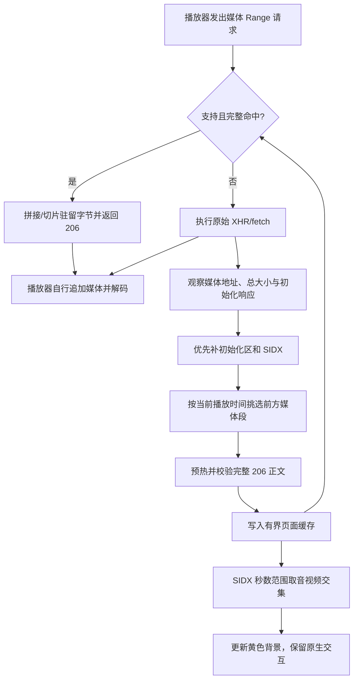

# 播放缓存的设计、原理与实现过程

> 对应实现：2.6.1。本文记录本次改造为什么做、如何做、遇到了什么问题，以及怎样证明它有效。
> 当前行为概览见 [README](../README.md)，系统架构与接口见 [技术文档第 6 节](../技术文档.md)，历史演进见 [开发日志](../开发日志.md)。

## 1. 从现象到可验收目标

用户发现播放过程中，原生亮灰色缓冲条会逐渐覆盖插件黄色，并希望同时做到：

1. 插件预热的未播放区域仍能辨认，不因播放器缓冲跟上而变灰。
2. 拖到预热区域时，播放器实际复用数据、减少等待，而不是仅仅把条画得更长。
3. 黄色位置对应真实媒体时间，不能拿下载字节百分比冒充可播放范围。

因此分别建立三类验收证据：**颜色状态、请求是否复用、实际解码与起播耗时**。其中任意一项不能代替另外两项。

## 2. 原实现的根因

### 2.1 “被挤掉”其实是状态优先级

原 `timelineStates()` 将同一位置归为一个互斥状态。当原生缓冲与插件范围重叠时选择原生状态，所以灰色逐渐替代黄色。不是两根 DOM 缓冲条挤压，也不是灰色把预热记录删除。

本次改变的是未播放区域的来源显示：

```text
已播放进度 > 插件预热黄色 > 非插件来源的原生灰色 > 空白
```

已播放区域仍由原生进度显示；黄色不遮住播放位置。用户自定义的预热颜色仍生效，默认色仍是橙色 `#ff8a1f`，本文沿用用户的“黄色”称呼。

### 2.2 原预热没有可交付给播放器的正文

原 `prefetch()` 读取 Range 响应流时只累计字节数量，然后保存成功范围。读完即释放正文，期待 CDN 提前回源带来后续收益。

这意味着“成功请求过”不等于“播放器随后一定能直接取用”。仅把黄色提到灰色之上，会改善可见性，却无法解决实际复用。

### 2.3 原时间映射只是估算

原映射把字节偏移除以轨道大小。可变码率下，同样大小的字节块可能对应不同播放时长；音视频码率也不同。再加上按文件大小猜测音视频类型，无法可靠承诺某个时间点的两条轨道都就绪。

## 3. 方案取舍

| 方案 | 能解决什么 | 本次选择 |
| --- | --- | --- |
| 只调整颜色优先级 | 黄色不被灰色替代 | 必做，但不视为加速完成 |
| 继续依赖 CDN / 浏览器 HTTP 缓存 | 可能减少回源或网络请求 | 不作为可靠复用保证 |
| 调整 B 站播放器自身缓冲配置 | 有机会扩大播放器原生缓冲 | 未采用；本次未确认稳定可用的公开接口 |
| 插件直接追加播放器的 SourceBuffer | 理论上直接增加原生缓冲 | 未采用；会介入初始化、时间戳、切轨和播放器自身追加队列 |
| 接住完整命中的播放器请求 | 保留播放器解封装、追加与解码流程，仅替换数据来源 | 采用 |
| 将预热正文写入离线片库 | 可跨页面、跨重启保留 | 未采用；短时前向缓存与完整片库的生命周期不同 |

选择页面内存而不是 Service Worker 全局变量，是为了把正文和使用者放在同一个页面生命周期中，避免 MV3 后台休眠、媒体跨消息通道复制和额外持久化状态。

## 4. 模块与执行路径

| 文件 | 本次职责 |
| --- | --- |
| [`src/playback-cache.js`](../src/playback-cache.js) | 驻留字节、完整范围匹配、SIDX/轨道类型解析、fetch/XHR 适配 |
| [`src/playback-observer.js`](../src/playback-observer.js) | 请求观察、前向预取调度、当前轨选择、导航清理、统计和绘制 |
| [`src/playback-bridge.js`](../src/playback-bridge.js) | 沿用既有配置与统计通信，本次不通过桥传输正文 |
| [`manifest.json`](../manifest.json) | 在 MAIN、document_start 中先注入缓存模块，再注入观察器 |



缓存适配器最后包住既有观察器。观察器预热使用事先保存的原始 fetch，不把自己的预热请求再次当成播放器请求，从而避免递归和统计混淆。本地命中也不作为 CDN 吞吐样本。

## 5. 分段缓存怎样匹配请求

### 5.1 键、边界与来源

- 正文缓存键是**完整 URL**，包含查询串；不跨签名地址、CDN 主机或清晰度共享。
- 观察统计仍可按 `host + pathname` 归组，但统计归组不代表正文可以复用。
- 内部区间使用半开形式 `[start, end)`，HTTP 的 `bytes=a-b` 则包含两端，进入缓存算法后将右端转换为 `b + 1`。
- 每块正文记录起点、字节、插入顺序及是否由插件主动预热。播放器初始化响应可帮助解析头部，但不冒充插件预热贡献。

### 5.2 完整命中，而不是猜测命中

`pieces()` 对驻留块按起点排序，从请求起点向右扫描；块之间允许相邻或重叠，但任何缺口都会导致未命中。

例如：

```text
驻留：[100, 200) + [200, 300)
请求：bytes=150-249
返回：第一块后 50 字节 + 第二块前 50 字节，共 100 字节

驻留：[100, 200) + [210, 300)
相同请求：存在 [200, 210) 缺口，整条请求回到原网络路径
```

不混合“半份缓存 + 半份网络响应”，以免引入更多范围拼接、失败回滚和取消语义。支持开放结尾 `bytes=start-`，前提是已知总大小且后续范围全部驻留。后缀范围、多范围、越界和非法数字不合成响应。

预热写入前检查 HTTP 206、Content-Range、实际正文长度与请求边界。提前结束或超出范围的正文不会作为完整缓存成功。相同 URL 的总大小变化会清理旧条目。

### 5.3 fetch 与 XHR 的契约

**fetch**：支持 GET 单段 Range 和 Request 对象；本地响应保持 206、Content-Range、Content-Length、媒体 Content-Type 与原 URL。请求之前和排队期间的 AbortSignal 会阻止交付；响应已经返回但正文尚未读取时，采用按需拉取的 ReadableStream，使取消仍可让正文读取失败。分配或响应构造失败则回到原请求。

**XHR**：仅接管异步 GET、`responseType = 'arraybuffer'` 的完整命中。复用原生 EventTarget，提供 2→3→4 状态变化、progress/load/loadend、状态码、范围响应头、responseURL 与 ArrayBuffer 正文，并处理取消。其他响应类型、同步请求等不做缓存响应适配，沿用原路径。

If-Range、Authorization 等不支持的条件请求同样回退；该适配器不是任意用途的 HTTP 缓存或完整 XHR 替代品。

## 6. 为什么黄色位置现在使用 SIDX

### 6.1 字节与时间如何对应

解析 ISO BMFF 的 SIDX v0/v1，使用：

```text
首段字节起点 = sidx 盒尾 + first_offset
后续段字节起点 = 前一段起点 + 前一段 referenced_size
首段时间起点 = earliest_presentation_time / timescale
每段时间长度 = subsegment_duration / timescale
```

关键易错点是 `first_offset` 相对 **SIDX 盒尾**，不是文件起点。v1 的时间与偏移是 64 位字段，需要在 JavaScript 安全整数范围内检查。截断、越界、不合法时长或层级引用不产生就绪标记。

例如两段分别占 10 字节和 20 字节，但时长分别为 1 秒和 3 秒：必须显示为 1 秒与 3 秒，不能按字节的 1:2 比例绘制。

### 6.2 音视频类型和完整就绪

从初始化段 `moov/trak/mdia/hdlr` 的 `vide` / `soun` 判断轨道，不用文件大小猜测。选择播放器最近实际请求的相应轨道；旧请求晚完成不能夺回“当前轨”身份。

一段进入黄色候选范围，必须满足：

1. 文件头至首个媒体段之前的初始化范围仍完整驻留。
2. 当前媒体段全部驻留，且由插件预热。
3. 有合法 SIDX 给出的真实起止秒数。
4. 当前视频轨与音频轨的就绪秒数范围相交。

最后再除以实际 `video.duration`，投影到进度条。容量回收导致条件失效时，黄色撤销；**黄色不因灰色跟上而消失，但也不是永久保存的下载历史标记**。

## 7. 调度、内存与生命周期

- 调度周期为 400ms。配置确认开启、媒体地址及位置已知后即可工作，不等待观看时长或“先出现卡顿”。
- 优先补初始化和索引，先探测 64 KiB，必要时扩大至最多 1 MiB；尽量跳过已驻留头部。
- 有 SIDX 时按当前播放时间挑选前方约 45 秒内相交的段，并减去驻留和在途覆盖，寻找下载缺口。
- 索引不可用时仍可回退到有限的字节窗口预取，但**不绘制估算黄色**。
- 沿用并发、块大小、45 秒请求超时、退避和失败停用保护；单轨额外读取预算默认 200 MB。
- 驻留正文默认上限 128 MiB，按最早插入的块回收；元数据最多保留 32 个资源。返回正文和在途数据有短期副本，因此这不是整个标签页的内存上限。
- 切视频/分 P 会清理缓存、取消预热；缓存世代和页面身份检查阻止旧响应重新填充。
- 关闭辅助会清理并取消；重新开启允许重新探测初始化区，不沿用已清理缓存的探测进度。
- 清晰度/签名变化保守隔离；新轨尚未确认时不借用旧轨黄色。

## 8. 绘制为何不破坏原生操作

保留 B 站原生章节节点、尺寸、变换、滑块、小电视和事件处理器。插件只对未播放背景生成分段纯色填充，原生已播放节点仍在上层；不创建替代时间轴，也不自行修改 currentTime。

章节分段按可见宽度投影全片范围。关闭“区分插件缓冲”只是将插件色改为灰色，不停止预热或删除范围。这与关闭整个“提前加载”开关不同。

## 9. 实现过程与实际修正

1. **追踪旧执行路径**：读取绘制优先级、预热 reader、XHR/fetch 包装与测试，确认颜色问题和数据复用问题是两件事。
2. **先建立失败验收**：新增缓存契约测试时缓存模块尚不存在，测试先失败；修改黄色期望后，旧观察器测试为 13 通过、1 失败，然后才修复颜色源码。
3. **拆出缓存模块并接通主链路**：先验证范围算法和索引，再接入预热、播放器请求、导航和绘制，而不是仅孤立实现一个缓存类。
4. **浏览器夹具修正**：最初在首个初始化段追加后才创建第二个 SourceBuffer，触发 QuotaExceededError。调整为先创建两条 SourceBuffer 再追加初始化段。该问题属于测试播放器初始化顺序，不是缓存容量耗尽。
5. **区分播放器请求与后台预热计数**：新 URL 的未命中测试曾把同时发生的初始化探测也算进“两次播放器请求”；改为按目标 Range 检查回退，并单独测量拖动阶段的网络请求数。
6. **补齐生命周期边界**：增加清晰度切换、旧请求晚完成、分 P 迟到响应、关闭再开启及取消测试。特别是 fetch 返回响应后、正文消费前的取消，原本没有失败，补成红测后改为按需流交付。
7. **真实扩展重载验证**：不能假定 runtime.reload 后一定自动出现新 Service Worker。新建 Chromium profile 还必须启用开发者模式，否则会以 unsupportedDeveloperExtension 禁用未打包扩展。最终用变更标记、刷新受测页和 SHA-256 验证实际新代码，而非只打印“已重载”。
8. **独立审查补齐过程证据**：补出原始测试失败时间线与任务开始的脏工作区对照，不将事后执行说成实现前记录。
9. **文档一致性修正**：审查发现旧段落仍与新实现相反。新增文档红测，统一 README 和技术文档的颜色、时间映射、缓存分层与边界，保留历史日志但明确标注版本。

## 10. 怎样验证，结果说明什么

| 验收项 | 测试/证据 | 通过条件 |
| --- | --- | --- |
| 范围拼接、缺口、容量回收 | `tests/playback-cache.test.mjs` | 完整才命中；回收后不返回旧字节 |
| SIDX v0/v1、非等码率、非法索引 | 同上 | 秒数正确；缺初始化或非法索引不标黄 |
| fetch 失败/取消/导航 | `tests/playback-cache-fetch.test.mjs` | 缓存失败可回退，取消不错误交付 |
| 黄色优先、切轨、重新开启 | `tests/playback-observer.test.mjs` | 不以灰色覆盖黄色，不借旧轨标记 |
| 原生布局和交互 | `tests/playback-progress-integration.mjs` | 几何与事件保留，不篡改播放位置 |
| 实际两轨解码、拖动、请求计数 | `tests/run-playback-cache-integration.mjs` | fetch/XHR 两轨命中；拖动阶段零网络请求 |
| 生产注入与重载 | `tests/run-playback-extension-smoke.mjs` | 实际 manifest 注入、新标记及哈希验证 |
| 注册和当前文档 | `tests/playback-registration.test.mjs`、`tests/playback-documentation.test.mjs` | 顺序、版本、脚本和行为说明一致 |

可复现命令：

```bash
npm run check
npm test
# 若环境未安装 Playwright：
npm install --no-save playwright
npx playwright install chromium
npm run test:playback
npm run test:extension
```

也可通过 `PLAYWRIGHT_MODULE=/绝对路径/playwright/index.mjs` 复用已有安装。测试使用独立 Chromium profile，不复制用户登录态。实际播放器请求使用真实 AVC/AAC 两分片夹具；夹具原始 SIDX 引用数缩至 2，但不改变盒大小或媒体偏移。浏览器端自己执行解码，不是只验证返回数组。

实现完成时，102 项测试、语法和 diff 检查通过。独立复核的受控实验中，为网络增加 180ms 延迟：冷拖动约 202ms、2 次媒体网络请求；fetch/XHR 缓存命中分别约 26/17ms、均 0 次媒体网络请求。其他轮次约 13–15ms，波动正常，不能将单次值当成性能 SLA。生产加载、自动重载、新代码标记、哈希，以及发布 zip 的 26 个文件与 unpacked 一致性也通过检查。

**这些是本地真实媒体夹具和生产扩展注入验证，不是用户实际 B 站线路测速。** 没有承诺任意视频、任意位置都零等待。

## 11. 原有修改与证据的保存方式

任务开始时工作区已有多项未提交修改。本次不做 reset/restore/checkout 等覆盖操作；只定点编辑与该功能重叠的 8 个原文件，并新增缓存和测试。Popup、后台下载、音视频合并及其相关既有改动没有被本次代理改写。

本地 `.pi/verification/` 留有原始会话条目、失败输出和工作区对照脚本，供本机核查；这些运行记录不进入发布包。本篇设计说明、源码、测试和主文档链接则是可纳入版本控制的长期资料，阅读本篇不依赖该本地目录。

证据边界：最初保存了 git status 和源码读取记录，没有全工作区逐文件哈希快照。因此只证明本次代理的写入范围及原有工作区项保留，不宣称能排除其他并发进程修改。

## 12. 明确边界与后续方向

- 普通无 SIDX 的 progressive MP4、层级索引和未支持布局安全回退，不提供推测黄色。
- 黄色需要双轨完整段和初始化驻留；只下载了一部分，即使字节很多，也不一定标黄。
- 页面刷新、关闭辅助、容量回收或 URL 变化都可能失去复用机会；长期离线保存应使用片库。
- 请求未命中或不支持时仍需网络；不会为了维持“命中”数字返回不完整数据。
- 缓存省掉下载时间，但不能省掉关键帧定位、解封装、音视频同步和解码。
- 分段进度条目前依赖可见宽度对应时长占比，网站布局变化后需要重新验证。
- 本次不接管播放器 SourceBuffer、不修改账号权限、不跨 URL 合并缓存，也没有新增扩展权限。

后续可单独评估其他媒体索引、更多请求类型、实站兼容矩阵或更细的内存回收策略；它们不是本次已经实现和验证的能力。

## 13. 参考与代码依据

本次字段与行为直接对照仓库源码及真实媒体夹具验证，未把其他项目的实现直接拷入。相关规范入口供后续维护核查：

- ISO/IEC 14496-12：ISO Base Media File Format，SIDX 与 handler 字段。
- [WHATWG XMLHttpRequest](https://xhr.spec.whatwg.org/)：请求状态、响应字段和事件。
- [WHATWG Fetch](https://fetch.spec.whatwg.org/) 与 [Streams](https://streams.spec.whatwg.org/)：请求/响应和取消。
- [Media Source Extensions](https://www.w3.org/TR/media-source-2/)：播放器追加与解码流程。
- [Chrome 内容脚本](https://developer.chrome.com/docs/extensions/develop/concepts/content-scripts)与 [Service Worker 生命周期](https://developer.chrome.com/docs/extensions/develop/concepts/service-workers/lifecycle)：运行上下文及 MV3 生命周期。

规范链接是维护参考，不代表本适配器完整实现了上述规范的所有功能；支持范围以第 5 节和对应测试为准。
