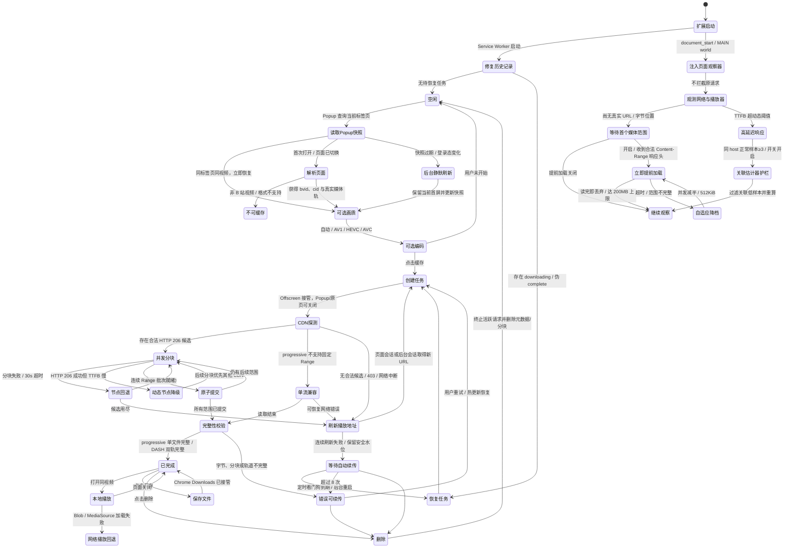

# bilibili 缓存插件

## 2.8.4 · 播放位置感知的缓存回收

- 以活动轨道的初始化/索引区、当前播放点前方窗口及 5 秒回看窗口设置保留提示；优先回收非活动或远离窗口的数据，同级按距离和插入顺序确定性回收。SIDX 可用时按真实分段，缺失时仅为回收顺序做比例估计，不宣称时间命中。保护仅影响顺序，不允许突破驻留容量上限；切视频/分P/关闭清理提示，关闭后的渲染不得重建保护。详见 docs/playback-retention.md。
- 验证：对应新增回归测试、npm test、npm run check、npm run build。

## 2.8.3 · 部分缓存命中只补缺口

- fetch/XHR 对精确 URL 的部分驻留范围同步取快照，仅向 loadPlayerRange 请求缺口，所有边界、正文长度和总长一致才拼出完整 206；单范围最多 16 MiB、最多 32 个缺口，单请求拼接正文约两倍范围上限。失败取消兄弟缺口，原生回退不交付半成品，导航/取消挡住迟到响应。父范围统一缺口锚点，但向后 seek 允许回退；命中统计包含真正复用的部分字节。详见 docs/partial-cache-reuse.md。
- 验证：对应新增回归测试、npm test、npm run check、npm run build。

## 2.8.2 · 跨标签与离线共享请求预算

- 插件主动请求在 MAIN→隔离桥→Service Worker 与 Offscreen→Service Worker 两条路径申请同一租约。storage.session 串行持久化成功后才授予，SW 休眠后恢复；后台最多占全局上限四分之一，多所有者公平分配，播放请求优先。每次租约 45 秒、客户端提前 1 秒取消，正文结束才释放；服务不可用不自发本地槽位，在线播放交原生回退、离线走错误重试。降低上限不抢占已在途数据，而是停止新授予直至回落。原生站点/回退流量不受此预算约束，也不声称这是带宽整形；后台冻结或时钟异常下不能承诺瞬时物理连接硬上限。预算等待不计 CDN 首字节延迟、不作为并发收益样本，统计区分排队与真正活跃请求。未新增权限。
- 验证：对应新增回归测试、npm test、npm run check、npm run build。

## 2.8.1 · 收益驱动并发预算

- 在线按原主机和范围量级记录完整请求有效吞吐；连续三个有效样本比较并发收益，降低并发若吞吐损失超过 10% 则回退，稳定六个样本后允许重新试探。救援、短样本、重叠任务与旧世代不参与学习；用户上限、范围预算和原生回退不变。
- 验证：对应新增回归测试、npm test、npm run check、npm run build。

## 2.8.0 · 冷门视频按需分块与多节点加速

- 原生 fetch / XHR 第一次媒体 Range 即进入下载器，不再等首个请求成功后才预热；当前片段用 64 KiB、后台用 256 KiB 分块，校验后按顺序合并。
- 真实 Chrome 实测后默认使用原清单主备 CDN；大陆优先和自动模式仍可手动选择，已保存的选择不覆盖。首字节超时、正文停滞和失败节点冷却分别处理，同轨备用竞争成功后取消冗余连接。
- 音频与当前播放缺口优先；8 路起步，共享连接预算默认最多 32，可选 4/8/16/32；不足 3 秒真实缓冲立即放开全局预算，其余缺缓冲/吞吐不足每 500 ms 可翻倍；单个请求每 256 KiB 分配一个普通工作者，2 MiB 通常用 8 路、8 MiB 用 32 路；冷节点失败不再全局收缩到 1。
- 移除 200 MB 累计停止与六次失败永久停用；保留前方窗口、有界缓存与可恢复退避。
- 增加首次请求并发、XHR 取消/超时/重开/回退及设置回滚验证；网速短数值四舍五入，增加加速请求与原生回退计数。
- CDN 候选参考 Bilibili-thread-ripper，随包附 MIT 许可与第三方声明。
- 增加只连接现有 Chrome 的 `bench:real`：真实 CDN 1/4/8/16/32/64/128 路、64/256 KiB 分块与三种线路对照，逐次检查长度和 SHA256。8 MiB 样本 32 路优于 64/128，2 MiB 样本选择低并发；方法、数据及局限见 [并发验证报告](docs/concurrency-validation.md)。

## 2.7.0 · 在线预热 CDN 救援、统计与自适应并发

- 默认初始并发调整为 4，导航或重置后恢复为 4；较低配置上限仍生效，后续继续自适应调整。

- 在线预热读取同轨道主备地址，校验范围和总长后按原地址缓存；慢首字节和正文停滞均可切换备用，胜出后取消冗余请求。
- 共享连接上限，缓冲不足时结合吞吐增援，失败及充足缓冲时收敛；单连接模式用替换避免救援排队死等。
- 播放页展示预热网速、真实命中量、两类缓冲时长、连接数、救援次数和最近完成节点；持续刷新保留 DOM 和焦点。
- 补充调度单元测试与 Chromium 受控网络验收，沿用原生播放器及离线下载流程。

## 未发布 · 「提前一格」图标

- 以三个向前收拢的色块表达播放与提前缓冲，替换电视造型；SVG 母版使用纯色路径，无位图、字体或外部资源。
- 16/32 像素使用加大主体、加宽间隙的专用母版；48/128 像素保持至少 12.5% 透明边距。
- 使用现有 `npm run icons` 导出四种 PNG；SVG 用于编辑，Chrome 清单继续使用 PNG。

## 2.6.3 · 发布上架准备（图标规范、隐私披露、发布自检）

**背景**：这一版没有改播放与下载行为，目标是把“能跑”变成“能提交 Chrome Web Store”，
并让上架要求变成可回归的检查，而不是靠人工记忆。

**发现的问题与处理**：

- **图标不合规**：`assets/icon-*.png` 全部是拍平导出的，整张 128×128 都是不透明白底
  （四角 alpha = 255），放到深色主题的工具栏上就是一块白方块，也不符合 Chrome 图标规范
  “96×96 图形 + 四周 16 像素透明边距”。改为 `scripts/build-icons.mjs` 从 SVG 母版用 Chromium
  以 `omitBackground` 渲染，并自检四角透明与留白下限；16/32 另用简化母版 `icon-small.svg`
  （去掉天线与指示灯，只留蓝色机身、白色播放三角与粉色进度条），否则按比例只剩 2 像素留白会糊成一团。
  现在 128 的图形是 96×90、留白 16px，48 为 36×34、留白 6px。
- **缺少安装后披露**：Chrome Web Store 2026 年 7 月的政策更新要求“所有数据收集都要显著披露，
  与单一用途是否密切相关都要披露，且安装后引入的新数据处理方式也要披露”。新增根目录 `privacy.html`
  （自包含、离线可用、含 Limited Use 连续原文声明），并在弹窗底部加常驻页脚“缓存与登录态只保存在本机 / 隐私说明”，
  同时把它复制进发布包。
- **发布包检查缺位**：以前 `npm run build` 只保证“能打包”。新增 `scripts/verify-release.mjs`，
  对 `dist/unpacked` 与 zip 做文件级体检：清单字段上限、图标透明度与留白、权限白名单、
  `host_permissions` 不得含本地域名或全站通配、无 `eval` / `new Function` / `importScripts` /
  内联或远程脚本、无开发态热更新残留、DNR 的 `initiatorDomains` 必须等于 `key` 推导出的扩展 ID、
  压缩包根目录含 manifest 且无 `.DS_Store` / `_metadata` / 多余目录层，最后打印 SHA-256。
  判断逻辑抽到 `scripts/lib/release-checks.mjs`，发布态清单变换 `toReleaseManifest` 由构建与校验共用，
  避免“构建剔除了本地域名、校验还按旧规则判断”的漂移。
- **发布包不可复现**：zip 会把每个文件的 mtime 与 Unix 权限位写进压缩包，同一份源码每次构建的字节都不同，
  记录 SHA-256 也就失去意义。构建在打包前统一 mtime（可用 `SOURCE_DATE_EPOCH` 覆盖）与权限位，
  并改用排序后的文件列表调用 `zip`（`zip -r .` 的遍历顺序取决于文件系统，
  在开发目录与解包目录里结果不同）。工作目录与 `git archive` 导出的干净副本各自连续构建两次，
  四次的 SHA-256 完全一致。
- **语法检查会漏检**：`npm run check` 原本是一串手写的 `node --check` 文件列表，新增文件忘加就静默漏检。
  改为 `scripts/check-syntax.mjs` 遍历仓库（跳过 `node_modules` / `dist` / 临时目录），
  当前覆盖 56 个文件。
- **商店文案与素材齐备**：新增 `store/listing.md`（摘要、详细描述、逐条权限理由、
  给审核员的测试步骤、数据使用披露答案）与 `store/README.md`（提交流程、每版发布步骤、
  常见驳回原因与对应防线）；`scripts/store-assets.mjs` 用真实 `popup.html` / `popup.css` /
  `popup.js` 加固定演示数据生成 3 张 1280×800 截图与 1 张 440×280 促销图，
  出图前断言当前视图未被裁断、排版不越界，出图后回读 PNG 校验尺寸必须精确匹配。

**本版发布包**：`dist/bili-buffer-extension-2.6.3.zip`（106.7 KiB，可复现构建；排序打包与 `zip -X` 让它比上一版略小）
SHA-256 `08096d936e18ac9b6b4b34146bb70094461c7630ca9fd08f994927cb83b2a512`

**验证**：

- `npm run check` 通过（56 个 JS 文件）；`npm test` 从 108 项增至 124 项全部通过，
  其中 12 项是新增的上架合规测试（含“坏样本必须被拒绝”的反向用例）。
- `npm run build` 通过，末尾 `npm run verify` 输出：图标 16/32/48/128 留白 1/3/6/16px；
  压缩包 106.7 KiB，包内无开发态脚本与 `127.0.0.1` 权限；工作目录与干净导出的构建哈希一致。
- 负向验证：把 `dist/unpacked` 复制一份并故意改坏（描述 140 字、加入 `http://127.0.0.1/*`、
  把 DNR 的 `initiatorDomains` 换成 `www.bilibili.com`、在 background 里塞入 `eval`、
  在 popup.html 里塞入内联脚本），`npm run verify` 对每一处都给出了对应的失败项并以非零状态退出。
- `npm run test:popup`、`npm run test:playback`、`npm run test:extension` 均通过
  （后者包含构建、真实加载、改标记后自动重载与 bundle 哈希校验），确认新增页脚没有破坏
  悬停/焦点/pending 稳定性。
- **尚未验证**：商店审核结果本身；`privacy.html` 尚未发布到 GitHub Pages（需要先开启 Pages 并填入仪表盘）；
  名称与商标的处理方式仍待决定，详见 `store/listing.md` 第 0.1 节。

## 2.6.2 · Popup 稳定刷新与进度统计修复

详见 [Popup 稳定性设计与实现](docs/popup-stability-design.md)。

- 重做播放外观：常驻示意条与图例、已播放颜色、提前加载区分开关、预设/自定义、恢复默认；明确区分“配色示意”和真实进度。
- 片库按业务 ID 复用节点、按创建顺序稳定排列；保留 hover/focus/pending，过滤旧快照与删除后迟到数据。
- 保存/删除均为 32×32 纯图标按钮；下载向下单次动画与删除轻微反馈，支持减少动态。
- 下载统计增加确认落盘水位；事务完成前不发布成功，在途重试回滚不再减少“已缓存”。速度按时间平滑且数字单位保持单行，进度以浮点 transform 更新。
- 多任务徽标由完整任务集合派生，并在 SW 重启后从 IndexedDB 重建。
- 串行化播放配置写入；复现并修复连续失败回到旧乐观值的问题，改为回退最后确认配置。
- 新增 `npm run test:popup`、任务展示单元测试与事务失败测试，扩展实际重载测试覆盖徽标恢复；文档记录执行链、取舍、数据字段与验收方法。
- 公共 AGENTS 规则与 `../docs/realtime-ui-stability.md` 已同步到本目录两套扩展。无新增权限；版本更新至 2.6.2。
- 验证：语法检查与 108 项单元测试通过；Chromium 中持续刷新节点/焦点/动画、四种速度单位与进度中间帧、配置/保存失败、删除墓碑、双轨合并/音频提取均通过；生产扩展实际重载、注入哈希及数据库徽标恢复通过。

## 2.6.1 · 预热数据复用与黄色来源保留

完整过程已整理为[播放缓存的设计、原理与实现过程](docs/playback-cache-design.md)，包括根因、方案取舍、分段缓存算法、请求契约、生命周期、失败修正和可复现验收。最终独立复核为 102 项测试通过（含文档一致性测试）。

- 不再丢弃预热正文：新增 `src/playback-cache.js`，完整 Range 命中可由 fetch/异步 arraybuffer XHR 直接读取，缺失、取消、容量回收、签名/清晰度变化和导航走明确回退/清理路径。
- 用 SIDX v0/v1 与 hdlr 识别真实时间和音视频类型；只有双轨完整就绪交集才画黄色，未知索引不以字节比例替代。
- 未播放黄色优先于灰色，已播放颜色和原生滑块、布局与交互保持不变。
- 新增缓存单元测试及 `npm run test:playback` 双轨真实解码验收。首轮受控 180ms 网络延迟下，冷拖动约 203ms，fetch/XHR 命中约 13/15ms；这是本地夹具结果，不代表真实站点任意拖动零等待。
- 新模块随生产 MAIN manifest 注入，无新增权限，不进入持久化片库。保留原有未提交功能改动。
- 功能验收：`npm run check`、`npm test`（101 项）、`npm run test:playback`、`npm run test:extension` 均通过；拖动阶段冷路径 2 次网络请求，fetch/XHR 命中均为 0 次，并解码 38 帧。最终受控起播约 199ms → 13ms。
- 生产扩展在专用 Chromium profile 中实际加载、变更标记后 runtime.reload、刷新页面与 SHA-256 校验均通过；发布 zip 共 26 个文件，与 dist/unpacked 逐文件一致。没有在用户当前登录会话或任意真实 B 站视频上承诺同样耗时。

- 文档复核：新增 `tests/playback-documentation.test.mjs`，先复现旧说明失败，再修正 README 的灰色优先/字节估算描述，以及技术文档的缓存分层、启动窗口和已知边界；新增测试通过，`git diff --check` 通过。

> 下文保留历史版本的设计与问题记录；包含“丢弃正文”“按字节比例”等旧方案时，应按对应版本理解。当前行为以本页最新版本记录及 README / 技术文档为准。

## 注意事项

这个文件用于描述开发内容和细节，并且需要及时更新

选择合适的技术和编程语言进行开发，参考的代码和解决方案需要给出出处

## 背景说明

在海外使用bilibili网页版看视频的时候经常出现加载速度过慢的问题，推测是本地网络CDN并没有保存一些播放量较低的视频的数据，而一些播放量较高且时间比较近的视频则没有这样的问题，由此需要就这个问题开发出一款用于将视频缓存在chrome浏览器中的插件

## 工作原理

这个插件的原理是通过预先完全缓存需要看的整条视频，这样当需要看的时候就不必因为实时加载卡顿而烦恼了

## 要求

- [x] 拥有一个适合的图标，需要跟bilibili相关
- [x] 点击插件图标，有一个紧凑的圆角矩形按钮，点击后可以自动开始缓存当前访问的bilibili网站的视频，如果当前的网站不是bilibili则按钮变成灰色并且提示用户无法操作。点击开始缓存后，在按钮内显示缓存进度条和实时的下载速度。缓存完毕后按钮提示已经缓存完毕
- [x] 在下方提供一个列表，用于查看已经缓存的视频，可以对视频进行删除缓存的操作，点击跳转到播放该视频
- [x] 能否做到在原视频界面下通过缓存播放，以此来达到无感使用的目的？如果可以给出可行的技术方案；如果不可以，给出原因
- [x] 提供视频质量选项，默认选择当前账号能够访问的最高画质
- [x] 对需要登录或大会员的内容，尝试使用当前 Chrome 的 B 站 Cookie 访问，同时不展示、导出或持久化 Cookie 原始值
- [x] 提供自动/AV1/HEVC/AVC 编码选项；自动模式优先同画质下更低码率的可播放轨道
- [x] 增加播放侧 CDN 冷区间观测、受控预热、带宽估计器护栏和实时可观测面板
- [x] 预热区间使用无高光的纯色显示，支持持久化预设/自定义颜色，并在播放边缘与预热段相接时显示动态白色分界
- [x] Popup 按缓存、播放、片库划分互斥一级视图，低频设置按需展开，避免把全部内容纵向堆叠
- [x] 播放页只保留提前加载的开启 / 关闭；开启后在首个媒体范围响应头到达时立即衔接后续请求，不再显示或等待准备流程

## 技术路线总览

### 1. 扩展运行结构

项目采用 Chrome Manifest V3，按职责拆成五条运行链路：

| 运行环境 | 主要文件 | 职责 |
| --- | --- | --- |
| Popup | `popup.html`、`src/popup.js` | 以缓存、播放、片库三个互斥视图组织画质/编码、播放提前加载开关和本地视频；只负责交互，不承担长时间下载 |
| Service Worker | `src/background.js` | 消息路由、B 站视频信息解析、创建 Offscreen Document、徽标状态、热更新检查和重载后的任务恢复 |
| Offscreen Document | `offscreen.html`、`src/offscreen.js` | 持续下载、CDN 续传、MP4 或 DASH 双轨分块写入 IndexedDB、完整性校验，以及为本地播放组合 Blob |
| 隔离世界 Content Script | `src/content.js`、`src/playback-bridge.js` | 使用页面登录会话请求播放清单、恢复本地播放，并在 `chrome.storage` / Popup 与页面主世界之间只转发配置和汇总指标 |
| 页面主世界观察器 | `src/playback-observer.js` | 在 `document_start` 包装 XHR/fetch 与 Storage，观测播放器 Range TTFB、卡顿和缓冲；独立执行受控预热与关联估计器清洗，不拦截播放器响应 |

选择 Offscreen Document 的原因是 Popup 关闭后会被销毁，Manifest V3 Service Worker 也可能随时休眠；将长时间网络流和 IndexedDB 写入放在隐藏文档中，能避免用户关闭弹窗后下载立即中断。Service Worker 只保留可恢复的协调逻辑，不依赖常驻内存状态。

### 2. 页面识别与视频源选择

页面解析支持：

- 标准 `https://www.bilibili.com/video/BV...` 地址；
- 标准 `av...` 地址；
- 带 `bvid` 参数的稍后再看 `/list/watchlater` 页面；
- `?p=N` 分 P，缓存键包含 `bvid` 与当前分 P 的 `cid`，不同分 P 不会互相覆盖。

后台先请求 `https://api.bilibili.com/x/web-interface/view` 获取标题、作者、封面、分 P、时长与 `cid`。播放清单改用 `fnval=4048` 请求 DASH：优先让当前 B 站页面的 Content Script 发起带 `credentials: "include"` 的请求，使 `.bilibili.com` 登录 Cookie 按页面同源规则送往 `api.bilibili.com`；如果页面通道不可用，再回退到扩展 Service Worker 请求。

画质面板不能只相信 `accept_quality`。该数组可能声明 1080P60、1080P、720P，但匿名响应实际只下发 480P、360P 的 `dash.video`。v1.3.0 改为遍历真实 `dash.video` 表示，只保留具有 URL、MP4 MIME 和编码信息的画质，再按画质代码降序排列，第一项才是“最高可缓存画质”。v2.0.0 又在每档画质内生成实际编码选项：自动模式先过滤 Chrome MediaSource 不支持的表示，再按 `bandwidth` 从低到高选择，带宽相同才按 AV1、HEVC、AVC 排序；用户显式选 AV1/HEVC/AVC 时必须取得对应轨道，不允许静默换编码。音频轨仍选择可播放的高质量表示；单段 MP4 保留为 AVC 兼容回退。

### 3. IndexedDB 数据结构

缓存数据库名称为 `bili-buffer-cache`，当前 schema 版本为 1，包含两个对象仓库：

- `videos`：v1.1 旧缓存继续使用 `${bvid}:${cid}`，v1.3–v1.7 使用 `${bvid}:${cid}:q${quality}`；v2.0 新任务扩展为 `${bvid}:${cid}:q${quality}:c${codecPreference}`，不同画质/编码可以共存；已有 ID 不改名；
- `chunks`：以 `[videoId, track, index]` 为复合主键保存二进制 Blob 分块。

媒体主路由 v1.6.0 起使用 2 MiB 固定 Range 分块；不支持固定 Range 的 progressive 兼容回退仍按约 4 MiB 流式块写入。视频元数据中的关键字段包括：

| 字段 | 含义 |
| --- | --- |
| `status` | `downloading`、`error` 或 `complete` |
| `downloadedBytes` | 当前界面可见的实时接收字节数，可能包含尚未落盘的内存数据 |
| `resumeBytes` | 已经作为完整 Blob 分块提交到 IndexedDB 的安全续传位置 |
| `totalBytes` | 播放接口或 `Content-Range` 报告的完整媒体大小 |
| `chunkCount` | 已经落盘的连续分块数 |
| `quality` / `qualityLabel` | B 站清晰度代码及界面标签 |
| `requestedQuality` | 用户明确选择的画质；恢复任务时继续请求同一画质 |
| `codec` / `codecLabel` | 实际落盘视频轨的编码族及界面标签；旧记录缺失时从轨道 `codecs` 推断 |
| `requestedCodec` | 用户的自动/AV1/HEVC/AVC 选择；恢复任务时不把显式编码静默替换 |
| `mediaKind` | `progressive` 或 `dash`；旧记录缺失时按 progressive 兼容 |
| `tracks.video` / `tracks.audio` | DASH 各轨的编码、表示身份、字节数、分块数和安全续传位置 |
| `progress` / `speed` | 弹窗进度条和实时速度所需数据 |
| `autoRetryCount` / `nextRetryAt` | v2.2.0 的持久自动续传次数与下次唤醒时间；Service Worker 重启后仍可恢复等待状态 |
| `ownerId` / `ownerUrl` | UP 主数字 ID 与 B 站空间地址；v1.5.0 新增的可选元数据，旧记录缺失时不影响缓存读取 |
| `downloadMetrics` | v2.0.0 记录并发、分块、CDN 主机、请求/重试、慢请求、主动切换、TTFB p50/p95、正文吞吐、网络字节和 IndexedDB 写入耗时；不记录签名 URL 或 Cookie |

这里刻意区分 `downloadedBytes` 与 `resumeBytes`。并发时后面的 Range 可能先完成，它们会暂存内存并计入实时 `downloadedBytes`，但只有从当前水位开始连续的分块才能进入同一个 IndexedDB 事务，连同 `videos` 元数据一起提交并推进 `resumeBytes`。热更新或崩溃后仍只从 `resumeBytes` 继续，不会因为乱序完成而在文件中留下缺口。

插件申请 `unlimitedStorage`，并在 Offscreen Document 初始化时尝试调用持久化存储 API。视频数据不写入 `chrome.storage`，避免把大二进制对象放入更适合配置项的小型键值存储。

### 4. CDN 下载与断点续传

下载流程如下：

1. 通过页面登录会话读取最新 DASH / MP4 播放地址；
2. progressive 检查画质和总大小；DASH 逐轨检查 `representationId + codecid + codecs` 身份；
3. 从主 URL 和最多两个备用 URL 各取 64 KiB 固定 Range 并行探测，仅接受起点、终点和总大小合法的 HTTP 206；排序采用端到端有效吞吐，同时独立记录响应头到达时间（TTFB）与正文读取吞吐；单个探测 8 秒超时，不让卡死节点拖住任务；
4. 单文件 progressive 使用 3 路并发；DASH 视频轨与音频轨同时下载，视频轨 2 路、音频轨 1 路，保持全局最多 3 个主动媒体连接；
5. 每个请求使用精确的 `Range: bytes=<start>-<end>`，默认分块 2 MiB；完整校验 HTTP 206、`Content-Range`、总大小和实收字节数；
6. 某个分块失败或 30 秒无法完成时，保持相同起止范围切换到下一个 CDN；HTTP 206 成功但 TTFB 高于 `max(800ms, 该节点热 TTFB 中位数 × 6)` 时不浪费已到手分块，但将该节点降级，让后续分块先尝试其他候选；接收了但失败的字节会从界面临时进度回滚；
7. 乱序完成的分块先留在内存，只将从当前 `resumeBytes` 连续延伸的一批块写入数据库；`chunks` 与新 `resumeBytes` 在同一个读写事务中原子提交；
8. 界面状态仍最快每 450 ms 广播，普通元数据持久化降频到约 1500 ms；完整分块提交不受该降频影响；
9. 如果 progressive CDN 根本不支持固定 HTTP 206，回退到旧的单流兼容路线；其他错误保留最后已原子提交的安全水位；
10. 遇到 HTTP 403、408、425、429、5xx、网络中断、超时或响应体提前结束时，先刷新播放地址并从已持久化的 `resumeBytes` 续传；连续刷新仍失败则写入带退避时间的 `downloading` 状态，由 `chrome.alarms` 看门狗再次接管，最多自动重试 8 次；
11. progressive 要求完整单文件；DASH 要求视频轨和音频轨分别完整，才允许把聚合状态改成 `complete`。

兼容回退路线如果续传请求意外收到 HTTP 200，会先清空旧块和续传位置，不会把完整文件错接在已有分块之后。并发主路对 HTTP 200、响应长度、`Content-Range` 起点/终点或总大小不一致都会拒绝提交，不会标记完成。

### 5. CDN 防盗链请求头

目标视频的 CDN 地址在缺少 B 站来源头时会返回 HTTP 403。扩展使用静态 `declarativeNetRequest` 规则，在请求真正发送前设置：

```text
Referer: https://www.bilibili.com/
```

规则同时限制：

- 发起者必须是固定 ID `ppoagkhgdcfchiodhgadpenibndbnhcj` 的本扩展；
- 目标域名只能是 `bilivideo.com` 或 `akamaized.net`；
- 资源类型只能是扩展发起的 `xmlhttprequest`。

因此不会修改用户访问其他网站时的普通请求，也不会全局伪造 Referer。固定 Manifest 公钥既用于稳定扩展 ID，也保证 DNR 的 `initiatorDomains` 在热更新后仍然匹配。

### 6. 登录态与大会员访问

Manifest 增加 `cookies` 权限，但读取范围仍受已有 `https://*.bilibili.com/*` 主机权限限制。Service Worker 只调用 `chrome.cookies.get()` 检查当前 Chrome 的 `SESSDATA` 是否存在，然后把“是否检测到会话”这个布尔状态交给下载模块；Cookie 值本身不会经扩展消息发送，不会写入 IndexedDB，也不会显示在 Popup 或日志中。

视频信息请求仍可由 Service Worker 完成；播放地址请求优先发送给当前 B 站 Content Script，由页面源调用 `api.bilibili.com`。该接口响应允许 `Origin: https://www.bilibili.com` 且支持 credentials，因此 HttpOnly 登录 Cookie 不需要也不应该由扩展手工拼接。所有请求使用 `cache: "no-store"`，避免把匿名响应复用成登录响应。播放接口返回的 `vip_status` / `vip_type` 只用于提示，最终权限以实际返回的 DASH 表示为准。

此方案的边界是“使用用户已经拥有的权限”，不是绕过权限：没有登录、会话过期、账号不是大会员、内容需要额外付费、存在地区限制或 B 站拒绝扩展请求时，插件会显示明确错误。扩展不会手工拼接 Cookie 请求头，也不会把 `SESSDATA` 提供给第三方程序。

### 7. 播放侧 CDN 预热与带宽估计器护栏

v2.0.0 参考 BiliLoader 对海外 CDN 冷命中的实测结论，但没有直接把固定参数照搬为不可变常数，而是将“完整离线缓存”和“当前播放加速”做成互补的两条链路。

`src/playback-observer.js` 以 Manifest `world: "MAIN"`、`run_at: "document_start"` 注入，原因是播放器创建 XHR 和读取本地带宽估计发生得很早，隔离世界无法直接包装页面原生对象。它对播放器请求只做以下被动观察：

1. 包装 `XMLHttpRequest.open / setRequestHeader / send`，只处理带 `Range` 且 host 属于 B 站媒体 CDN 的请求；`readyState=2` 记录响应头 TTFB，`loadend` 记录正文长度与总耗时；
2. 对 `fetch` 只记录响应头，不 `clone()` 或二次读取播放器 body，避免额外内存和网络路径干扰；
3. 以 `host + pathname` 识别媒体轨。pathname 可跨签名续期保持稳定，但 host 必须保留，因为不同海外边缘节点的缓存热度不能互相冒充；
4. 观察页面 `<video>` 的播放、waiting/stalled、缓冲区间和标签页可见性；只向隔离世界发送主机级 p50/p95、慢请求数、卡顿、缓冲秒数、预热 MB 等聚合数据，不发送签名 URL、Cookie 或媒体正文。

v2.0.0 至 v2.4.0 曾把累计播放 20 秒、已经出现慢 TTFB、标签页可见和本地播放余量至少 10 秒设为自动预热闸门，用于减少健康链路上的额外流量。v2.5.0 根据实际使用目标取消这些人为等待：开关开启时，XHR 在 `readyState=2`、fetch 在 Promise 返回响应对象时读取首个合法 `Content-Range`，直接以该响应末尾的下一字节作为提前加载起点；400 ms 调度器随即可以请求后续范围，不等待首个响应正文读完。前方窗口仍按“媒体总字节 / 视频时长 × 45 秒”估算并限制在 8–48 MB；初始 512 KiB × 2 路，成功较快时加性提高到 1 MiB / 最多 4 路，失败时并发减半并退回 512 KiB。单轨仍最多额外读取 200 MB，连续错误使用 2–30 秒指数退避，6 次仍失败则关闭该轨，避免对永久失效地址无限重试。每次必须收到合法 HTTP 206、匹配的 `Content-Range` 和完整字节数，body 读完后立即丢弃；提前加载的目的是促使边缘节点回源，不把这份数据写进播放器或片库。

带宽估计器仍针对 `localStorage["bilibili_dash_throughput_lru_v1"]`，但不使用 BiliLoader 的固定 8000 kbps 下限。v2.0.0 为每个 CDN 收集热请求正文吞吐；至少有 3 个样本后取 p25 的 55%，并限制为 1000–12000 kbps，作为当前设备/线路的动态下限。只有同 host 在最近 15 秒刚发生冷命中时，才过滤低于下限的样本、重算 p25/p50/ewma，并把异常延迟限制到热 TTFB 推导出的上限。没有热基线、无关联慢请求、其他 host、非法 JSON 和普通 localStorage key 都原样保留。底层保留旧版备份 / 恢复命令以兼容既有实现，v2.5.0 的精简 Popup 不再显示手动入口。

页面主世界不能使用 `chrome.storage`，因此 `src/playback-bridge.js` 运行在 ISOLATED world，只负责从 `chrome.storage.local["playbackAssistConfigV1"]` 读取配置、通过 `window.postMessage` 下发，并把聚合统计保存在该标签页内存中供 Popup 查询。v2.5.0 的界面只公开“开启 / 关闭”：底层以 `always` 表示开启、`off` 表示关闭，并把旧 `auto` / `always` 规范为开启、旧 `observe` / `off` 规范为关闭，不建立新存储键或迁移 IndexedDB。v2.3.0 加入的 `preheatColor` 继续原位使用，缺失时补入默认橙色 `#ff8a1f`。关闭 Popup 不会停止页面观察或提前加载，关闭视频标签页则自然终止这条页面内链路，不影响已交给 Offscreen 的完整缓存任务。

### 8. 本地播放路线

本地播放保留两条兼容路线：

1. Content Script 在页面加载或收到 `CACHE_READY` 后询问后台当前 `bvid + cid` 是否存在完整缓存；
2. progressive：Offscreen Document 验证并组合 `media` 分块，Content Script 读取 Blob 后创建页面同源 URL；
3. DASH：Offscreen Document 分别验证并组合 `video` / `audio` Blob，返回两个扩展 Blob URL 及 MIME/codec；
4. Content Script 读取两个 Blob 为 ArrayBuffer，创建页面 `MediaSource`；
5. 为视频轨和音频轨分别创建 SourceBuffer，追加完整的 fragmented MP4，全部 `updateend` 后调用 `endOfStream()`；
6. 两条路线都复用原 `<video>`，恢复切换前的播放时间、暂停状态、静音、音量和倍速；
7. `loadedmetadata` 成功后记录 `playbackState=local`，并把工具栏徽标改为“本地”。

两条路线都会在播放前把完整媒体复制到页面进程，DASH 还需要两份 ArrayBuffer，因而高画质视频的临时内存开销更明显。缓存仍由 B 站原播放器元素播放，所以控制条、宽屏、倍速和弹幕时间轴仍在原页面中。

### 9. 开发态热更新、发布构建与数据连续性

运行 `npm run dev` 后，本地服务只监听 `127.0.0.1:17321`。它通过文件系统监听 JS、JSON、HTML、CSS、PNG 与 SVG 的变化，并在 `/health` 返回递增修订号。最初把 750 ms 轮询器放在 MV3 Service Worker 中，但后台空闲休眠后定时器会停止，因此出现“服务正常、文件已变、浏览器却没有自动加载”的假热更新。v2.0.0 改由开发版 Offscreen Document 持续轮询；它只使用 Offscreen 可用的 `chrome.runtime` 通知后台。后台先把待刷新修订写入可跨 `runtime.reload()` 保留的 `chrome.storage.local`，再重载扩展。新 Service Worker 启动后消费并删除标记，只刷新匹配 `www.bilibili.com/video/*` / `list/*` 的现有标签页，使新增或修改的普通 Content Script 以及 MAIN/ISOLATED `document_start` 脚本真正重新注入；其他网站标签页不动。

由于旧热更新器自己已经可能处于休眠状态，从旧实现升级到这一版时必须在扩展管理页手动重新加载一次；新版代码启动 Offscreen 监听器后，后续改动不再需要重复手动操作。本轮真实 Chrome 已确认普通 Content Script、MAIN 与 ISOLATED 三条注入链在 v2.0.0 页面共同运行；新的“Offscreen 发现修订 → 后台写入 local → runtime 重载 → 消费标记并刷新标签页”链路另用两项隔离回归覆盖。浏览器集成测试仍验证 Popup 即时恢复、后台快照以及 11,534,546 字节双轨下载。

热更新的连续性依赖以下约束：

- Manifest 中保存固定公钥，扩展 ID 不变；
- IndexedDB 属于扩展 ID 对应的固定源，代码重载不会删除数据库；
- Service Worker 启动时扫描 `status=downloading` 的任务并重新创建 Offscreen Document；
- 开发态扩展重载后自动刷新已打开的 B 站视频页；页面刷新会打断当下播放，但不会删除片库或安全续传水位；
- 如果发现历史记录写成 `complete` 但实际字节数不等于 `totalBytes`，先降级为下载任务，再从安全分块自动续传；
- 下载恢复时优先向 B 站播放接口刷新 URL；如果原标签页已经关闭或页面会话不可用，则由扩展后台使用当前 Chrome 登录会话请求播放清单，再以任务开始时保存的 CDN 候选地址作为最后回退。候选地址不含 Cookie；地址过期、限流或临时断网时会保留安全水位并进入持久自动续传，不再要求原页面保持打开。

热更新服务仅用于本地开发。v2.0.0 增加 `npm run build`：复制运行所需文件到 `dist/unpacked`，从发布版后台剥离 `startDevReload` 导入/调用，删除 `src/dev-reload.js` 和 `http://127.0.0.1/*` 权限，校验 Manifest 引用文件后生成根目录结构正确的 zip。开发目录不被改写；固定公钥、IndexedDB 名称/schema 和所有旧缓存键保持不变。

### 10. Popup 画质、编码、辅助面板与状态刷新

Popup 每 700 ms 拉取一次本地片库，以显示下载字节、速度和完成状态。画质菜单不能因此被重新创建：v1.5.0 使用 Chrome 116 已支持的 Popover API，把选项放在浏览器顶层弹出层中，避免被圆角外壳的 `overflow: hidden` 裁切；触发按钮和菜单项都由扩展自己的 HTML / CSS 绘制，不再依赖不同系统外观不一致的原生 `<select>`。

Chrome 工具栏 Popup 关闭后会销毁其 Document，无法让 DOM 本身常驻。v1.7.0 将“已加载状态”移到 Popup 之外：Service Worker 按“标签页 ID + 视频/分 P”维护不含媒体 URL 与 Cookie 原文的界面快照，同时写入 `chrome.storage.session`。追踪参数、播放时间和 `vd_source` 变化不会造成错误失效；切换视频、分 P 或标签页时必须重新解析，不会闪现上一个视频的信息。

首次打开同一视频时，后台将视频信息和画质解析合并为一条链路，从原来的两次 `view` + 一次 `playurl` 减少为一次 `view` + 一次 `playurl`。后续打开在 30 分钟有效期内直接恢复快照，不请求 B 站接口；超期时也先显示旧快照，再静默刷新。`SESSDATA` 变化会立即将快照标记为过期，但不删除首屏；用户在静默刷新期间刚选的画质以最新选择为准，不会被较早发出的请求覆盖。

片库列表改为 Service Worker 直接读取共享 IndexedDB，不再为仅查看列表创建 Offscreen Document。正在下载的任务仍由 Offscreen 广播实时状态，快照只用于标题、画质、选择和登录提示的首屏恢复，不参与下载续传水位和完成判定。

画质项会生成只包含“画质代码 + 显示文字”的稳定签名。片库轮询只更新下载状态时，签名不变，现有菜单节点、展开状态和焦点都保留；只有 B 站实际返回的画质集合改变时才重建选项。用户点击或通过方向键、Home、End、Enter 选择后，`selectedQuality` 立即更新，随后再按该值寻找同画质缓存并提交缓存任务。下载进行中会禁用并收起菜单，避免切换到与当前任务不同的轨道。

视频信息接口同时返回 `owner.mid`。后台只保存数字 ID 和标准 `https://space.bilibili.com/<mid>` 地址，Popup 当前视频区与新写入片库记录中的 UP 主名称都可打开对应空间；旧缓存没有作者 ID 时仍可显示作者名称和继续播放、保存或删除。

### 11. 播放器进度条中的预热区间

B 站原生进度条用亮灰色表示播放器已经写入 MediaSource 的本地内存缓冲，深灰色表示尚未缓冲。插件预热则是另一种状态：Range 正文读完后立即丢弃，留下的是特定 CDN host 的边缘缓存副作用，不能修改 `HTMLMediaElement.buffered`，也不应伪装成原生灰色缓冲。

v2.1.0 在 MAIN world 为每条媒体轨新增独立的 `prefetchedRanges`，只在插件预热请求收到合法 HTTP 206、范围一致且正文完整后写入；播放器自己的请求仍只进入 `covered`，不会被误标成插件贡献。预热字节区间按 `start / totalBytes`、`end / totalBytes` 映射成 0–100% 的近似时间轴比例。v2.2.0 进一步发现旧版显示的是各轨范围的并集，音频单轨成功也会把该比例段画蓝；现改为只显示当前 DASH 视频轨与音频轨的交集，单文件 MP4 仍直接显示自身范围。由于媒体可能是可变码率，这只是位置近似值，而不是精确秒数。

页面观察器按照真实 B 站 DOM 同时覆盖两处：展开控制栏时的 `.bpx-player-progress-schedule` 和控制栏隐藏时的 `.bpx-player-shadow-progress-schedule-wrap`。v2.3.0 去掉色段原有的顶部内阴影，改为不透明纯色；默认橙色 `#ff8a1f`，Popup 提供橙、黄、青、蓝、紫、粉六种预设和浏览器调色器，选择经 Service Worker 持久化后由 ISOLATED bridge 同步到 MAIN world。层级高于灰色 buffer、低于当前播放进度；覆盖层 `pointer-events: none`，不会抢走拖动、点击跳转或悬停预览。B 站重建播放器 DOM 时 750 ms 内自动补回；SPA 切换视频时清空旧轨道和色块；同 pathname 切换 CDN host 时只把最新 host 标为活动轨道，避免把另一个边缘节点的预热误显示为当前节点可用。

v2.3.1 修复多分段时间轴：B 站会为章节/分段分别创建多个 `.bpx-player-progress-schedule`，旧代码把全片归一化区间原样注入每一个节点，因而每段都出现相同比例的橙色块。新实现按同一主进度条或影子进度条分组，读取各子段实际宽度，建立互不重叠的全片起止比例；随后对全片预取范围求交并换算到段内坐标。没有交集的子段不创建覆盖层，白色播放分界也只投影到当前播放位置所属的子段。

为了区分已经播放的原生色块与其前方相接的插件预热段，v2.3.0 另放置一个独立的 2 px 白色竖线：用活动 `<video>` 的 `currentTime / duration` 取得播放边缘，每约 33 ms 更新一次 `translate3d()`，只在该比例位于预热交集内或距离边界不超过 0.2% 时显示。使用 transform 而不是持续改写 `left` 或色段宽度，避免每帧触发布局；进度条处于 `:hover` 或 `:focus-within` 时用 CSS 隐藏白线，不干扰用户拖动与悬停预览。白线只是播放/预热状态的视觉分界，不改变预热数据或播放器进度。

### 12. 整体运行时状态图



热更新是与上述业务状态并行的运行事件：修订号变化后先持久化待刷新标记，再执行 `chrome.runtime.reload()`；新 Service Worker 从最后原子提交的 `resumeBytes` 重新进入“恢复任务”，并刷新现有 B 站视频页以重新注入页面脚本。两步都不清除 IndexedDB。

## 遇到的问题与解决过程

### 问题一：目标视频下载立即返回 HTTP 403

**现象**：`BV1Kg8t6NEmN` 点击缓存后显示“CDN 下载失败（HTTP 403）”。

**复现**：对播放接口返回的同一个签名 CDN URL 请求 `bytes=0-31`：

- 不带 B 站 Referer：HTTP 403，返回 nginx 错误页；
- 带 `Referer: https://www.bilibili.com/`：HTTP 206，返回正确的 32 字节范围。

**根因**：该 CDN 节点启用了来源校验，而扩展 Offscreen Document 的 `fetch()` 默认不会自动带上 B 站页面 Referer。

**修复**：增加范围严格受限的 DNR `modifyHeaders` 规则，由浏览器在请求发送阶段补充 Referer。修复热加载后，同一视频从 0% 正常开始下载，确认越过 403。

### 问题二：零字节错误任务进入“已缓存”片库

**现象**：请求在收到第一个媒体字节前就失败，但元数据已经写入 `videos`，Popup 按“存在记录”把它显示在本地片库中。

**根因**：任务状态和可用缓存被当成同一个概念，没有区分“当前视频的失败重试入口”与“片库中的真实本地数据”。

**修复**：

- 当前视频卡片仍显示错误和“继续 / 重新缓存”，用户无需先删除记录；
- 片库使用 `shouldShowInLibrary()` 过滤：错误任务只有 `resumeBytes > 0` 时才显示；
- 零字节错误不会计入片库数量和容量；已有真实分块的错误任务继续显示，便于续传或删除。

### 问题三：热更新后 11.7 MB 被错误标记为完整 78.1 MB

**现象**：下载到约 13% 时触发热更新。扩展恢复后，当前按钮一度显示“已缓存完成，78.1 MB”，但片库实际只统计 11.7 MB。

**根因**：B 站 CDN 即使收到开放式 `Range: bytes=<offset>-`，也可能只返回几 MiB 的 HTTP 206 响应。旧逻辑用“这次响应流结束”代表“整个文件结束”，并用 `offset + Content-Length` 计算总大小，因此把 CDN 的一个短分段误认为完整媒体。

**修复**：

- 解析 `Content-Range` 的 `start`、`end` 与完整 `total`；
- 验证响应起点必须等于请求偏移，实际读取长度必须等于该响应声明的范围；
- 如果 `end + 1 < total`，自动从下一偏移继续请求同一 CDN；
- 完成状态同时要求实际字节数等于播放接口给出的预期大小；
- Service Worker 启动时自动修复历史上的“元数据 complete、字节数不完整”记录并继续下载。

Chrome 实测该错误记录被自动识别，从已有安全分块继续，依次观察到 23.0 MB、44.0 MB、62.5 MB、77.0 MB，最终达到完整 81,871,821 字节。

### 问题四：热更新时最后一段内存数据可能消失

**现象**：下载进度可能已经显示 10.5 MB，但数据库中只有两个完整 4 MiB 分块。若此时扩展重载，剩余约 2.5 MB 尚在内存中。

**根因**：界面接收进度与 IndexedDB 事务提交进度不同。直接从 `downloadedBytes` 续传会跳过没有落盘的尾部。

**修复**：新增并严格使用 `resumeBytes`。进度条可以显示实时 `downloadedBytes`，但重启只从最后一个成功提交的完整分块继续。重复下载少量尾部比产生永久文件空洞更安全。

### 问题五：跨源 iframe 播放桥收不到消息

**最初方案**：在 B 站页面插入隐藏的 `chrome-extension://.../playback-bridge.html` iframe，让 iframe 读取扩展 IndexedDB，再通过 `postMessage` 把 Blob 传给 Content Script。

**现象**：iframe 一直停在 loading。Chrome 错误页记录：目标源设置为扩展源，但接收窗口当时仍被识别为 `https://www.bilibili.com`。后续加入 load 事件、就绪握手、随机令牌和经典脚本引导，仍无法在 B 站隔离世界中稳定完成通信。

**根因**：Content Script 的隔离世界、iframe 初始 `about:blank` 窗口、扩展源导航和 `WindowProxy` 身份之间存在不稳定时序；即使加握手，也不能把本地播放建立在这种浏览器实现细节上。

**处理**：彻底移除 iframe 和 `web_accessible_resources`，改为 Offscreen Document 组合 Blob，再通过后台返回 Blob URL 字符串。

### 问题六：网页不能直接播放扩展源 Blob URL

**现象**：Content Script 把 `blob:chrome-extension://...` 直接赋给 B 站 `<video>` 后，元素触发 error；B 站播放器随后自动恢复为自己的网络 MediaSource。调试时曾看到 `marker=local`，但页面状态已经变成 error，说明只看标记不足以证明本地播放成功。

**根因**：Blob URL 绑定创建它的源和存储分区。B 站页面不能稳定读取由扩展源创建的媒体 URL。

**修复**：Content Script 先 `fetch()` 扩展 Blob URL，校验 Blob 大小，再在页面上下文创建新的对象 URL。最终 URL 形如 `blob:https://www.bilibili.com/...`，与页面播放器同源。只有 `loadedmetadata` 成功后才把状态设为 local；媒体 error 会清除本地标记并保留网络播放作为回退。

### 问题七：片尾自动连播干扰验证

**现象**：目标视频历史进度接近结尾，等待本地 Blob 组合时页面自动跳到推荐视频，读取到的时长变成约 735 秒，造成一次无效验证。

**处理**：最终回归使用目标地址加 `?t=1` 从开头打开，同时核对当前 URL、`bvid`、视频时长、本地状态和就绪状态，避免只凭当前 `<video>` 是否为 Blob URL 下结论，因为 B 站网络播放器本身也使用 Blob MediaSource。

### 问题八：指定高画质可能被接口静默降级

**现象**：B 站播放接口即使收到较高 `qn`，在未登录、会员失效或该格式不可用时，也可能以 `code=0` 返回较低的 `data.quality`。如果只判断请求成功，界面会声称缓存了用户选择的画质，实际文件却更低。

**处理**：画质选择来自当前会话的 `accept_quality`；真正开始任务后再次请求并严格比较“请求画质”和“实际画质”。不相等时停止任务并给出登录/会员提示。断点续传还要求已有记录的 `quality` 与新媒体源完全一致，否则先清除不兼容分块，防止两个清晰度被拼接。

### 问题九：Offscreen Document 不能直接使用 Cookies API

**现象**：Offscreen Document 适合长时间下载，但 Chrome 对它开放的扩展 API 很有限，不能把 `chrome.cookies` 读取逻辑放在该文档中。

**处理**：由 Service Worker 读取 `SESSDATA` 是否存在，只传递布尔状态；v1.3.0 起播放清单优先由 B 站 Content Script 使用页面会话请求，Offscreen Document 只接收已解析的媒体清单并负责 CDN 下载。这样既符合运行环境限制，也避免 Cookie 原始值跨上下文传播和落盘。

### 问题十：v1.2.0 的“最高画质”实际仍停在 720P

**用户复验**：画质选择器没有默认到真正最高画质，大会员登录后能够观看的更高画质也没有出现。

**根因一**：v1.2.0 仍使用 `fnval=1` 请求 progressive MP4。这种响应在目标视频上只提供 720P、360P；1080P60、1080P、4K 等主流高画质实际位于 `dash.video`，因此仅增加选择器无法取得它们。

**根因二**：画质列表使用 `accept_quality`，但该字段可能声明并未实际下发的档位。匿名 DASH 实测声明 `[116, 80, 64, 32, 16]`，实际视频表示只有 480P 和 360P。直接展示声明值会制造又一个“看似最高、实际无法缓存”的错误。

**根因三**：扩展源 `fetch(credentials: "include")` 是否获得页面会话受请求来源和 Cookie 规则影响；仅检测到 `SESSDATA` 存在，不等于这次播放地址请求已经以页面登录态完成。

**v1.3.0 修复**：播放清单切换到 `fnval=4048`，并由当前 B 站 Content Script 优先发起带 credentials 的请求；画质列表只取实际返回的 DASH 视频表示。缓存层加入视频/音频双轨、独立范围续传与完整性校验；播放层加入双 SourceBuffer MediaSource。新画质使用独立 `:q<quality>` 缓存键，旧 720P 不再锁住默认选择，也不会在下载高画质时被覆盖。

### 问题十一：展开画质选项时偶发没有反应或切换失败

**现象**：原生画质选择框有时可以正常选择，有时点击选项后界面仍显示旧画质，或者展开的系统选项突然消失，看起来像点击没有反应。

**复现条件**：Popup 打开后每 700 ms 执行一次 `LIST_VIDEOS`。每次请求完成都会调用 `renderCurrent()`，旧版 `renderQualityControl()` 又无条件执行 `replaceChildren()`，删除全部 `<option>` 后重新创建。只要轮询响应恰好落在用户展开原生选择框到提交 `change` 事件之间，正在操作的 `<select>` 内部选项就被替换；浏览器原生弹层会关闭，或者将选择结果落到已经失效的节点上。

**根因**：下载状态是高频变化数据，画质集合是低频稳定数据；旧实现把两者绑定到同一次破坏性渲染中。问题不是 B 站拒绝了某个画质，也不是 `START_CACHE` 没有读取选中值，而是 Popup 自己在交互过程中销毁了原生控件状态。

**v1.5.0 修复**：改为自定义 Popover 下拉菜单，并按画质项稳定签名决定是否重建。下载进度刷新只更新按钮和提示，不替换菜单 DOM；选择后先更新内存中的 `selectedQuality`，再刷新当前卡片。实测菜单展开 1.7 秒、跨过至少两次 700 ms 轮询后仍保持展开；选择 720P 后再等待 1.7 秒仍显示 720P。鼠标选择及方向键、Home、End、Enter、Escape 均可操作。

### 问题十二：重复启动热更新服务后出现空转进程

**现象**：同一项目重复执行 `npm run dev`，第二个服务正确收到 `EADDRINUSE`，但对应的 Node 进程仍然存在。端口仍由第一个服务正常监听，因此功能看起来没有异常，却会留下无用的文件监听器。

**根因**：端口错误处理只设置了 `process.exitCode = 1`。此时 HTTP Server 没有监听成功，但已经创建的递归文件监听器仍持有事件循环，Node 不会自动退出。

**v1.5.0 修复**：在 `EADDRINUSE` 分支先关闭文件监听器，再保留非零退出码。回归时再次执行 `npm run dev`，副本打印“热更新服务可能已经启动”后以退出码 1 立即结束；已经占用 17321 端口的正常服务继续监听，不再留下长期空转进程。

### 问题十三：缓存吞吐量偏低的性能分析

**现象**：缓存能够稳定进行，但界面显示的下载速度低于用户对当前网络带宽的预期，高画质 DASH 完成时间尤其明显。

**v1.5.2 旧链路的主动取舍**：下载器以正确续传优先，每条媒体轨只打开一个 CDN 流，按连续偏移顺序读取；每累计约 4 MiB 等待一次 IndexedDB 分块事务，每约 450 ms 等待一次视频元数据事务。DASH 还使用 `for...of + await` 依次下载视频轨和音频轨。主 CDN 只有发生错误时才尝试备用 URL，不会因为“能下载但速度慢”主动换节点。这套路线容易证明 `resumeBytes` 连续、`Content-Range` 正确和最终字节完整，但没有利用多连接带宽，并会把数据库事务延迟纳入下载墙钟时间。

**可能的外部瓶颈**：签名播放地址已经由 B 站选择 CDN，海外线路的节点距离、晚高峰拥塞、运营商跨境路由或 CDN 对单连接的限速都不受扩展直接控制。高画质文件更大只会延长完成时间，不必然说明扩展吞吐变差；同时缓存多个视频还会共享同一网络带宽。

**实施前的可行优化清单**：

1. 将进度广播与持久化解耦：界面仍可约 450 ms 更新，但小型元数据只每 1–2 秒或在完整分块落盘后提交；`resumeBytes` 继续只指向已提交分块。风险低，预期收益有限到中等。
2. 并行下载 DASH 视频轨与音频轨：两个轨道本来就使用独立的 IndexedDB 键，可以并行网络读取；但必须由单一协调器合并两边状态，不能让两个异步任务互相覆盖同一条 `videos` 元数据。风险中等，音频轨占比较小时总收益有限；若 CDN 按连接限速则收益更明显。
3. 对主 URL 和备用 URL 做短时测速或持续低速切换：在相同安全偏移处比较候选 CDN，只保留最快且返回合法 `Content-Range` 的连接。可以改善节点选错，但会增加少量重复流量，且签名 URL 可能同时受同一上游限速。
4. 为单轨增加 2–4 路固定范围并发：把媒体切为有明确起止位置的 Range 段，并行请求、逐段校验；完成段可按索引写入，但只有从零开始连续存在的段才能推进安全续传水位。这是最可能突破单连接限速的方案，也是改动最大的方案，必须补充乱序完成、某段失败、备用 CDN、热更新恢复、删除中止和最终拼接顺序测试。

**v1.6.0 实施结果**：按上述顺序完成了受控并发实现。进度广播保持约 450 ms，普通元数据持久化改为约 1500 ms；DASH 视频/音频轨并行，但总连接限制为 2+1；CDN 候选先用 64 KiB 范围探测并排序；正式下载采用 2 MiB 固定 Range，progressive 默认 3 路并发。分块请求失败或 30 秒超时时按同一范围切换备用 CDN。

**4 MiB 实测问题**：对目标视频的匿名 DASH 轨做短范围测试时，4 MiB 请求两次在约 3.5–3.99 MiB 后被对端关闭，Node 网络层报 `UND_ERR_SOCKET` / `terminated`。这不是 HTTP 403，而是响应体未读完时的连接中断；新下载器会回滚该尝试的临时进度并切换候选，不会提交半块。为降低这类中途断开的成本，最终默认分块收紧为 2 MiB。

**真实 CDN 速度对比**：2026-08-23 对 `BV1Kg8t6NEmN` 公开匿名播放清单中实际可用的 480P AVC 视频轨测试，媒体总大小 42,214,618 字节；使用同一优选节点读取 3 个 2 MiB 范围，顺序请求为 16.55 Mbps，3 路并发为 50.21 Mbps，该次样本提速 3.03 倍，两轮均未发生候选重试。这是当时网络与 CDN 的短样本，不保证所有视频和时段都有同样倍数。

**浏览器完整性回归**：在真实 Chrome IndexedDB 中用确定性假 CDN 完整执行 Offscreen 任务，视频轨 9,437,321 字节分成 5 块，音频轨 2,097,225 字节分成 2 块；乱序并发后组合结果逐字节一致，指标显示视频轨 2 路、音频轨 1 路，且优先选中模拟的更快备用 CDN。

### 问题十四：`Failed to execute 'fetch' on 'Window': Illegal invocation`

**现象**：v1.6.0 热更新后开始缓存，任务在 CDN 探测或固定 Range 请求前立即失败，界面显示 `Failed to execute 'fetch' on 'Window': Illegal invocation`。

**根因**：为了在单元测试中注入假网络实现，并发下载器使用了 `const fetchImpl = options.fetchImpl || fetch`。这会把浏览器原生 `Window.fetch` 取出为脱离所属对象的普通函数；某些 Chrome 执行上下文会对 Web API 进行接收者校验，不以 `Window` 为调用者时抛出 `Illegal invocation`。旧下载路线直接写 `fetch(...)`，因此之前没有这个问题。

**v1.6.1 修复**：默认路线不再保存脱离上下文的原生函数，而是经由 `platformFetch(...args) { return globalThis.fetch(...args); }` 调用，确保 `fetch` 始终以当前全局 `Window` 为接收者；测试注入的 `fetchImpl` 仍保持可用。CDN 探测与正式分块两个入口同时修复。

**回归**：新增一个会主动校验 `this === globalThis` 的原生方法模拟，覆盖探测和正式下载两条路线；23 项单元测试全部通过。随后在真实 Chrome 重新执行 Offscreen + IndexedDB 双轨集成测试，11,534,546 字节组合结果仍逐字节一致；B 站页面已读到 `biliBufferVersion=1.6.1`。

### 问题十五：每次打开 Popup 都重新显示加载状态

**现象**：同一视频页没有变化，关闭再打开插件后仍会先显示“正在识别视频 / 正在读取可用画质”，随后才恢复标题、画质和按钮。

**平台边界**：Chrome Action Popup 不是可隐藏的常驻窗口。它失去焦点后 Document 会被销毁，下次点击必然重新加载 HTML/JS；无法用扩展代码要求 Chrome 永久保留该 DOM。能够改变的是把界面所需状态移出 Popup，使新 Document 在打开后立即恢复。

**旧链路的额外延迟**：`initialize()` 每次都同时发起 `GET_PAGE_INFO` 和 `LIST_VIDEOS`；页面信息返回后又发起 `GET_QUALITY_OPTIONS`，而后台在这个分支中再次调用 `getPageInfo()`。因此每次打开至少包含两次视频信息请求和一次播放清单请求；`LIST_VIDEOS` 还会先确保 Offscreen Document 存在，仅查看本地数据也要等待隐藏文档创建。


[Showing lines 1-458 of 936 (50.0KB limit). Use offset=459 to continue.]
