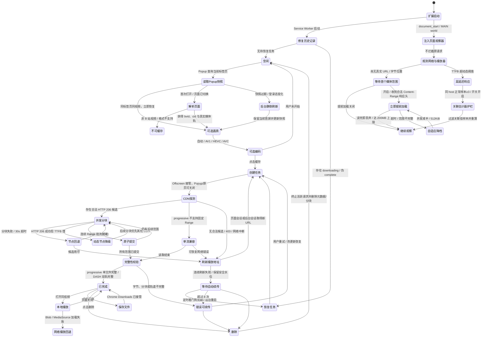

# bilibili 缓存插件

## 2.6.2 · Popup 稳定刷新与进度统计修复

详见 [Popup 稳定性设计与实现](docs/popup-stability-design.md)。

- 重做播放外观：常驻示意条与图例、已播放颜色、提前加载区分开关、预设/自定义、恢复默认；明确区分“配色示意”和真实进度。
- 片库按业务 ID 复用节点、按创建顺序稳定排列；保留 hover/focus/pending，过滤旧快照与删除后迟到数据。
- 保存/删除均为 32×32 纯图标按钮；下载向下单次动画与删除轻微反馈，支持减少动态。
- 下载统计增加确认落盘水位；事务完成前不发布成功，在途重试回滚不再减少“已缓存”。速度按时间平滑且数字单位保持单行，进度以浮点 transform 更新。
- 多任务徽标由完整任务集合派生，并在 SW 重启后从 IndexedDB 重建。
- 串行化播放配置写入；复现并修复连续失败回到旧乐观值的问题，改为回退最后确认配置。
- 新增 `npm run test:popup`、任务展示单元测试与事务失败测试，扩展实际重载测试覆盖徽标恢复；文档记录执行链、取舍、数据字段与验收方法。
- 公共 AGENTS 规则与 `../docs/realtime-ui-stability.md` 已同步到本目录两套扩展。无新增权限；版本更新至 2.6.2。
- 验证：语法检查与 108 项单元测试通过；Chromium 中持续刷新节点/焦点/动画、四种速度单位与进度中间帧、配置/保存失败、删除墓碑、双轨合并/音频提取均通过；生产扩展实际重载、注入哈希及数据库徽标恢复通过。

## 2.6.1 · 预热数据复用与黄色来源保留

完整过程已整理为[播放缓存的设计、原理与实现过程](docs/playback-cache-design.md)，包括根因、方案取舍、分段缓存算法、请求契约、生命周期、失败修正和可复现验收。最终独立复核为 102 项测试通过（含文档一致性测试）。

- 不再丢弃预热正文：新增 `src/playback-cache.js`，完整 Range 命中可由 fetch/异步 arraybuffer XHR 直接读取，缺失、取消、容量回收、签名/清晰度变化和导航走明确回退/清理路径。
- 用 SIDX v0/v1 与 hdlr 识别真实时间和音视频类型；只有双轨完整就绪交集才画黄色，未知索引不以字节比例替代。
- 未播放黄色优先于灰色，已播放颜色和原生滑块、布局与交互保持不变。
- 新增缓存单元测试及 `npm run test:playback` 双轨真实解码验收。首轮受控 180ms 网络延迟下，冷拖动约 203ms，fetch/XHR 命中约 13/15ms；这是本地夹具结果，不代表真实站点任意拖动零等待。
- 新模块随生产 MAIN manifest 注入，无新增权限，不进入持久化片库。保留原有未提交功能改动。
- 功能验收：`npm run check`、`npm test`（101 项）、`npm run test:playback`、`npm run test:extension` 均通过；拖动阶段冷路径 2 次网络请求，fetch/XHR 命中均为 0 次，并解码 38 帧。最终受控起播约 199ms → 13ms。
- 生产扩展在专用 Chromium profile 中实际加载、变更标记后 runtime.reload、刷新页面与 SHA-256 校验均通过；发布 zip 共 26 个文件，与 dist/unpacked 逐文件一致。没有在用户当前登录会话或任意真实 B 站视频上承诺同样耗时。

- 文档复核：新增 `tests/playback-documentation.test.mjs`，先复现旧说明失败，再修正 README 的灰色优先/字节估算描述，以及技术文档的缓存分层、启动窗口和已知边界；新增测试通过，`git diff --check` 通过。

> 下文保留历史版本的设计与问题记录；包含“丢弃正文”“按字节比例”等旧方案时，应按对应版本理解。当前行为以本页最新版本记录及 README / 技术文档为准。

## 注意事项

这个文件用于描述开发内容和细节，并且需要及时更新

选择合适的技术和编程语言进行开发，参考的代码和解决方案需要给出出处

## 背景说明

在海外使用bilibili网页版看视频的时候经常出现加载速度过慢的问题，推测是本地网络CDN并没有保存一些播放量较低的视频的数据，而一些播放量较高且时间比较近的视频则没有这样的问题，由此需要就这个问题开发出一款用于将视频缓存在chrome浏览器中的插件

## 工作原理

这个插件的原理是通过预先完全缓存需要看的整条视频，这样当需要看的时候就不必因为实时加载卡顿而烦恼了

## 要求

- [x] 拥有一个适合的图标，需要跟bilibili相关
- [x] 点击插件图标，有一个紧凑的圆角矩形按钮，点击后可以自动开始缓存当前访问的bilibili网站的视频，如果当前的网站不是bilibili则按钮变成灰色并且提示用户无法操作。点击开始缓存后，在按钮内显示缓存进度条和实时的下载速度。缓存完毕后按钮提示已经缓存完毕
- [x] 在下方提供一个列表，用于查看已经缓存的视频，可以对视频进行删除缓存的操作，点击跳转到播放该视频
- [x] 能否做到在原视频界面下通过缓存播放，以此来达到无感使用的目的？如果可以给出可行的技术方案；如果不可以，给出原因
- [x] 提供视频质量选项，默认选择当前账号能够访问的最高画质
- [x] 对需要登录或大会员的内容，尝试使用当前 Chrome 的 B 站 Cookie 访问，同时不展示、导出或持久化 Cookie 原始值
- [x] 提供自动/AV1/HEVC/AVC 编码选项；自动模式优先同画质下更低码率的可播放轨道
- [x] 增加播放侧 CDN 冷区间观测、受控预热、带宽估计器护栏和实时可观测面板
- [x] 预热区间使用无高光的纯色显示，支持持久化预设/自定义颜色，并在播放边缘与预热段相接时显示动态白色分界
- [x] Popup 按缓存、播放、片库划分互斥一级视图，低频设置按需展开，避免把全部内容纵向堆叠
- [x] 播放页只保留提前加载的开启 / 关闭；开启后在首个媒体范围响应头到达时立即衔接后续请求，不再显示或等待准备流程

## 技术路线总览

### 1. 扩展运行结构

项目采用 Chrome Manifest V3，按职责拆成五条运行链路：

| 运行环境 | 主要文件 | 职责 |
| --- | --- | --- |
| Popup | `popup.html`、`src/popup.js` | 以缓存、播放、片库三个互斥视图组织画质/编码、播放提前加载开关和本地视频；只负责交互，不承担长时间下载 |
| Service Worker | `src/background.js` | 消息路由、B 站视频信息解析、创建 Offscreen Document、徽标状态、热更新检查和重载后的任务恢复 |
| Offscreen Document | `offscreen.html`、`src/offscreen.js` | 持续下载、CDN 续传、MP4 或 DASH 双轨分块写入 IndexedDB、完整性校验，以及为本地播放组合 Blob |
| 隔离世界 Content Script | `src/content.js`、`src/playback-bridge.js` | 使用页面登录会话请求播放清单、恢复本地播放，并在 `chrome.storage` / Popup 与页面主世界之间只转发配置和汇总指标 |
| 页面主世界观察器 | `src/playback-observer.js` | 在 `document_start` 包装 XHR/fetch 与 Storage，观测播放器 Range TTFB、卡顿和缓冲；独立执行受控预热与关联估计器清洗，不拦截播放器响应 |

选择 Offscreen Document 的原因是 Popup 关闭后会被销毁，Manifest V3 Service Worker 也可能随时休眠；将长时间网络流和 IndexedDB 写入放在隐藏文档中，能避免用户关闭弹窗后下载立即中断。Service Worker 只保留可恢复的协调逻辑，不依赖常驻内存状态。

### 2. 页面识别与视频源选择

页面解析支持：

- 标准 `https://www.bilibili.com/video/BV...` 地址；
- 标准 `av...` 地址；
- 带 `bvid` 参数的稍后再看 `/list/watchlater` 页面；
- `?p=N` 分 P，缓存键包含 `bvid` 与当前分 P 的 `cid`，不同分 P 不会互相覆盖。

后台先请求 `https://api.bilibili.com/x/web-interface/view` 获取标题、作者、封面、分 P、时长与 `cid`。播放清单改用 `fnval=4048` 请求 DASH：优先让当前 B 站页面的 Content Script 发起带 `credentials: "include"` 的请求，使 `.bilibili.com` 登录 Cookie 按页面同源规则送往 `api.bilibili.com`；如果页面通道不可用，再回退到扩展 Service Worker 请求。

画质面板不能只相信 `accept_quality`。该数组可能声明 1080P60、1080P、720P，但匿名响应实际只下发 480P、360P 的 `dash.video`。v1.3.0 改为遍历真实 `dash.video` 表示，只保留具有 URL、MP4 MIME 和编码信息的画质，再按画质代码降序排列，第一项才是“最高可缓存画质”。v2.0.0 又在每档画质内生成实际编码选项：自动模式先过滤 Chrome MediaSource 不支持的表示，再按 `bandwidth` 从低到高选择，带宽相同才按 AV1、HEVC、AVC 排序；用户显式选 AV1/HEVC/AVC 时必须取得对应轨道，不允许静默换编码。音频轨仍选择可播放的高质量表示；单段 MP4 保留为 AVC 兼容回退。

### 3. IndexedDB 数据结构

缓存数据库名称为 `bili-buffer-cache`，当前 schema 版本为 1，包含两个对象仓库：

- `videos`：v1.1 旧缓存继续使用 `${bvid}:${cid}`，v1.3–v1.7 使用 `${bvid}:${cid}:q${quality}`；v2.0 新任务扩展为 `${bvid}:${cid}:q${quality}:c${codecPreference}`，不同画质/编码可以共存；已有 ID 不改名；
- `chunks`：以 `[videoId, track, index]` 为复合主键保存二进制 Blob 分块。

媒体主路由 v1.6.0 起使用 2 MiB 固定 Range 分块；不支持固定 Range 的 progressive 兼容回退仍按约 4 MiB 流式块写入。视频元数据中的关键字段包括：

| 字段 | 含义 |
| --- | --- |
| `status` | `downloading`、`error` 或 `complete` |
| `downloadedBytes` | 当前界面可见的实时接收字节数，可能包含尚未落盘的内存数据 |
| `resumeBytes` | 已经作为完整 Blob 分块提交到 IndexedDB 的安全续传位置 |
| `totalBytes` | 播放接口或 `Content-Range` 报告的完整媒体大小 |
| `chunkCount` | 已经落盘的连续分块数 |
| `quality` / `qualityLabel` | B 站清晰度代码及界面标签 |
| `requestedQuality` | 用户明确选择的画质；恢复任务时继续请求同一画质 |
| `codec` / `codecLabel` | 实际落盘视频轨的编码族及界面标签；旧记录缺失时从轨道 `codecs` 推断 |
| `requestedCodec` | 用户的自动/AV1/HEVC/AVC 选择；恢复任务时不把显式编码静默替换 |
| `mediaKind` | `progressive` 或 `dash`；旧记录缺失时按 progressive 兼容 |
| `tracks.video` / `tracks.audio` | DASH 各轨的编码、表示身份、字节数、分块数和安全续传位置 |
| `progress` / `speed` | 弹窗进度条和实时速度所需数据 |
| `autoRetryCount` / `nextRetryAt` | v2.2.0 的持久自动续传次数与下次唤醒时间；Service Worker 重启后仍可恢复等待状态 |
| `ownerId` / `ownerUrl` | UP 主数字 ID 与 B 站空间地址；v1.5.0 新增的可选元数据，旧记录缺失时不影响缓存读取 |
| `downloadMetrics` | v2.0.0 记录并发、分块、CDN 主机、请求/重试、慢请求、主动切换、TTFB p50/p95、正文吞吐、网络字节和 IndexedDB 写入耗时；不记录签名 URL 或 Cookie |

这里刻意区分 `downloadedBytes` 与 `resumeBytes`。并发时后面的 Range 可能先完成，它们会暂存内存并计入实时 `downloadedBytes`，但只有从当前水位开始连续的分块才能进入同一个 IndexedDB 事务，连同 `videos` 元数据一起提交并推进 `resumeBytes`。热更新或崩溃后仍只从 `resumeBytes` 继续，不会因为乱序完成而在文件中留下缺口。

插件申请 `unlimitedStorage`，并在 Offscreen Document 初始化时尝试调用持久化存储 API。视频数据不写入 `chrome.storage`，避免把大二进制对象放入更适合配置项的小型键值存储。

### 4. CDN 下载与断点续传

下载流程如下：

1. 通过页面登录会话读取最新 DASH / MP4 播放地址；
2. progressive 检查画质和总大小；DASH 逐轨检查 `representationId + codecid + codecs` 身份；
3. 从主 URL 和最多两个备用 URL 各取 64 KiB 固定 Range 并行探测，仅接受起点、终点和总大小合法的 HTTP 206；排序采用端到端有效吞吐，同时独立记录响应头到达时间（TTFB）与正文读取吞吐；单个探测 8 秒超时，不让卡死节点拖住任务；
4. 单文件 progressive 使用 3 路并发；DASH 视频轨与音频轨同时下载，视频轨 2 路、音频轨 1 路，保持全局最多 3 个主动媒体连接；
5. 每个请求使用精确的 `Range: bytes=<start>-<end>`，默认分块 2 MiB；完整校验 HTTP 206、`Content-Range`、总大小和实收字节数；
6. 某个分块失败或 30 秒无法完成时，保持相同起止范围切换到下一个 CDN；HTTP 206 成功但 TTFB 高于 `max(800ms, 该节点热 TTFB 中位数 × 6)` 时不浪费已到手分块，但将该节点降级，让后续分块先尝试其他候选；接收了但失败的字节会从界面临时进度回滚；
7. 乱序完成的分块先留在内存，只将从当前 `resumeBytes` 连续延伸的一批块写入数据库；`chunks` 与新 `resumeBytes` 在同一个读写事务中原子提交；
8. 界面状态仍最快每 450 ms 广播，普通元数据持久化降频到约 1500 ms；完整分块提交不受该降频影响；
9. 如果 progressive CDN 根本不支持固定 HTTP 206，回退到旧的单流兼容路线；其他错误保留最后已原子提交的安全水位；
10. 遇到 HTTP 403、408、425、429、5xx、网络中断、超时或响应体提前结束时，先刷新播放地址并从已持久化的 `resumeBytes` 续传；连续刷新仍失败则写入带退避时间的 `downloading` 状态，由 `chrome.alarms` 看门狗再次接管，最多自动重试 8 次；
11. progressive 要求完整单文件；DASH 要求视频轨和音频轨分别完整，才允许把聚合状态改成 `complete`。

兼容回退路线如果续传请求意外收到 HTTP 200，会先清空旧块和续传位置，不会把完整文件错接在已有分块之后。并发主路对 HTTP 200、响应长度、`Content-Range` 起点/终点或总大小不一致都会拒绝提交，不会标记完成。

### 5. CDN 防盗链请求头

目标视频的 CDN 地址在缺少 B 站来源头时会返回 HTTP 403。扩展使用静态 `declarativeNetRequest` 规则，在请求真正发送前设置：

```text
Referer: https://www.bilibili.com/
```

规则同时限制：

- 发起者必须是固定 ID `ppoagkhgdcfchiodhgadpenibndbnhcj` 的本扩展；
- 目标域名只能是 `bilivideo.com` 或 `akamaized.net`；
- 资源类型只能是扩展发起的 `xmlhttprequest`。

因此不会修改用户访问其他网站时的普通请求，也不会全局伪造 Referer。固定 Manifest 公钥既用于稳定扩展 ID，也保证 DNR 的 `initiatorDomains` 在热更新后仍然匹配。

### 6. 登录态与大会员访问

Manifest 增加 `cookies` 权限，但读取范围仍受已有 `https://*.bilibili.com/*` 主机权限限制。Service Worker 只调用 `chrome.cookies.get()` 检查当前 Chrome 的 `SESSDATA` 是否存在，然后把“是否检测到会话”这个布尔状态交给下载模块；Cookie 值本身不会经扩展消息发送，不会写入 IndexedDB，也不会显示在 Popup 或日志中。

视频信息请求仍可由 Service Worker 完成；播放地址请求优先发送给当前 B 站 Content Script，由页面源调用 `api.bilibili.com`。该接口响应允许 `Origin: https://www.bilibili.com` 且支持 credentials，因此 HttpOnly 登录 Cookie 不需要也不应该由扩展手工拼接。所有请求使用 `cache: "no-store"`，避免把匿名响应复用成登录响应。播放接口返回的 `vip_status` / `vip_type` 只用于提示，最终权限以实际返回的 DASH 表示为准。

此方案的边界是“使用用户已经拥有的权限”，不是绕过权限：没有登录、会话过期、账号不是大会员、内容需要额外付费、存在地区限制或 B 站拒绝扩展请求时，插件会显示明确错误。扩展不会手工拼接 Cookie 请求头，也不会把 `SESSDATA` 提供给第三方程序。

### 7. 播放侧 CDN 预热与带宽估计器护栏

v2.0.0 参考 BiliLoader 对海外 CDN 冷命中的实测结论，但没有直接把固定参数照搬为不可变常数，而是将“完整离线缓存”和“当前播放加速”做成互补的两条链路。

`src/playback-observer.js` 以 Manifest `world: "MAIN"`、`run_at: "document_start"` 注入，原因是播放器创建 XHR 和读取本地带宽估计发生得很早，隔离世界无法直接包装页面原生对象。它对播放器请求只做以下被动观察：

1. 包装 `XMLHttpRequest.open / setRequestHeader / send`，只处理带 `Range` 且 host 属于 B 站媒体 CDN 的请求；`readyState=2` 记录响应头 TTFB，`loadend` 记录正文长度与总耗时；
2. 对 `fetch` 只记录响应头，不 `clone()` 或二次读取播放器 body，避免额外内存和网络路径干扰；
3. 以 `host + pathname` 识别媒体轨。pathname 可跨签名续期保持稳定，但 host 必须保留，因为不同海外边缘节点的缓存热度不能互相冒充；
4. 观察页面 `<video>` 的播放、waiting/stalled、缓冲区间和标签页可见性；只向隔离世界发送主机级 p50/p95、慢请求数、卡顿、缓冲秒数、预热 MB 等聚合数据，不发送签名 URL、Cookie 或媒体正文。

v2.0.0 至 v2.4.0 曾把累计播放 20 秒、已经出现慢 TTFB、标签页可见和本地播放余量至少 10 秒设为自动预热闸门，用于减少健康链路上的额外流量。v2.5.0 根据实际使用目标取消这些人为等待：开关开启时，XHR 在 `readyState=2`、fetch 在 Promise 返回响应对象时读取首个合法 `Content-Range`，直接以该响应末尾的下一字节作为提前加载起点；400 ms 调度器随即可以请求后续范围，不等待首个响应正文读完。前方窗口仍按“媒体总字节 / 视频时长 × 45 秒”估算并限制在 8–48 MB；初始 512 KiB × 2 路，成功较快时加性提高到 1 MiB / 最多 4 路，失败时并发减半并退回 512 KiB。单轨仍最多额外读取 200 MB，连续错误使用 2–30 秒指数退避，6 次仍失败则关闭该轨，避免对永久失效地址无限重试。每次必须收到合法 HTTP 206、匹配的 `Content-Range` 和完整字节数，body 读完后立即丢弃；提前加载的目的是促使边缘节点回源，不把这份数据写进播放器或片库。

带宽估计器仍针对 `localStorage["bilibili_dash_throughput_lru_v1"]`，但不使用 BiliLoader 的固定 8000 kbps 下限。v2.0.0 为每个 CDN 收集热请求正文吞吐；至少有 3 个样本后取 p25 的 55%，并限制为 1000–12000 kbps，作为当前设备/线路的动态下限。只有同 host 在最近 15 秒刚发生冷命中时，才过滤低于下限的样本、重算 p25/p50/ewma，并把异常延迟限制到热 TTFB 推导出的上限。没有热基线、无关联慢请求、其他 host、非法 JSON 和普通 localStorage key 都原样保留。底层保留旧版备份 / 恢复命令以兼容既有实现，v2.5.0 的精简 Popup 不再显示手动入口。

页面主世界不能使用 `chrome.storage`，因此 `src/playback-bridge.js` 运行在 ISOLATED world，只负责从 `chrome.storage.local["playbackAssistConfigV1"]` 读取配置、通过 `window.postMessage` 下发，并把聚合统计保存在该标签页内存中供 Popup 查询。v2.5.0 的界面只公开“开启 / 关闭”：底层以 `always` 表示开启、`off` 表示关闭，并把旧 `auto` / `always` 规范为开启、旧 `observe` / `off` 规范为关闭，不建立新存储键或迁移 IndexedDB。v2.3.0 加入的 `preheatColor` 继续原位使用，缺失时补入默认橙色 `#ff8a1f`。关闭 Popup 不会停止页面观察或提前加载，关闭视频标签页则自然终止这条页面内链路，不影响已交给 Offscreen 的完整缓存任务。

### 8. 本地播放路线

本地播放保留两条兼容路线：

1. Content Script 在页面加载或收到 `CACHE_READY` 后询问后台当前 `bvid + cid` 是否存在完整缓存；
2. progressive：Offscreen Document 验证并组合 `media` 分块，Content Script 读取 Blob 后创建页面同源 URL；
3. DASH：Offscreen Document 分别验证并组合 `video` / `audio` Blob，返回两个扩展 Blob URL 及 MIME/codec；
4. Content Script 读取两个 Blob 为 ArrayBuffer，创建页面 `MediaSource`；
5. 为视频轨和音频轨分别创建 SourceBuffer，追加完整的 fragmented MP4，全部 `updateend` 后调用 `endOfStream()`；
6. 两条路线都复用原 `<video>`，恢复切换前的播放时间、暂停状态、静音、音量和倍速；
7. `loadedmetadata` 成功后记录 `playbackState=local`，并把工具栏徽标改为“本地”。

两条路线都会在播放前把完整媒体复制到页面进程，DASH 还需要两份 ArrayBuffer，因而高画质视频的临时内存开销更明显。缓存仍由 B 站原播放器元素播放，所以控制条、宽屏、倍速和弹幕时间轴仍在原页面中。

### 9. 开发态热更新、发布构建与数据连续性

运行 `npm run dev` 后，本地服务只监听 `127.0.0.1:17321`。它通过文件系统监听 JS、JSON、HTML、CSS、PNG 与 SVG 的变化，并在 `/health` 返回递增修订号。最初把 750 ms 轮询器放在 MV3 Service Worker 中，但后台空闲休眠后定时器会停止，因此出现“服务正常、文件已变、浏览器却没有自动加载”的假热更新。v2.0.0 改由开发版 Offscreen Document 持续轮询；它只使用 Offscreen 可用的 `chrome.runtime` 通知后台。后台先把待刷新修订写入可跨 `runtime.reload()` 保留的 `chrome.storage.local`，再重载扩展。新 Service Worker 启动后消费并删除标记，只刷新匹配 `www.bilibili.com/video/*` / `list/*` 的现有标签页，使新增或修改的普通 Content Script 以及 MAIN/ISOLATED `document_start` 脚本真正重新注入；其他网站标签页不动。

由于旧热更新器自己已经可能处于休眠状态，从旧实现升级到这一版时必须在扩展管理页手动重新加载一次；新版代码启动 Offscreen 监听器后，后续改动不再需要重复手动操作。本轮真实 Chrome 已确认普通 Content Script、MAIN 与 ISOLATED 三条注入链在 v2.0.0 页面共同运行；新的“Offscreen 发现修订 → 后台写入 local → runtime 重载 → 消费标记并刷新标签页”链路另用两项隔离回归覆盖。浏览器集成测试仍验证 Popup 即时恢复、后台快照以及 11,534,546 字节双轨下载。

热更新的连续性依赖以下约束：

- Manifest 中保存固定公钥，扩展 ID 不变；
- IndexedDB 属于扩展 ID 对应的固定源，代码重载不会删除数据库；
- Service Worker 启动时扫描 `status=downloading` 的任务并重新创建 Offscreen Document；
- 开发态扩展重载后自动刷新已打开的 B 站视频页；页面刷新会打断当下播放，但不会删除片库或安全续传水位；
- 如果发现历史记录写成 `complete` 但实际字节数不等于 `totalBytes`，先降级为下载任务，再从安全分块自动续传；
- 下载恢复时优先向 B 站播放接口刷新 URL；如果原标签页已经关闭或页面会话不可用，则由扩展后台使用当前 Chrome 登录会话请求播放清单，再以任务开始时保存的 CDN 候选地址作为最后回退。候选地址不含 Cookie；地址过期、限流或临时断网时会保留安全水位并进入持久自动续传，不再要求原页面保持打开。

热更新服务仅用于本地开发。v2.0.0 增加 `npm run build`：复制运行所需文件到 `dist/unpacked`，从发布版后台剥离 `startDevReload` 导入/调用，删除 `src/dev-reload.js` 和 `http://127.0.0.1/*` 权限，校验 Manifest 引用文件后生成根目录结构正确的 zip。开发目录不被改写；固定公钥、IndexedDB 名称/schema 和所有旧缓存键保持不变。

### 10. Popup 画质、编码、辅助面板与状态刷新

Popup 每 700 ms 拉取一次本地片库，以显示下载字节、速度和完成状态。画质菜单不能因此被重新创建：v1.5.0 使用 Chrome 116 已支持的 Popover API，把选项放在浏览器顶层弹出层中，避免被圆角外壳的 `overflow: hidden` 裁切；触发按钮和菜单项都由扩展自己的 HTML / CSS 绘制，不再依赖不同系统外观不一致的原生 `<select>`。

Chrome 工具栏 Popup 关闭后会销毁其 Document，无法让 DOM 本身常驻。v1.7.0 将“已加载状态”移到 Popup 之外：Service Worker 按“标签页 ID + 视频/分 P”维护不含媒体 URL 与 Cookie 原文的界面快照，同时写入 `chrome.storage.session`。追踪参数、播放时间和 `vd_source` 变化不会造成错误失效；切换视频、分 P 或标签页时必须重新解析，不会闪现上一个视频的信息。

首次打开同一视频时，后台将视频信息和画质解析合并为一条链路，从原来的两次 `view` + 一次 `playurl` 减少为一次 `view` + 一次 `playurl`。后续打开在 30 分钟有效期内直接恢复快照，不请求 B 站接口；超期时也先显示旧快照，再静默刷新。`SESSDATA` 变化会立即将快照标记为过期，但不删除首屏；用户在静默刷新期间刚选的画质以最新选择为准，不会被较早发出的请求覆盖。

片库列表改为 Service Worker 直接读取共享 IndexedDB，不再为仅查看列表创建 Offscreen Document。正在下载的任务仍由 Offscreen 广播实时状态，快照只用于标题、画质、选择和登录提示的首屏恢复，不参与下载续传水位和完成判定。

画质项会生成只包含“画质代码 + 显示文字”的稳定签名。片库轮询只更新下载状态时，签名不变，现有菜单节点、展开状态和焦点都保留；只有 B 站实际返回的画质集合改变时才重建选项。用户点击或通过方向键、Home、End、Enter 选择后，`selectedQuality` 立即更新，随后再按该值寻找同画质缓存并提交缓存任务。下载进行中会禁用并收起菜单，避免切换到与当前任务不同的轨道。

视频信息接口同时返回 `owner.mid`。后台只保存数字 ID 和标准 `https://space.bilibili.com/<mid>` 地址，Popup 当前视频区与新写入片库记录中的 UP 主名称都可打开对应空间；旧缓存没有作者 ID 时仍可显示作者名称和继续播放、保存或删除。

### 11. 播放器进度条中的预热区间

B 站原生进度条用亮灰色表示播放器已经写入 MediaSource 的本地内存缓冲，深灰色表示尚未缓冲。插件预热则是另一种状态：Range 正文读完后立即丢弃，留下的是特定 CDN host 的边缘缓存副作用，不能修改 `HTMLMediaElement.buffered`，也不应伪装成原生灰色缓冲。

v2.1.0 在 MAIN world 为每条媒体轨新增独立的 `prefetchedRanges`，只在插件预热请求收到合法 HTTP 206、范围一致且正文完整后写入；播放器自己的请求仍只进入 `covered`，不会被误标成插件贡献。预热字节区间按 `start / totalBytes`、`end / totalBytes` 映射成 0–100% 的近似时间轴比例。v2.2.0 进一步发现旧版显示的是各轨范围的并集，音频单轨成功也会把该比例段画蓝；现改为只显示当前 DASH 视频轨与音频轨的交集，单文件 MP4 仍直接显示自身范围。由于媒体可能是可变码率，这只是位置近似值，而不是精确秒数。

页面观察器按照真实 B 站 DOM 同时覆盖两处：展开控制栏时的 `.bpx-player-progress-schedule` 和控制栏隐藏时的 `.bpx-player-shadow-progress-schedule-wrap`。v2.3.0 去掉色段原有的顶部内阴影，改为不透明纯色；默认橙色 `#ff8a1f`，Popup 提供橙、黄、青、蓝、紫、粉六种预设和浏览器调色器，选择经 Service Worker 持久化后由 ISOLATED bridge 同步到 MAIN world。层级高于灰色 buffer、低于当前播放进度；覆盖层 `pointer-events: none`，不会抢走拖动、点击跳转或悬停预览。B 站重建播放器 DOM 时 750 ms 内自动补回；SPA 切换视频时清空旧轨道和色块；同 pathname 切换 CDN host 时只把最新 host 标为活动轨道，避免把另一个边缘节点的预热误显示为当前节点可用。

v2.3.1 修复多分段时间轴：B 站会为章节/分段分别创建多个 `.bpx-player-progress-schedule`，旧代码把全片归一化区间原样注入每一个节点，因而每段都出现相同比例的橙色块。新实现按同一主进度条或影子进度条分组，读取各子段实际宽度，建立互不重叠的全片起止比例；随后对全片预取范围求交并换算到段内坐标。没有交集的子段不创建覆盖层，白色播放分界也只投影到当前播放位置所属的子段。

为了区分已经播放的原生色块与其前方相接的插件预热段，v2.3.0 另放置一个独立的 2 px 白色竖线：用活动 `<video>` 的 `currentTime / duration` 取得播放边缘，每约 33 ms 更新一次 `translate3d()`，只在该比例位于预热交集内或距离边界不超过 0.2% 时显示。使用 transform 而不是持续改写 `left` 或色段宽度，避免每帧触发布局；进度条处于 `:hover` 或 `:focus-within` 时用 CSS 隐藏白线，不干扰用户拖动与悬停预览。白线只是播放/预热状态的视觉分界，不改变预热数据或播放器进度。

### 12. 整体运行时状态图



热更新是与上述业务状态并行的运行事件：修订号变化后先持久化待刷新标记，再执行 `chrome.runtime.reload()`；新 Service Worker 从最后原子提交的 `resumeBytes` 重新进入“恢复任务”，并刷新现有 B 站视频页以重新注入页面脚本。两步都不清除 IndexedDB。

## 遇到的问题与解决过程

### 问题一：目标视频下载立即返回 HTTP 403

**现象**：`BV1Kg8t6NEmN` 点击缓存后显示“CDN 下载失败（HTTP 403）”。

**复现**：对播放接口返回的同一个签名 CDN URL 请求 `bytes=0-31`：

- 不带 B 站 Referer：HTTP 403，返回 nginx 错误页；
- 带 `Referer: https://www.bilibili.com/`：HTTP 206，返回正确的 32 字节范围。

**根因**：该 CDN 节点启用了来源校验，而扩展 Offscreen Document 的 `fetch()` 默认不会自动带上 B 站页面 Referer。

**修复**：增加范围严格受限的 DNR `modifyHeaders` 规则，由浏览器在请求发送阶段补充 Referer。修复热加载后，同一视频从 0% 正常开始下载，确认越过 403。

### 问题二：零字节错误任务进入“已缓存”片库

**现象**：请求在收到第一个媒体字节前就失败，但元数据已经写入 `videos`，Popup 按“存在记录”把它显示在本地片库中。

**根因**：任务状态和可用缓存被当成同一个概念，没有区分“当前视频的失败重试入口”与“片库中的真实本地数据”。

**修复**：

- 当前视频卡片仍显示错误和“继续 / 重新缓存”，用户无需先删除记录；
- 片库使用 `shouldShowInLibrary()` 过滤：错误任务只有 `resumeBytes > 0` 时才显示；
- 零字节错误不会计入片库数量和容量；已有真实分块的错误任务继续显示，便于续传或删除。

### 问题三：热更新后 11.7 MB 被错误标记为完整 78.1 MB

**现象**：下载到约 13% 时触发热更新。扩展恢复后，当前按钮一度显示“已缓存完成，78.1 MB”，但片库实际只统计 11.7 MB。

**根因**：B 站 CDN 即使收到开放式 `Range: bytes=<offset>-`，也可能只返回几 MiB 的 HTTP 206 响应。旧逻辑用“这次响应流结束”代表“整个文件结束”，并用 `offset + Content-Length` 计算总大小，因此把 CDN 的一个短分段误认为完整媒体。

**修复**：

- 解析 `Content-Range` 的 `start`、`end` 与完整 `total`；
- 验证响应起点必须等于请求偏移，实际读取长度必须等于该响应声明的范围；
- 如果 `end + 1 < total`，自动从下一偏移继续请求同一 CDN；
- 完成状态同时要求实际字节数等于播放接口给出的预期大小；
- Service Worker 启动时自动修复历史上的“元数据 complete、字节数不完整”记录并继续下载。

Chrome 实测该错误记录被自动识别，从已有安全分块继续，依次观察到 23.0 MB、44.0 MB、62.5 MB、77.0 MB，最终达到完整 81,871,821 字节。

### 问题四：热更新时最后一段内存数据可能消失

**现象**：下载进度可能已经显示 10.5 MB，但数据库中只有两个完整 4 MiB 分块。若此时扩展重载，剩余约 2.5 MB 尚在内存中。

**根因**：界面接收进度与 IndexedDB 事务提交进度不同。直接从 `downloadedBytes` 续传会跳过没有落盘的尾部。

**修复**：新增并严格使用 `resumeBytes`。进度条可以显示实时 `downloadedBytes`，但重启只从最后一个成功提交的完整分块继续。重复下载少量尾部比产生永久文件空洞更安全。

### 问题五：跨源 iframe 播放桥收不到消息

**最初方案**：在 B 站页面插入隐藏的 `chrome-extension://.../playback-bridge.html` iframe，让 iframe 读取扩展 IndexedDB，再通过 `postMessage` 把 Blob 传给 Content Script。

**现象**：iframe 一直停在 loading。Chrome 错误页记录：目标源设置为扩展源，但接收窗口当时仍被识别为 `https://www.bilibili.com`。后续加入 load 事件、就绪握手、随机令牌和经典脚本引导，仍无法在 B 站隔离世界中稳定完成通信。

**根因**：Content Script 的隔离世界、iframe 初始 `about:blank` 窗口、扩展源导航和 `WindowProxy` 身份之间存在不稳定时序；即使加握手，也不能把本地播放建立在这种浏览器实现细节上。

**处理**：彻底移除 iframe 和 `web_accessible_resources`，改为 Offscreen Document 组合 Blob，再通过后台返回 Blob URL 字符串。

### 问题六：网页不能直接播放扩展源 Blob URL

**现象**：Content Script 把 `blob:chrome-extension://...` 直接赋给 B 站 `<video>` 后，元素触发 error；B 站播放器随后自动恢复为自己的网络 MediaSource。调试时曾看到 `marker=local`，但页面状态已经变成 error，说明只看标记不足以证明本地播放成功。

**根因**：Blob URL 绑定创建它的源和存储分区。B 站页面不能稳定读取由扩展源创建的媒体 URL。

**修复**：Content Script 先 `fetch()` 扩展 Blob URL，校验 Blob 大小，再在页面上下文创建新的对象 URL。最终 URL 形如 `blob:https://www.bilibili.com/...`，与页面播放器同源。只有 `loadedmetadata` 成功后才把状态设为 local；媒体 error 会清除本地标记并保留网络播放作为回退。

### 问题七：片尾自动连播干扰验证

**现象**：目标视频历史进度接近结尾，等待本地 Blob 组合时页面自动跳到推荐视频，读取到的时长变成约 735 秒，造成一次无效验证。

**处理**：最终回归使用目标地址加 `?t=1` 从开头打开，同时核对当前 URL、`bvid`、视频时长、本地状态和就绪状态，避免只凭当前 `<video>` 是否为 Blob URL 下结论，因为 B 站网络播放器本身也使用 Blob MediaSource。

### 问题八：指定高画质可能被接口静默降级

**现象**：B 站播放接口即使收到较高 `qn`，在未登录、会员失效或该格式不可用时，也可能以 `code=0` 返回较低的 `data.quality`。如果只判断请求成功，界面会声称缓存了用户选择的画质，实际文件却更低。

**处理**：画质选择来自当前会话的 `accept_quality`；真正开始任务后再次请求并严格比较“请求画质”和“实际画质”。不相等时停止任务并给出登录/会员提示。断点续传还要求已有记录的 `quality` 与新媒体源完全一致，否则先清除不兼容分块，防止两个清晰度被拼接。

### 问题九：Offscreen Document 不能直接使用 Cookies API

**现象**：Offscreen Document 适合长时间下载，但 Chrome 对它开放的扩展 API 很有限，不能把 `chrome.cookies` 读取逻辑放在该文档中。

**处理**：由 Service Worker 读取 `SESSDATA` 是否存在，只传递布尔状态；v1.3.0 起播放清单优先由 B 站 Content Script 使用页面会话请求，Offscreen Document 只接收已解析的媒体清单并负责 CDN 下载。这样既符合运行环境限制，也避免 Cookie 原始值跨上下文传播和落盘。

### 问题十：v1.2.0 的“最高画质”实际仍停在 720P

**用户复验**：画质选择器没有默认到真正最高画质，大会员登录后能够观看的更高画质也没有出现。

**根因一**：v1.2.0 仍使用 `fnval=1` 请求 progressive MP4。这种响应在目标视频上只提供 720P、360P；1080P60、1080P、4K 等主流高画质实际位于 `dash.video`，因此仅增加选择器无法取得它们。

**根因二**：画质列表使用 `accept_quality`，但该字段可能声明并未实际下发的档位。匿名 DASH 实测声明 `[116, 80, 64, 32, 16]`，实际视频表示只有 480P 和 360P。直接展示声明值会制造又一个“看似最高、实际无法缓存”的错误。

**根因三**：扩展源 `fetch(credentials: "include")` 是否获得页面会话受请求来源和 Cookie 规则影响；仅检测到 `SESSDATA` 存在，不等于这次播放地址请求已经以页面登录态完成。

**v1.3.0 修复**：播放清单切换到 `fnval=4048`，并由当前 B 站 Content Script 优先发起带 credentials 的请求；画质列表只取实际返回的 DASH 视频表示。缓存层加入视频/音频双轨、独立范围续传与完整性校验；播放层加入双 SourceBuffer MediaSource。新画质使用独立 `:q<quality>` 缓存键，旧 720P 不再锁住默认选择，也不会在下载高画质时被覆盖。

### 问题十一：展开画质选项时偶发没有反应或切换失败

**现象**：原生画质选择框有时可以正常选择，有时点击选项后界面仍显示旧画质，或者展开的系统选项突然消失，看起来像点击没有反应。

**复现条件**：Popup 打开后每 700 ms 执行一次 `LIST_VIDEOS`。每次请求完成都会调用 `renderCurrent()`，旧版 `renderQualityControl()` 又无条件执行 `replaceChildren()`，删除全部 `<option>` 后重新创建。只要轮询响应恰好落在用户展开原生选择框到提交 `change` 事件之间，正在操作的 `<select>` 内部选项就被替换；浏览器原生弹层会关闭，或者将选择结果落到已经失效的节点上。

**根因**：下载状态是高频变化数据，画质集合是低频稳定数据；旧实现把两者绑定到同一次破坏性渲染中。问题不是 B 站拒绝了某个画质，也不是 `START_CACHE` 没有读取选中值，而是 Popup 自己在交互过程中销毁了原生控件状态。

**v1.5.0 修复**：改为自定义 Popover 下拉菜单，并按画质项稳定签名决定是否重建。下载进度刷新只更新按钮和提示，不替换菜单 DOM；选择后先更新内存中的 `selectedQuality`，再刷新当前卡片。实测菜单展开 1.7 秒、跨过至少两次 700 ms 轮询后仍保持展开；选择 720P 后再等待 1.7 秒仍显示 720P。鼠标选择及方向键、Home、End、Enter、Escape 均可操作。

### 问题十二：重复启动热更新服务后出现空转进程

**现象**：同一项目重复执行 `npm run dev`，第二个服务正确收到 `EADDRINUSE`，但对应的 Node 进程仍然存在。端口仍由第一个服务正常监听，因此功能看起来没有异常，却会留下无用的文件监听器。

**根因**：端口错误处理只设置了 `process.exitCode = 1`。此时 HTTP Server 没有监听成功，但已经创建的递归文件监听器仍持有事件循环，Node 不会自动退出。

**v1.5.0 修复**：在 `EADDRINUSE` 分支先关闭文件监听器，再保留非零退出码。回归时再次执行 `npm run dev`，副本打印“热更新服务可能已经启动”后以退出码 1 立即结束；已经占用 17321 端口的正常服务继续监听，不再留下长期空转进程。

### 问题十三：缓存吞吐量偏低的性能分析

**现象**：缓存能够稳定进行，但界面显示的下载速度低于用户对当前网络带宽的预期，高画质 DASH 完成时间尤其明显。

**v1.5.2 旧链路的主动取舍**：下载器以正确续传优先，每条媒体轨只打开一个 CDN 流，按连续偏移顺序读取；每累计约 4 MiB 等待一次 IndexedDB 分块事务，每约 450 ms 等待一次视频元数据事务。DASH 还使用 `for...of + await` 依次下载视频轨和音频轨。主 CDN 只有发生错误时才尝试备用 URL，不会因为“能下载但速度慢”主动换节点。这套路线容易证明 `resumeBytes` 连续、`Content-Range` 正确和最终字节完整，但没有利用多连接带宽，并会把数据库事务延迟纳入下载墙钟时间。

**可能的外部瓶颈**：签名播放地址已经由 B 站选择 CDN，海外线路的节点距离、晚高峰拥塞、运营商跨境路由或 CDN 对单连接的限速都不受扩展直接控制。高画质文件更大只会延长完成时间，不必然说明扩展吞吐变差；同时缓存多个视频还会共享同一网络带宽。

**实施前的可行优化清单**：

1. 将进度广播与持久化解耦：界面仍可约 450 ms 更新，但小型元数据只每 1–2 秒或在完整分块落盘后提交；`resumeBytes` 继续只指向已提交分块。风险低，预期收益有限到中等。
2. 并行下载 DASH 视频轨与音频轨：两个轨道本来就使用独立的 IndexedDB 键，可以并行网络读取；但必须由单一协调器合并两边状态，不能让两个异步任务互相覆盖同一条 `videos` 元数据。风险中等，音频轨占比较小时总收益有限；若 CDN 按连接限速则收益更明显。
3. 对主 URL 和备用 URL 做短时测速或持续低速切换：在相同安全偏移处比较候选 CDN，只保留最快且返回合法 `Content-Range` 的连接。可以改善节点选错，但会增加少量重复流量，且签名 URL 可能同时受同一上游限速。
4. 为单轨增加 2–4 路固定范围并发：把媒体切为有明确起止位置的 Range 段，并行请求、逐段校验；完成段可按索引写入，但只有从零开始连续存在的段才能推进安全续传水位。这是最可能突破单连接限速的方案，也是改动最大的方案，必须补充乱序完成、某段失败、备用 CDN、热更新恢复、删除中止和最终拼接顺序测试。

**v1.6.0 实施结果**：按上述顺序完成了受控并发实现。进度广播保持约 450 ms，普通元数据持久化改为约 1500 ms；DASH 视频/音频轨并行，但总连接限制为 2+1；CDN 候选先用 64 KiB 范围探测并排序；正式下载采用 2 MiB 固定 Range，progressive 默认 3 路并发。分块请求失败或 30 秒超时时按同一范围切换备用 CDN。

**4 MiB 实测问题**：对目标视频的匿名 DASH 轨做短范围测试时，4 MiB 请求两次在约 3.5–3.99 MiB 后被对端关闭，Node 网络层报 `UND_ERR_SOCKET` / `terminated`。这不是 HTTP 403，而是响应体未读完时的连接中断；新下载器会回滚该尝试的临时进度并切换候选，不会提交半块。为降低这类中途断开的成本，最终默认分块收紧为 2 MiB。

**真实 CDN 速度对比**：2026-08-23 对 `BV1Kg8t6NEmN` 公开匿名播放清单中实际可用的 480P AVC 视频轨测试，媒体总大小 42,214,618 字节；使用同一优选节点读取 3 个 2 MiB 范围，顺序请求为 16.55 Mbps，3 路并发为 50.21 Mbps，该次样本提速 3.03 倍，两轮均未发生候选重试。这是当时网络与 CDN 的短样本，不保证所有视频和时段都有同样倍数。

**浏览器完整性回归**：在真实 Chrome IndexedDB 中用确定性假 CDN 完整执行 Offscreen 任务，视频轨 9,437,321 字节分成 5 块，音频轨 2,097,225 字节分成 2 块；乱序并发后组合结果逐字节一致，指标显示视频轨 2 路、音频轨 1 路，且优先选中模拟的更快备用 CDN。

### 问题十四：`Failed to execute 'fetch' on 'Window': Illegal invocation`

**现象**：v1.6.0 热更新后开始缓存，任务在 CDN 探测或固定 Range 请求前立即失败，界面显示 `Failed to execute 'fetch' on 'Window': Illegal invocation`。

**根因**：为了在单元测试中注入假网络实现，并发下载器使用了 `const fetchImpl = options.fetchImpl || fetch`。这会把浏览器原生 `Window.fetch` 取出为脱离所属对象的普通函数；某些 Chrome 执行上下文会对 Web API 进行接收者校验，不以 `Window` 为调用者时抛出 `Illegal invocation`。旧下载路线直接写 `fetch(...)`，因此之前没有这个问题。

**v1.6.1 修复**：默认路线不再保存脱离上下文的原生函数，而是经由 `platformFetch(...args) { return globalThis.fetch(...args); }` 调用，确保 `fetch` 始终以当前全局 `Window` 为接收者；测试注入的 `fetchImpl` 仍保持可用。CDN 探测与正式分块两个入口同时修复。

**回归**：新增一个会主动校验 `this === globalThis` 的原生方法模拟，覆盖探测和正式下载两条路线；23 项单元测试全部通过。随后在真实 Chrome 重新执行 Offscreen + IndexedDB 双轨集成测试，11,534,546 字节组合结果仍逐字节一致；B 站页面已读到 `biliBufferVersion=1.6.1`。

### 问题十五：每次打开 Popup 都重新显示加载状态

**现象**：同一视频页没有变化，关闭再打开插件后仍会先显示“正在识别视频 / 正在读取可用画质”，随后才恢复标题、画质和按钮。

**平台边界**：Chrome Action Popup 不是可隐藏的常驻窗口。它失去焦点后 Document 会被销毁，下次点击必然重新加载 HTML/JS；无法用扩展代码要求 Chrome 永久保留该 DOM。能够改变的是把界面所需状态移出 Popup，使新 Document 在打开后立即恢复。

**旧链路的额外延迟**：`initialize()` 每次都同时发起 `GET_PAGE_INFO` 和 `LIST_VIDEOS`；页面信息返回后又发起 `GET_QUALITY_OPTIONS`，而后台在这个分支中再次调用 `getPageInfo()`。因此每次打开至少包含两次视频信息请求和一次播放清单请求；`LIST_VIDEOS` 还会先确保 Offscreen Document 存在，仅查看本地数据也要等待隐藏文档创建。

**v1.7.0 修复**：新增 `popup-snapshot.js`，以标签页和视频/分 P 身份验证界面快照。快照同时保存在 Service Worker 内存和 `chrome.storage.session`，包含页面信息、实际可用画质、用户选择和登录/会员布尔状态，不含 Cookie 值、播放清单或签名 CDN URL。快照新鲜时不再请求 B 站；过期时先恢复 UI 再静默更新。画质选择同步写回快照，并通过 `selectionUpdatedAt` 解决“静默刷新响应覆盖用户刚选的画质”竞态。

**请求与首屏回归**：真实浏览器集成测试记录首次打开只请求 1 次 `view` 和 1 次 `playurl`；同标签页同视频重新打开新增请求均为 0，保留了上次选择的 1080P。模拟片库读取故意延迟 120 ms 时，快照返回后 4 ms 内已恢复标题、画质和“缓存”按钮，首屏不再被片库阻塞。仅读片库的 Offscreen 创建数为 0；切换视频时旧快照不匹配；Cookie 变更时旧快照可见但会静默刷新。

### 问题十六：将 BiliLoader 思路并入完整缓存架构时暴露的边界

**问题 A：固定预热参数并不等于在所有视频上都最优。** BiliLoader 的 1 MiB × 4 路、48 MB 前方窗口来自特定美国网络和海外节点实测，具有很强参考价值，但本项目还面对不同地区、不同码率、用户同时完整缓存等情况。v2.0.0 因此从 512 KiB × 2 路保守起步，用成功耗时加性升档、错误减半；前方窗口按 45 秒媒体量估算并夹在 8–48 MB。仍保留 20 秒与 200 MB 浪费闸门。

**问题 B：只按 pathname 合并会误把另一个 CDN 节点当成已预热。** 签名变化时 pathname 确实稳定，但同一路径从 Akamai 切到另一个 bilivideo host 后，两个边缘缓存不是同一份。最终键改为 `host + pathname`：同 host 的签名续期继续复用轨道，换 host 则重新记录覆盖范围和冷状态。

**问题 C：`document_start` 时 `<html>` 可能还不存在。** 初版观察器把 MutationObserver 直接挂到 `document.documentElement`，在极早注入时目标可能为 `null`。修复为观察始终存在的 `document` 节点，并用 VM 真实加载整个 IIFE 回归，避免只测试抽出的辅助函数而漏掉启动错误。

**问题 D：固定 8000 kbps 下限可能在真实慢链路上反向污染估计。** 本项目改用同 host 热请求正文吞吐 p25 × 55% 的动态下限，至少 3 个样本才启用，并且必须与最近 15 秒冷 TTFB 同时出现。全是低样本时用动态 floor 保留一个安全样本，避免空数组；手动清理会先保存带时间戳的备份，可恢复。

**问题 E：CDN 探针的正文计时在小内存响应上噪声很大。** 初版综合分数过度依赖 64 KiB body 读取时间，单元测试中出现“响应头故意慢 12 ms 的节点反而排名第一”。测速排序恢复为端到端字节/总耗时；TTFB 与正文吞吐仍分开记录，只用于诊断和正式分块的动态降级。该失败先由测试捕获，修复后 35 项全部通过。

**问题 F：新增编码维度不能让旧缓存突然失配。** v1.7 以前的记录没有 `requestedCodec`，如果简单把缺失值当成一个新编码，Popup 会认为旧任务不是当前任务并允许重复下载。v2.0.0 的匹配规则为：旧记录在“自动”下继续匹配；显式编码则从旧 DASH 轨 `codecs` 推断；新任务才使用 `:cauto/:cav1/:chevc/:cavc` 后缀。数据库 schema 仍为 1，没有批量迁移或删除旧分块。

### 问题十七：预热成功但 B 站原生缓冲条没有变化

**现象**：插件面板的预热 MB 持续增加，但播放器进度条仍只有 B 站自己的亮灰色缓冲和深灰色未缓冲，用户无法直观看出哪些位置由插件提前触发了 CDN 回源。

**根因**：预热的目标是让海外 CDN 边缘节点先取得字节，响应体读完即丢弃，并未追加到播放器的 MediaSource。浏览器的 `video.buffered` 只反映播放器本地内存中的真实媒体区间，所以插件既不能、也不应该修改原生灰色 buffer。

**处理**：新增独立亮蓝色覆盖层，只消费成功预热的 `prefetchedRanges`，同时适配 4 px 主进度条和 2 px 影子进度条。当前播放层保持最高层级，覆盖层不接收任何指针事件。字节比例映射、音视频区间合并、CDN host 切换和 SPA 清理均有独立逻辑。

**验证**：隔离集成页面确认主/影子两层均生成两个合并色段，首段为 10%–35%，计算色为 `oklch(0.72 0.16 238 / 0.96)`，`pointer-events=none`。真实 B 站页面热更新到 v2.1.0 后，两条进度条都读取到同一段 31.7002%–100% 的插件预热高亮，MAIN、ISOLATED 与普通 Content Script 标记均为 2.1.0。

### 问题十八：真实视频页看不到预热颜色

**现象**：用户在真实 B 站视频上测试 v2.1.0，进度条始终只有 B 站原生灰色，怀疑蓝色层被遮挡或颜色不够明显。

**现场证据**：当前页面 MAIN、ISOLATED 和普通 Content Script 均已是 2.1.0，B 站两条进度 DOM 也存在；但插件高亮层数和色段数都为 0。视频已播放约 340 秒，当前缓冲超前约 70 秒，说明不是 20 秒观察门槛或 10 秒缓冲水位造成。真正原因是该链路没有出现超过动态阈值的慢首字节，默认“自动预热”因此不会发起额外请求，也就没有成功预热区间可以着色。

**v2.1.1 改进**：保留节省流量的“自动预热”作为默认值，在 Popup 增加“始终”模式。始终模式仍遵守累计播放时长、页面可见性、缓冲水位、并发与单轨 200 MB 上限，但不再要求先出现冷请求，用于用户主动预热和验证蓝色时间轴。状态文案同时区分“仅观察”、“链路正常·未触发预热”、播放准备、页面隐藏、缓冲不足、预热进行中和已完成 MB，不再把“没有任务”显示成含糊的“预热中 0”。

**语义边界**：点击“缓存”属于离线片库下载，不会把 B 站播放进度条染蓝。只有播放辅助发起的 Range 预热完整收到合法 HTTP 206 后才记录色段；“始终”会产生额外流量，不取代默认自动模式。

### 问题十九：蓝色区间仍会卡顿，关闭原页面后完整缓存稍后暂停

**现象 A：蓝色不等于一定流畅。** 用户实测在已经显示亮蓝色的进度位置仍可能发生缓冲卡顿。旧实现把每条媒体轨归一化后的预热范围做并集合并，因此 DASH 只要音频或视频任一轨预热成功，同一比例位置就会显示蓝色；若另一轨仍是冷区间，播放器仍会等待。即使两轨都预热，蓝色表达的也只是“特定 CDN host 曾完整响应这些字节”，正文已经被插件丢弃，并不在播放器的 `video.buffered` 中。可变码率造成的字节/时间近似误差、播放器换表示或换 CDN、边缘节点淘汰、签名过期以及之后发生的网络中断，仍都可能让蓝色位置卡顿。

**v2.2.0 的颜色修正**：页面观察器先从最近参与播放器请求的轨道中识别当前 DASH 视频/音频表示，再对两轨分别归一化，最后只绘制区间交集；只成功预热一轨时不再画实心蓝色。progressive 单文件 MP4 没有双轨等待问题，继续直接显示该轨范围。同 host/pathname 的约束、换节点停用旧范围、SPA 切换清理和指针穿透保持不变。这项修改消除了可证明的单轨误报，但没有把 CDN 预热包装成“本地已缓冲”或绝对流畅保证。

**现象 B：关页后不是立刻停止，而是过一段时间暂停。** 下载网络流确实由 Offscreen Document 持有，关闭原页不会直接取消它；延迟出现恰好说明任务仍在使用开始时取得的签名 CDN URL。旧逻辑在主/备用地址全部遇到 HTTP 403、限流、网络断开或正文提前结束后，会把任务改为 `error`。v1.4.0 只补了“Service Worker 启动时尝试恢复”和“使用已保存候选地址”，没有在活跃任务内部刷新失效 URL，也没有持久的定时看门狗；原标签页关闭后，旧 `tabId` 又无法再代为取得新播放地址，所以表现为先继续、地址失效后暂停。

**v2.2.0 的续传链路**：

1. Offscreen 将网络中断、超时、响应体提前结束、HTTP 403/408/425/429/5xx 和播放地址/CDN 候选耗尽列为可恢复错误；数据库失败、编码/画质/轨道身份冲突、总大小不一致等正确性错误不自动重试；
2. 可恢复错误先在当前 Offscreen 任务内请求后台刷新播放清单，最多立即尝试两次；后台仍优先走原页面会话，但 `tabId` 已失效时会用扩展自身的 `credentials: "include"` 请求当前 Chrome 会话可获得的同画质、同编码轨道；
3. 新 URL 只替换网络来源，表示身份、总大小和已有分块仍要通过原校验；恢复从 IndexedDB 已原子提交的 `resumeBytes` 开始，不采用未落盘的临时进度，也不删除历史数据；
4. 立即刷新仍失败时，任务保持 `status=downloading`，持久化 `autoRetryCount`、`nextRetryAt` 和错误提示。退避为 60、120、300 秒（之后保持 300 秒），最多 8 次；这个下限与 Chrome 116 的 Alarm 最小调度周期一致，避免界面显示一个浏览器无法兑现的 5 秒倒计时。Popup 区分“正在恢复”和“等待自动续传”；
5. Manifest 新增 `alarms` 权限。Service Worker 为最早的 `nextRetryAt` 创建精确首轮唤醒，之后每分钟巡视；后台或 Offscreen 被 Chrome 回收、热更新或重建后，仍可从数据库找回任务。每次巡视先询问 Offscreen 的活跃任务 ID，避免对仍在正常传输的任务重复创建下载或无意义刷新 URL。

**现场与回归证据**：排查时真实 B 站页的普通 Content Script、MAIN 和 ISOLATED 标记均为 2.1.1，播放器自身缓冲可用，但控制台在不同时间出现由页面请求触发的 `Failed to fetch`，证明实际网络中断确实可能发生，并非蓝色 DOM 被遮挡。v2.2.0 的 Chrome 隔离回归在旧 URL 下载到 4 MiB 后让所有候选返回 HTTP 403，后台返回 `renewed.test` 新地址；任务最终从已有安全分块续传并逐字节写满 DASH 视频 9,437,321 字节和音频 2,097,225 字节，刷新播放地址 1 次。后台回归另模拟原页面不可用，确认扩展会话播放接口被调用；进度条回归确认主/影子两层各只显示音视频交集 20%–30% 与 50%–70%。46 项单元测试、语法检查和差异空白检查全部通过。

### 问题二十：高亮顶部白线、用户配色与动态播放分界

**现象 A：纯色色块上缘仍出现细白线。** 这不是 B 站原生缓冲层漏出，而是 v2.1.0 为了制造立体感，在插件色段上主动添加的 `box-shadow: inset 0 1px 0 ...`。主进度条只有约 4 px、影子进度条只有约 2 px，1 px 内阴影会占据非常明显的比例，看起来像色块没有填满。v2.3.0 删除该内阴影，色段只保留单一 `background`，不再使用顶部高光、渐变、边线或透明叠色。

**配色处理**：默认色由蓝色改为高对比橙色 `#ff8a1f`，播放辅助面板提供橙、黄、青、蓝、紫、粉六个实心预设和系统颜色选择器。配置集中到 `src/assist-config.js`，Popup 只提交颜色，Service Worker 以当前配置合并并写回既有 `chrome.storage.local["playbackAssistConfigV1"]`；bridge 和 MAIN observer 都再次校验 `#rrggbb`，避免非法字符串进入页面样式。点击预设先乐观更新界面，保存失败时回滚并提示；自定义值和预设一样会在重新打开 Popup、刷新页面和热更新后恢复。

**现象 B：已播放色块与预热色段相接时难以判断播放头。** B 站收起控制栏时进度条很细，原生已播放层覆盖在插件层上方，两个色块相接后仅凭颜色边缘不够醒目。v2.3.0 新增独立白色竖向分界：读取活动 `<video>` 的 `currentTime / duration`，以 `requestAnimationFrame` 驱动并限制到约 30 fps，用 `translate3d()` 使 2 px 边缘持续跟随播放位置；只有播放边缘位于当前可见预热交集内（含 0.2% 容差）时才显示。鼠标悬停或键盘焦点进入主/影子进度条时立即隐藏，避免盖住缩略图预览、拖动点和定位反馈，离开后若仍相接则继续跟随。

**数据与性能边界**：颜色设置只是小型配置字段；IndexedDB 名称、schema、视频 ID、分块键、`resumeBytes` 和扩展固定公钥均未改变，旧片库与未完成任务继续使用。动画不扫描网络记录，只读取已经归一化的内存区间和一个视频元素；没有连接预热段时白线保持不可见。色段和白线仍只表达 CDN 曾返回预热字节，不升级为播放器本地缓冲或无卡顿承诺。

### 问题二十一：多分段视频的每一段重复相同预热块和播放标记

**现象**：章节式或多分段视频的总进度条被分成多个带间隔的灰色子段，但每个子段都出现了位置、长度相同的橙色预取块；播放边缘进入预取范围时，每一段还同时出现相同比例的白色标记。

**原因**：`normalizedPrefetchedRanges()` 输出的是整部视频的 0–1 全局比例。v2.3.0 的 `renderPreheatProgress()` 对页面找到的每个 `.bpx-player-progress-schedule` 都直接绘制这组全局比例，没有识别这些节点可能是同一时间轴的不同子段。`updatePlaybackBoundary()` 也把全局 `currentTime / duration` 直接作为每个子节点内部的 transform 百分比，所以色块和播放标记都被复制。

**修复**：v2.3.1 先按主进度条与影子进度条分别归组，并以子段实际宽度为权重建立连续的全片区间。例如宽度比例为 30:40:30 时，三个子段分别代表 0–30%、30–70%、70–100%。全片预取范围先与每个区间求交，再换算成该子段内部的 0–100%；没有交集就删除覆盖层。播放标记使用相同的全局到局部换算，并在相邻段边界采用半开区间，确保同一时刻只属于一个子段。

**验证与边界**：新增三项自动化回归覆盖分段区间建立、预取交集投影和播放标记唯一归属。隔离浏览器集成页模拟 30:40:30 三段和 20–30%、50–70% 两段预取：主进度条只在前两段各生成一个色块，第三段为零，25% 播放位置只在第一段生成 83.33% 的白色分界；单段影子进度条保持原有全片映射。该修复只修改页面内存中的显示坐标，不改变预取范围、网络请求、IndexedDB schema、缓存记录或下载断点。

### 问题二十二：Popup 将缓存、播放诊断和片库纵向堆在同一页面

**现象**：随着画质、编码、播放网络指标、预取模式、调色盘和片库操作逐步增加，Popup 虽然保持 360 px 宽度，但所有功能仍按一个长页面顺序排列。用户只想缓存当前视频时也必须同时面对诊断数据和整个片库，主操作与低频设置处于同一视觉层级；视频较多时还会让弹窗持续变长。

**原因**：旧界面只有区块样式，没有任务导航。CSS 分组只能产生视觉间隔，不能让互不相关的内容在交互上互斥，也无法根据当前目标减少信息量。网络模式属于播放期调节，画质/编码属于下载前选择，保存/删除属于片库管理，把三者放在同一滚动流中会造成操作层级混乱。

**改进**：v2.4.0 使用“缓存 / 播放 / 片库”三个 ARIA 一级页签，同一时刻只显示对应 `tabpanel`。“缓存”保留当前视频、完整标题、画质、编码、登录状态和居中的主按钮；“播放”集中显示模式与四项关键指标，把低频配色放入可展开区域；“片库”改为独立视图和独立滚动列表，数量直接显示在页签徽标上。页签支持鼠标、左右方向键、Home 和 End；不支持的视频页会禁用播放页签并安全退回缓存页。

**交互约束与验证**：画质菜单继续使用自绘 Popover，但离开缓存页时必须主动收起，不能在隐藏视图中留下顶层弹层。浏览器集成回归确认默认只显示缓存页、片库页单独显示、键盘可由片库切换到播放、画质菜单跨视图自动关闭、片库数量为 2；缓存、播放、配色展开和片库四种状态的 `scrollWidth` / `clientWidth` 均为 360 px，无横向溢出。界面重组没有修改消息协议、IndexedDB schema、视频/分块键、快照结构或播放辅助配置键，旧片库、未完成任务、画质选择和颜色设置继续使用。

### 问题二十三：播放页仍过于复杂，开启后还要等待准备流程

**现象**：v2.4.0 已把功能分到三个页签，但“播放”页仍要求用户理解观察、自动、始终、关闭四档模式和四项网络指标。即使选择主动预取，旧策略仍等待累计播放 20 秒、页面可见和至少 10 秒播放余量；这与“进入视频就开始准备后续内容”的直觉不一致。

**判断**：这些等待不是 Chrome 或 B 站接口的技术要求，而是 v2.0.0 为减少健康链路额外流量设置的产品策略。真正不可省略的只有一件事：插件必须先看到播放器选择的真实媒体 URL、`Range` 和 `Content-Range`，否则不知道账号实际画质、编码、CDN 节点、签名和安全的下一字节位置。等到整个首段下载完成也没有必要，响应头已经包含足够信息。

**v2.5.0 改进**：播放页只保留一个符合 ARIA `switch` 语义的“开启 / 关闭”开关和一句简短状态，网络指标与手动估计器操作不再占据界面；高亮颜色继续作为折叠的低频设置。默认开启。XHR 在 `readyState=2`、fetch 在收到响应对象时解析合法 `Content-Range`，把其末尾下一字节设为锚点；调度器不再检查慢请求、播放 20 秒、`document.hidden` 或播放余量，最迟在下一次 400 ms 周期开始请求后续范围。

**兼容与安全边界**：旧 `auto` / `always` 映射为开启，旧 `observe` / `off` 映射为关闭，因此尊重用户明确关闭的选择；MAIN 观察器在异步配置到达前保持内部 `pending`，不会因为新版默认开启而抢跑一轮请求。仍使用同一个 `playbackAssistConfigV1`，颜色和其他安全参数保留。每轨 200 MB、8–48 MB 前方窗口、最多四路、45 秒超时、错误退避、连续六次失败停用以及完整 HTTP 206 校验全部保留。提前加载仍是依附当前页面的 CDN 前置请求，关闭视频标签页会停止；完整缓存任务才由 Offscreen 接管并可在关页后续传。IndexedDB、任务 ID、分块和 `resumeBytes` 未改动。

## 正确性约束

当前实现把以下条件作为不可破坏的约束：

1. 零字节错误不属于本地片库；
2. `resumeBytes` 只能指向已成功提交到 IndexedDB 的连续分块结尾；
3. HTTP 206 的起点必须等于请求偏移；
4. CDN 报告的完整总大小必须与播放接口元数据一致；
5. `complete` 必须满足 `downloadedBytes === totalBytes`；
6. 本地播放前，元数据状态、分块数量和组合 Blob 大小必须同时通过；
7. 页面只有收到 `loadedmetadata` 后才能显示本地播放状态；
8. 热更新不得更换扩展 ID、删除 IndexedDB 或从未落盘的实时进度继续；
9. 用户指定画质时，接口实际返回画质必须完全相同；
10. 只有相同画质和相同总字节数的旧分块才能续传；
11. Cookie 原始值不得进入消息、数据库、界面或日志。
12. 画质列表只能来自实际媒体轨道，不能只依据 `accept_quality`；
13. DASH 视频轨和音频轨必须分别完整且编码身份一致；
14. 同一分 P 的不同画质使用独立缓存键，旧缓存不得因选择新画质被隐式删除；
15. 宣称“使用登录态”必须来自页面会话请求成功标记，不能仅依据 Cookie 存在。
16. 标签页角标或内容脚本消息失败不得中断后台任务或片库状态广播；
17. 活跃任务必须持久化不含 Cookie 的 CDN 候选地址，原页面关闭后仍可恢复；
18. DASH 保存不得把仅含视频轨的文件冒充为完整音视频文件。
19. 并发后乱序完成的分块不得单独推进 `resumeBytes`，只有从当前水位连续的块才可提交；
20. 分块 Blob 与对应的新 `resumeBytes` 必须在同一个 IndexedDB 事务内成功或一起失败；
21. 每个固定 Range 必须同时匹配请求起点、请求终点、完整总大小和实收字节数，中途断开的半块不得落盘；
22. progressive 和 DASH 主动媒体连接总数默认不超过 3，避免无界并发触发 CDN 限制或过度抢占带宽；
23. CDN 探测和正式分块都必须有超时边界，但用户删除/取消信号的优先级高于节点自动回退。
24. Popup 快照必须同时匹配标签页 ID 与视频/分 P，不得在页面切换后显示旧视频信息；
25. Popup 快照不得保存 Cookie 原文、播放清单或签名 CDN URL，也不得作为下载完成性判定依据；
26. 快照过期或登录 Cookie 变更时应先恢复旧首屏再静默刷新，刷新不得覆盖期间更新的用户画质选择；
27. 片库只读操作必须直接使用共享 IndexedDB，不得为此额外创建 Offscreen Document。
28. 自动编码只能在所选最高画质的实际可播放轨道中选最低码率；显式编码不得静默换成其他编码；
29. 旧记录缺少 `requestedCodec` 时必须保持可见、可播放、可续传，不能强制迁移或重复创建；
30. 播放提前加载开启后，只能在首个合法媒体 `Content-Range` 已确定当前响应末尾时从下一字节开始；关闭时不得创建新的预取请求，任何模式都不得拦截或代答播放器原请求；
31. CDN 热区间必须按 host 与 pathname 同时隔离，签名查询参数不得进入统计键或上报；
32. 估计器自动清洗必须同时具备同 host 热吞吐基线与最近冷请求，其他 host、其他 key 和非法 JSON 原样保留；
33. 下载 CDN 的慢成功只影响后续分块排序，已经完整取得的合法分块不得为了换节点重复下载；
34. 发布 zip 不得包含开发热更新入口或本机端点权限，开发构建与发布构建不得改写 IndexedDB 身份。
35. DASH 预热实心高亮只能来自当前视频轨与音频轨归一化范围的交集，单轨成功不得冒充整段已预热；
36. 预热颜色只表示特定 CDN 曾返回完整预热范围，不得表述为播放器本地缓冲或绝不卡顿；
37. 自动续传只能从已原子提交的 `resumeBytes` 开始；刷新 URL 不得放宽画质、编码、表示身份、总大小或 `Content-Range` 校验；
38. 后台看门狗必须跳过 Offscreen 正在处理的任务；网络自动重试有次数上限，非网络正确性错误不得进入无限循环。
39. 预热色段必须使用用户配置的纯色，不得附加顶部高光、阴影或渐变；无效颜色必须回退到已有合法值或默认橙色；
40. 播放白色分界只能在播放边缘连接预热段时显示，必须随播放位置移动，并在进度条悬停或聚焦时隐藏；
41. 配色功能不得迁移或清空 IndexedDB、下载断点与旧视频记录。
42. 多分段时间轴的全片预取范围和播放比例必须先与子段全片区间求交再换算为段内坐标，不得把同一全局比例复制到每个子段；
43. Popup 的缓存、播放和片库视图必须互斥；隐藏视图不得保留打开的画质弹层或可抢焦点的交互；当前页面不支持播放观测时不得允许进入空播放页；
44. 播放页公开设置必须只有开启 / 关闭和折叠配色；旧 `auto` / `always` 配置要保持开启，旧 `observe` / `off` 要保持关闭，不得迁移或清除片库数据；

## 当前能力边界

- 支持标准 BV / av 投稿、分 P 和带 `bvid` 的稍后再看页面；
- 可选择当前页面登录状态实际返回的 MP4 / DASH 画质，默认选择最高一档；同画质可选择自动/AV1/HEVC/AVC；
- 支持 Chrome MediaSource 能解码的 DASH MP4 视频轨和音频轨；
- 默认使用最多 3 路、2 MiB 固定 Range 并发，会先测速候选 CDN；分块失败/超时会回退，慢 TTFB 成功会让后续分块主动换节点；
- 原视频页关闭后，完整缓存任务仍可在签名过期、403、限流或临时网络中断时刷新播放地址并自动续传；等待状态和安全水位跨 Service Worker/Offscreen 重建保留；
- 播放提前加载默认开启；取得播放器首个合法媒体范围响应头后立即衔接后续请求，不再等待高延迟、20 秒播放、前台可见或播放余量；单轨最多 200 MB，且这是额外流量，不保证追上完全冷的高码率视频；
- 同一 Chrome 会话内，Popup 重新打开会恢复同标签页同视频的标题、画质、用户选择和登录提示；浏览器重启、扩展禁用/重载或第一次打开某视频时仍需重新请求真实画质；
- 番剧、互动视频、课程、非 MP4 轨、不受支持的编码和特殊格式会明确显示不支持；
- 本地播放需要把完整媒体复制成页面同源 Blob，大视频会产生明显的临时内存开销；
- 缓存只存在当前 Chrome 配置的扩展 IndexedDB 中，卸载扩展或清除扩展存储会删除数据；
- B 站接口不是为第三方扩展提供的稳定公共合同，字段、鉴权和 CDN 策略未来仍可能变化；
- 并发的实际收益取决于 CDN、跨境线路、当前带宽与节点限速；实测 3.03 倍是单次短样本，不是固定保证；
- 保存按钮会把 progressive 缓存导出为单个 MP4；DASH 高画质当前导出为视频轨 MP4 与音频轨 M4A 两个文件，尚未在扩展内无损封装为单个 MP4；
- 插件只应用于用户有权观看的内容，使用时应遵守平台条款和版权要求。

## Chrome 实测与回归结果

最终使用 `BV1Kg8t6NEmN` 进行端到端验证：

| 验证项 | 结果 |
| --- | --- |
| 修复前无 Referer 范围请求 | HTTP 403 |
| 加 B 站 Referer 的 32 字节范围请求 | HTTP 206，返回 32 字节 |
| Popup 失败记录 | 零字节任务不进入片库，当前卡片保留重试入口 |
| 实际缓存结果 | 720P，81,871,821 字节，界面显示 78.1 MB |
| 下载中热更新 | Popup 关闭、扩展自动重载、从最后安全分块继续 |
| 完成判定 | 当前卡片与片库均显示 78.1 MB，不再出现 11.7 MB 误完成 |
| 完成后再次热更新 | 既有缓存仍存在并可重新组合 |
| 原页面本地播放 | `extensionVersion=1.1.1`、`playbackState=local`、`marker=local`、`readyState=4`、时长约 623 秒 |
| 自动化检查 | 10 项单元测试通过；所有脚本语法检查、Manifest 和 DNR JSON 校验通过 |

v1.2.0 的验证只覆盖 progressive MP4，不能证明最高画质成立，已由问题十和 v1.3.0 修正。v1.3.0 匿名 DASH 实测：接口声明 1080P60、1080P、720P、480P、360P，但实际媒体轨只有 480P、360P；新过滤逻辑只显示后两档。带页面登录态时同样只按实际返回的轨道生成选项。Chrome 页面热更新并刷新后读到 `biliBufferVersion=1.3.0`。

v1.4.0 增加“关闭原标签页后的任务恢复”和本地保存能力。自动化回归扩展为 13 项：除原有覆盖外，新增保存文件名清理、从任务记录恢复 DASH 视频/音频候选地址，以及单文件/双轨保存计划。

v1.6.0 新增两层性能与完整性验证。真实 CDN 短样本中，2 MiB × 3 范围顺序为 16.55 Mbps，三路并发为 50.21 Mbps，提速 3.03 倍。真实 Chrome IndexedDB 集成回归写入并逐字节校验 11,534,546 字节 DASH 双轨数据，视频 5 块、音频 2 块全部一致。热更新健康端点正常，真实 B 站页面读到 `biliBufferVersion=1.6.0`。

v1.7.0 Popup 集成回归证明：首次打开只发生 1 次视频信息和 1 次播放清单请求；重复打开新增网络请求为 0；快照返回至界面恢复为 4 ms；片库直读时 Offscreen 创建为 0。下载集成回归仍对 11,534,546 字节 DASH 双轨逐字节通过，B 站页面读到 `biliBufferVersion=1.7.0`。

v2.0.0 真实浏览器集成回归中，Popup 快照恢复结果为 `ok: true`，快照到“缓存”按钮就绪为 0 ms；后台测试保持首次 1 次 `view` + 1 次 `playurl`、重复打开新增请求为 0，并成功桥接默认 `auto` 播放辅助状态。Offscreen 测试在模拟支持全部编码时，自动选择 1080P 同档 1.6 Mbps AV1，而不是 3.6 Mbps AVC；视频 9,437,321 字节 / 5 块、音频 2,097,225 字节 / 2 块，合计 11,534,546 字节逐字节一致。视频轨优选 `backup.test`，记录 TTFB p50 约 12 ms、p95 约 21 ms。开发版热更新后刷新一个真实 B 站视频页，DOM 同时读到 `biliBufferVersion=2.0.0`、`biliBufferAssistMain=2.0.0` 与 `biliBufferAssistBridge=2.0.0`，证明普通 Content Script、MAIN 观察器和 ISOLATED 桥三条注入链均已运行；相关浏览器控制台无 warning/error。

单元测试在 v2.0.0 收敛到 37 项。在原有 URL、画质、保存、本地播放、固定 Range、CDN 回退、原子续传和 Popup 快照覆盖之外，新增整份 MAIN world IIFE 的 document_start 启动、host+pathname 隔离、预热闸门、动态估计器关联清洗、编码选项、旧缓存编码兼容，以及“成功但慢 TTFB 时后续分块主动切换 CDN”。`npm run check` 覆盖所有运行脚本与构建脚本；`npm run build` 生成的 v2.0.0 zip 根目录含完整 Manifest 引用文件，且扫描不到 `127.0.0.1`、`dev-reload` 或 `startDevReload`。

v2.2.0 浏览器回归模拟下载中途签名失效：旧视频 CDN 从 4 MiB 起对主/备地址统一返回 HTTP 403，Offscreen 请求后台刷新一次后换到 `renewed.test`，最终 DASH 双轨 11,534,546 字节逐字节一致，视频 5 块、音频 2 块，没有从零重复开始。后台测试在原页面不可用时成功回退到扩展会话播放接口；预热进度条测试确认两层各生成 20%–30% 与 50%–70% 两段音视频交集，颜色和指针穿透保持正确。46 项单元测试和全部脚本语法检查通过。

v2.3.0 的自动化单元回归扩展为 51 项，新增默认橙色、预设集合、自定义颜色规范化/持久化、非法颜色回退和动态分界相接判断。真实 Chrome 隔离页确认主/影子进度条各有两段音视频交集，默认计算色为 `rgb(255, 138, 31)`、`box-shadow: none`、覆盖层仍为 `pointer-events: none`；播放位置 25% 时白线 transform 为 25%，离开进度条 opacity 为 1、悬停时为 0。360 px Popup 内容区的调色行 `clientWidth` 与 `scrollWidth` 同为 328 px，六个预设无横向溢出，青绿色选择恢复为 `#20c997`。后台隔离页确认配置重新读取仍为该值；旧 Offscreen 下载回归再次逐字节完成 11,534,546 字节双轨数据并刷新一次失效地址。

## 迭代记录

### 2026-08-23 · v1.0.0

- 完成原创“电视屏幕 + 缓存轨道”图标及 16/32/48/128 PNG。
- 完成药丸缓存按钮、进度、实时速度、完成/错误状态和非视频页禁用状态。
- 完成本地片库、跳转、删除、分块缓存、断点续传与原播放器本地 Blob 播放桥。
- 完成开发态热更新：`npm run dev` 监听扩展文件，修订变化后约 1 秒内调用 `chrome.runtime.reload()`；既有缓存不迁移、不清空。

### 2026-08-23 · v1.0.1 · CDN 403 修复

- 复现视频 `BV1Kg8t6NEmN`：对同一签名 CDN URL 请求 `bytes=0-31`，不带 B 站 `Referer` 时返回 HTTP 403；加入 `Referer: https://www.bilibili.com/` 后返回 HTTP 206 和 32 字节数据。
- 加入只匹配本扩展发往 `bilivideo.com` / `akamaized.net` 的 `declarativeNetRequest` 规则，在发送前补充 B 站 `Referer`，不影响其他网站请求。
- 零字节失败任务不再进入“本地片库”；当前视频区域仍保留错误与重试入口。有已持久化分块的失败任务继续显示，便于续传或删除。
- 自动化检查与 6 项单元测试已通过。

### 2026-08-23 · v1.1.1 · 完整续传与本地播放验证

- Chrome 内实际重试 `BV1Kg8t6NEmN` 后成功越过 HTTP 403，并下载完整的 81,871,821 字节（界面显示 78.1 MB、720P）。
- 发现该 CDN 会把一次开放范围请求限制成较短的 HTTP 206 分段；旧逻辑把首个分段结束误判成整条视频完成。现改为解析并校验 `Content-Range`，逐段继续请求，只有实际字节数等于完整总大小才写入 `complete`。
- 下载途中触发真实热更新后，已持久化分块和任务元数据均保留；扩展自动识别旧的不完整“完成”记录并从安全分块续传到 100%。
- 移除不稳定的跨源 iframe 播放桥。最终方案由 Offscreen Document 组合缓存，内容脚本读取 Blob 后创建页面同源 URL；Chrome 实测 `playbackState=local`、媒体标记为 `local`、`readyState=4`、时长约 623 秒。
- 零字节失败记录保持从片库隐藏但可在当前视频区域重试；有真实分块的失败任务仍进入片库以便续传或删除。
- v1.1.1 热更新后完整缓存仍可读取并用于本地播放；8 项单元测试、全部脚本语法检查和 Manifest JSON 校验通过。

### 2026-08-23 · v1.2.0 · 画质选择与登录态访问

- Popup 增加画质选择器，根据当前会话的 `accept_quality` / `support_formats` 降序展示，默认选择最高可用画质；下载中和已有完整缓存时锁定画质，避免误换轨。
- 开始缓存时提交用户选择的 `qn` 并校验返回的实际 `quality`，拒绝静默降级；旧的缓存键和 IndexedDB schema 保持不变，因此 v1.1.1 已完成缓存和断点数据继续可用。
- 增加 B 站 Cookie 权限，由 Service Worker 仅检查 `SESSDATA` 是否存在；API 请求使用 `credentials: "include"` 尝试复用当前 Chrome 登录态。Cookie 原始值不经消息传递、不存储、不显示。
- 对登录缺失、会话失效、会员权限不足、所选画质只提供 DASH 等情况补充针对性错误提示。
- 公开接口实测目标视频的 720P / 360P 选择结果正确；Chrome 热更新版本标记为 1.2.0；9 项单元测试、全部脚本语法和 JSON 校验通过。
- 后续用户复验确认此版本仍未取得真正最高画质：选择器只覆盖 progressive MP4，且登录态存在不等于播放请求确实使用了页面会话。该结论已在 v1.3.0 推翻并修正。

### 2026-08-23 · v1.3.0 · DASH 最高画质与页面登录会话

- 播放清单从 `fnval=1` 切换为 `fnval=4048`；由当前 B 站 Content Script 优先请求，以页面源和现有登录 Cookie 获取账号实际可用的 DASH 表示。
- 画质列表不再直接采用 `accept_quality`，只展示真实 `dash.video` 或单段 MP4 中存在的画质，按代码降序默认最高一档。
- 新增 DASH 视频轨和音频轨的独立分块存储、范围续传、备用 CDN、总字节校验和聚合进度；轨道编码身份不一致时禁止续传拼接。
- 新增 MediaSource 本地播放：分别读取缓存视频/音频 Blob，建立两个 SourceBuffer，完成后仍交给 B 站原 `<video>` 控制。
- 新缓存键增加 `:q<quality>` 后缀，不同画质可以共存；原 `${bvid}:${cid}` MP4 缓存无需迁移，仍可继续播放和续传。
- 匿名 DASH 实测验证“声明画质”和“实际轨道”可以不同；10 项单元测试、全部脚本语法及 JSON 校验通过，Chrome 内容脚本版本标记为 1.3.0。

### 2026-08-23 · v1.4.0 · 脱离原标签页下载与本地保存

- 分析“视频页不在当前标签页/关闭视频页后下载异常”：下载流本来运行在 Offscreen Document，不依赖页面是否处于前台；但播放清单只通过一次内存消息传入，持久化元数据又主动移除了 CDN 地址。Offscreen 或扩展一旦因热更新重建，续传必须回到原 `tabId` 刷新播放地址，原页关闭后大会员高画质尤其容易丢失恢复来源。
- 发现另一条独立故障链：进度事件仍会 `await` 指定 `tabId` 的角标更新。标签页已经关闭时 Chrome 会拒绝该调用，导致函数在向 Popup 广播之前退出。它通常不直接取消 Offscreen 下载，却会造成进度消失、完成状态不刷新，看起来像“切页后下载坏了”。
- DASH 与 progressive 任务现在都会把当前解析到的主 CDN 与备用 CDN 写入元数据，字段只包含签名 URL，不含 Cookie。恢复时优先尝试页面会话/扩展请求刷新清单；刷新失败或返回不了原画质时，Offscreen 使用已持久化候选地址从最后一个 `resumeBytes` 继续。
- 角标和原页面通知改为尽力而为：原标签页不存在时吞掉该 UI 错误，并在 `finally` 中继续广播片库状态。因此下载开始后切换或关闭原页面不会再破坏任务状态链。
- 候选 CDN 地址仍有平台签名有效期。原页面关闭后立即继续下载受支持；若浏览器/扩展长时间退出后地址已过期，会保留已有分块并提示重新打开原视频刷新地址，不会把不完整数据标记为完成。
- Manifest 增加 Chrome `downloads` 权限；本地片库为已完成项目增加保存按钮。progressive 缓存组合为单个 Blob 后保存为 MP4，文件名会移除路径和系统保留字符。
- B 站高画质 DASH 在缓存中是两个 fragmented MP4（视频、音频）。Chrome Downloads API 只负责下载 URL，不提供封装能力；直接保存视频轨会得到无声文件。评估浏览器端 MP4Box.js 后，当前版本暂不引入高内存、兼容性难以充分验证的样本级重封装，而是明确打开两个保存任务：`.视频轨.mp4` 与 `.音频轨.m4a`。页面内本地播放仍用 MediaSource 同步两轨。
- 原 IndexedDB 名称、版本、视频键和分块键均未改变；1.0–1.3 的已有缓存继续读取。13 项单元测试和全部脚本语法检查通过。

### 2026-08-23 · v1.4.1 · 纯色圆角界面与完整标题

- 图标移除覆盖整个画布的浅色圆角底板，SVG 画布保持透明；电视主体扩大为圆角外轮廓，屏幕、播放三角和缓存轨道继续保留原创识别特征。使用同一 SVG 重新生成 16、32、48、128 PNG，并确认四个文件均包含 Alpha 透明通道。
- Popup 根页面改为透明，实际应用外壳使用 22px 圆角、细边框和单一浅蓝中性色；移除页面径向渐变和封面占位渐变，所有背景均改用明确纯色。外壳外侧留下 4px 透明空间，使圆角在 Chrome Popup 中可见。
- 删除品牌区“先装满，再出发。”以及底部“视频只保存在这台电脑，不会上传。”，保留缓存状态、登录态、错误信息和操作提示等真正影响决策的文字。
- 当前视频标题取消单行省略；片库标题取消两行 `line-clamp`。两处均改用自然换行与 `overflow-wrap:anywhere`，超长中文、英文连续字符和分 P 标题都可以完整显示，列表项目随标题高度增长。
- 缓存按钮从内容区全宽缩为最大 332px，并居中显示；高度从 54px 收紧到 50px。画质选择器所在容器改用 `max-content`，原生 `<select>` 按最长选项文字取得宽度，同时保留 265px 上限避免异常长文案挤压布局。
- 弹窗宽度从 420px 收紧到 400px，移除固定 510px 最小高度；本地片库可视高度增至 320px。增加 380px 以下布局适配，缩小封面和内边距但不隐藏标题或操作。
- 使用真实组件样式构造 400px 和 360px 视觉回归：当前页超长标题、片库超长标题、1080P+ 大会员选项、下载中进度、完成后的保存/删除操作均无截断或横向溢出。功能脚本、数据库版本和缓存键未改变，已有缓存继续使用。

### 2026-08-23 · v1.5.0 · 紧凑弹窗、稳定画质菜单与 UP 主跳转

- Popup 固定宽度从 400px 收紧到 360px，外壳内边距统一为 16px、区块间距收为 12px，片库封面收为 68px；当前页与片库长标题继续自然换行，不用省略号截断。
- 原生 `<select>` 替换为与整体纯色界面一致的自定义 Popover 下拉菜单。触发框按当前选项文字取得所需宽度，菜单用选中底色和勾号反馈，并支持鼠标及键盘操作。
- 修复 700 ms 片库轮询反复销毁画质选项造成的偶发无反应：仅当画质集合内容真正改变时才重建菜单，普通进度刷新保留展开状态、焦点和已选画质。
- 缓存按钮最大宽度从 332px 收为 216px，形状由胶囊改为 14px 圆角矩形；空闲态文案简化为“缓存”，字号放大并在按钮几何中心对齐。下载速度仍放在右侧，进度与完成/错误状态保持不变。
- 视频信息加入可选 `ownerId` / `ownerUrl`，当前视频和新缓存条目中的 UP 主名称可在新标签页打开其 B 站主页。旧 IndexedDB schema、缓存键和分块均未变，已有数据继续使用；旧记录即使没有新字段也不会迁移失败。
- 修复重复启动开发态热更新服务时的空转进程：端口已占用的副本现在会关闭自身文件监听器并退出，首个正常服务继续工作。
- 使用真实 Popup 脚本和模拟后台数据完成 360px 交互回归：超长标题完整显示，自定义菜单展开跨越多次轮询不关闭，切换后不回退，键盘选择有效，UP 主链接准确请求 `https://space.bilibili.com/<mid>`。13 项单元测试和全部脚本语法检查通过。

### 2026-08-23 · v1.5.1 · 移除圆角外侧空框

- v1.4.1 为了让应用外壳的圆角完整露出，在透明 `body` 上保留了 4px 内边距。Chrome Popup 自身已经提供承载窗口，这圈透明留白会被窗口底色衬成第二层外框，与外壳现有的 1px 圆角边线形成视觉重复。
- `body` 内边距改为 0，应用外壳直接贴合 Popup 内容区域；只保留 `.app-shell` 的 18px 圆角和 1px 边线，不再人为绘制外侧留白。Chrome 自身可能仍显示由浏览器控制的窗口阴影或极细系统边缘，扩展 CSS 无法关闭该原生窗口装饰。
- 本次只修改 Popup 外层盒模型并更新版本号，没有改变 IndexedDB、缓存任务、画质逻辑或扩展 ID；已有缓存继续使用。

### 2026-08-23 · v1.5.2 · 移除 Popup 外壳圆角与边线

- 按最新界面要求删除 `.app-shell` 的 `border` 与 `border-radius`，纯色背景直接填满 Chrome Popup 内容区域，不再绘制任何扩展自定义外框。
- 缓存按钮、画质下拉框、封面和列表操作按钮仍保留各自用于表达交互边界的局部圆角；本次只移除整个 Popup 最外层的装饰。
- IndexedDB schema、缓存键、下载任务和扩展固定公钥均未改变，旧缓存与热更新连续性不受影响。

### 2026-08-24 · v1.6.0 · CDN 优选与受控并发下载

- 新增独立固定 Range 下载器：64 KiB 候选探测、2 MiB 分块、progressive 3 路并发、DASH 视频 2 路 + 音频 1 路、单分块 30 秒超时与同范围备用 CDN 切换。
- 将界面广播与数据库元数据写入解耦；完整分块和新安全水位通过跨 `chunks` / `videos` 的同一 IndexedDB 事务提交。乱序完成只暂存，不跳过缺失的前段。
- 真实 CDN 测速发现 4 MiB 响应体在当前线路上可于末端被中断，因此收紧到 2 MiB。目标视频同节点短样本由 16.55 Mbps 提高到 50.21 Mbps，提速 3.03 倍。
- 22 项单元回归全部通过；真实 Chrome IndexedDB 双轨集成回归逐字节通过；热更新服务健康，B 站页面已读取到 1.6.0。
- Manifest 固定公钥、IndexedDB 名称/schema、视频键和分块复合键保持不变；既有完成缓存可直接使用，旧未完成任务从已持久化的 `resumeBytes` 续传。

### 2026-08-24 · v1.6.1 · 修复原生 fetch 的 Illegal invocation

- 修复并发下载器将 `Window.fetch` 脱离所属对象后调用导致的 `Illegal invocation`；默认网络入口改为通过 `globalThis.fetch(...)` 调用。
- 新增原生 Web API 接收者回归，CDN 探测与固定 Range 下载均覆盖；23 项单元测试全部通过。
- 真实 Chrome Offscreen + IndexedDB 双轨集成回归再次通过，合计 11,534,546 字节逐字节一致；B 站页面确认热更新版本为 1.6.1。
- 本次未更改 Manifest 固定公钥、IndexedDB schema、缓存键或已有分块，旧数据与安全续传位置保留。

### 2026-08-24 · v1.7.0 · Popup 会话快照与即时恢复

- 新增按标签页和视频/分 P 匹配的 Popup 快照，使用 Service Worker 内存 + `chrome.storage.session` 保留标题、画质、用户选择和登录提示，不保存 Cookie 原文、播放清单或 CDN URL。
- 同一视频的追踪参数、播放时间和 `vd_source` 变化不影响快照命中；切换标签页、视频或分 P 会拒绝旧快照。
- 快照 30 分钟内重新打开不再请求 B 站接口；过期或 `SESSDATA` 变化时先显示旧首屏、再静默刷新。用户在刷新中改画质时保留最新选择。
- 合并页面信息和画质首次解析，首次接口由 2 次 `view` + 1 次 `playurl` 减为 1+1；片库改为 Service Worker 直读 IndexedDB，不再创建 Offscreen。
- 真实浏览器模拟重复打开时，新增 B 站请求为 0，快照返回后 4 ms 恢复界面；27 项单元回归通过，Offscreen 双轨下载回归仍逐字节通过，Chrome 页面确认版本 1.7.0。
- 扩展固定公钥、IndexedDB schema、缓存键和分块全部保持不变，旧缓存与断点数据继续使用。

### 2026-08-24 · v2.0.0 · 播放侧预热、动态估计器与编码/CDN 自适应

- 新增 MAIN world `playback-observer.js` 与 ISOLATED `playback-bridge.js`：在播放器之前观测 Range TTFB、正文吞吐、缓冲和卡顿，只传输聚合指标。
- 修复开发态只重载扩展、不重新注入已打开页面的问题：Offscreen 轮询避免 Service Worker 休眠丢失文件变化，重载前写入 local 交接标记，新后台自动刷新现有 B 站视频页；发布构建会剥离整条开发链。
- 默认自动模式只在冷请求出现且累计播放 20 秒后预热；标签页隐藏或缓冲少于 10 秒时暂停，前方窗口为 8–48 MB，单轨最多 200 MB。分块/并发从 512 KiB × 2 路自适应到 1 MiB × 4 路，失败时减半。
- 带宽估计器不使用固定硬下限；按同 host 热吞吐样本动态计算 1–12 Mbps 护栏，只有冷请求相关时清洗。手动清理前自动备份，可恢复。
- 画质仍默认账号实际可用最高档；新增自动/AV1/HEVC/AVC 编码。自动模式选同画质、Chrome 可播放的最低带宽表示，显式编码缺失或不支持时明确报错。
- 固定 Range 下载器拆分 TTFB 与正文吞吐统计。HTTP 206 即使成功，只要首字节持续偏慢，也会让后续分块主动尝试备用 CDN；已完整取得的当前分块照常提交，不制造重复流量。
- 新任务 ID 增加编码后缀；旧无编码记录在自动模式继续匹配，并可从旧轨道推断显式编码。IndexedDB 名称/schema、固定公钥、旧 ID 与分块原样保留。
- 增加发布构建，自动移除开发热更新与本机权限；37 项单元测试（含 Offscreen 轮询、跨重载标记与标签页刷新）、三组真实浏览器集成测试、语法检查和发布包完整性检查全部通过。

### 2026-08-24 · v2.1.0 · 进度条预热区间可视化

- 将插件成功预热的字节范围与播放器普通 `covered` 范围分开记录，只有合法且完整的 HTTP 206 预热响应才产生高亮。
- 按轨道总字节映射并合并亮蓝色时间轴色段；同时适配 B 站 4 px 主进度条与 2 px 隐藏控制栏影子进度条。
- 高亮层位于灰色缓冲之上、当前播放进度之下，并使用 `pointer-events: none`，不会影响拖动、点击跳转或悬停预览。
- SPA 切换视频时清空旧色段；同一路径换 CDN host 时停用旧节点范围，避免把另一边缘节点的缓存状态误报为当前可用。
- 39 项单元测试（含追踪参数/分 P 导航清理）、预热进度条浏览器集成测试、真实 B 站 DOM 与热更新标记验证通过；固定扩展 ID、IndexedDB schema、旧缓存键和已有分块均未改变。

### 2026-08-24 · v2.1.1 · 可验证的始终预热与明确状态

- 真实 B 站排查确认“看不到蓝色”的页面没有任何插件预热色段，而非覆盖层被遮挡；当时播放约 340 秒、缓冲超前约 70 秒，默认自动模式因链路正常而未触发。
- Popup 新增“始终”模式，可在没有冷请求时主动预热；仍保留 20 秒、页面可见、10 秒缓冲和 200 MB/轨等流量与稳定性护栏。
- 播放辅助状态现在会明确告知未触发、观察门槛、页面隐藏、缓冲不足、正在预热或已预热 MB；README 补充蓝色与离线“缓存”的语义区别。
- 始终模式的策略回归已覆盖“播放门槛前禁止、达到门槛后无冷请求也允许”；固定扩展 ID、IndexedDB schema、缓存键和旧数据均未改变。

### 2026-08-25 · v2.2.0 · 可信预热色段与关页自动续传

- 修复 DASH 预热高亮将音频/视频单轨范围做并集造成的误报；现在只绘制当前两轨的归一化交集，单文件 MP4 保持单轨显示。蓝色明确表示 CDN 预热而非本地缓冲，仍不承诺绝对无卡顿。
- 完整缓存遇到播放地址过期、HTTP 403/限流、超时、网络中断或响应体提前结束时，会在 Offscreen 内立即刷新播放清单并从最后安全分块续传；关闭原页后由扩展后台使用当前 Chrome 会话请求同画质、同编码的新地址。
- 新增持久重试状态与 `chrome.alarms` 看门狗：1 至 5 分钟退避，最多 8 次；Service Worker 或 Offscreen 重建后继续接管，且跳过仍在活跃下载的任务。Popup 显示“正在恢复”或“等待自动续传”。
- IndexedDB 名称/schema、固定公钥、旧缓存键、已完成视频和未完成分块均未迁移或删除；恢复仍严格校验轨道身份、总大小与 `Content-Range`。
- 46 项单元测试、语法检查、HTTP 403 换地址续传、原页不可用时的后台刷新、音视频交集高亮三组 Chrome 集成回归全部通过。

### 2026-09-01 · v2.3.0 · 纯色高亮、调色盘与播放分界

- 删除预热色段顶部 1 px 内阴影，主进度条与影子进度条都改为完全实心的单一颜色；默认使用与 B 站粉/灰进度对比明显的橙色。
- Popup 增加六种预设色和系统调色器；选色写入既有播放辅助配置，重新打开、刷新和热更新后继续使用，非法颜色不会污染页面样式。
- 当原生已播放边缘进入预热交集时显示 2 px 白色竖线，以约 30 fps 的 transform 持续跟随播放；悬停或键盘聚焦进度条时隐藏。
- IndexedDB schema、视频/分块键、下载断点、固定扩展 ID 和旧缓存均未改变。51 项单元测试和脚本语法检查通过；Chrome 进度条、悬停状态、360 px 调色盘、后台配置恢复及 11,534,546 字节旧下载链路回归通过。
- 发布构建生成 `dist/bili-buffer-extension-2.3.0.zip`，SHA-256 为 `6300ce0de5f44ff4bcc7e3424e259de75423c1a28780fd7afba84ce98e97c197`；包内版本为 2.3.0，未包含开发热更新脚本或本机端点权限。
- 热更新服务健康端点返回新修订后，现有 B 站标签页被自动刷新，普通 Content Script、MAIN observer 和 ISOLATED bridge 四个页面标记均由 2.2.0 更新为 2.3.0；整个过程未重新安装扩展或清除存储。
- 新增根目录 `技术文档.md`，以当前 v2.3.0 源码为准集中说明三种缓存、MV3 运行架构、画质/编码、完整下载、原子续传、CDN 边缘预取、本地播放、热更新、权限和术语；README 增加稳定入口，开发日志继续只承担按时间记录问题与验证证据的职责。

### 2026-09-02 · v2.3.1 · 多分段进度条坐标修复

- 修复章节式/多分段时间轴中，每个 `.bpx-player-progress-schedule` 重复绘制同一组全片预取比例和播放标记的问题。
- 子段按照真实显示宽度转换为连续的全片时间区间；全片预取范围只投影到相交子段，白色播放分界只投影到当前播放位置所属子段，单段进度条行为保持不变。
- 自动化回归由 51 项增至 54 项；隔离浏览器三段式集成测试确认主进度条色块数量为 `[1, 1, 0]`，25% 播放位置只在第一段显示 83.33% 的白色分界。
- IndexedDB schema、扩展固定 ID、旧缓存、下载断点、预取网络策略和用户颜色配置均未改变，不需要数据迁移。
- 发布构建生成 `dist/bili-buffer-extension-2.3.1.zip`，SHA-256 为 `f1d48946a4f9a48389c042d955423535e2413ba6535897f9d5364276b80490e3`；包内版本为 2.3.1，并已确认不含开发态本机端点权限。

### 2026-09-02 · v2.4.0 · Popup 分层导航与渐进展示

- 把原来纵向堆叠的当前缓存、播放辅助和本地片库拆成“缓存 / 播放 / 片库”三个互斥一级视图；打开 Popup 默认进入缓存，片库数量在页签徽标中直接反馈。
- 缓存页只保留当前视频、完整标题、UP 主、画质、编码、短登录状态和居中的主按钮；播放页使用四档模式分段控件和 2×2 指标，配色预设与系统调色器改为按需展开；片库拥有独立标题、总容量、滚动列表和保存/删除操作。
- 页签使用 ARIA `tablist` / `tab` / `tabpanel`，支持点击、左右方向键、Home 与 End；不支持的页面禁用播放页签并自动回到缓存页。画质菜单离开缓存页时主动关闭，避免 Popover 留在顶层但其来源视图已经隐藏。
- 视觉层使用 4 px 间距基线、纯色浅色背景和有限的粉/蓝强调，不新增外壳圆角或边线，不使用渐变和嵌套卡片；所有关键控件提供 `focus-visible` 状态，并尊重 `prefers-reduced-motion`。
- 新增两项静态回归，自动化测试由 54 项增至 56 项。浏览器隔离集成回归确认默认页、片库互斥、键盘切页、画质菜单跨页关闭和数量徽标均正确；缓存页 395 px 高、播放页 369 px 高、配色展开 414 px 高、两项片库 334 px 高，四种状态宽度均为 360 px 且没有横向溢出。
- 本轮没有改变消息协议、Popup 快照格式、IndexedDB schema、视频/分块键、`resumeBytes`、固定扩展 ID 或播放辅助配置键；现有缓存、未完成下载、画质选择和预热颜色不需要迁移。由于当前浏览器控制通道不是用户实际 Chrome 工具栏 Popup，本轮真实范围止于隔离浏览器页面，Chrome 原生弹窗窗口外观仍待实机查看。
- 发布构建生成 `dist/bili-buffer-extension-2.4.0.zip`，SHA-256 为 `2ef73d0804dfce9efaeae05aaeb310ad0c0a09d480023c1f6ad746e65f99d4cc`；包内版本为 2.4.0，并已确认不含开发热更新脚本或 `127.0.0.1` 权限。

### 2026-09-05 · v2.5.0 · 单开关与首个媒体响应后立即提前加载

- 播放页删除观察、自动、始终、关闭四档模式、2×2 网络指标和手动估计器操作，只保留一个“开启 / 关闭”开关、一句即时状态与折叠的高亮颜色；用户不再需要理解 TTFB、播放余量或准备阶段。
- 默认开启。XHR 在 `readyState=2`、fetch 在收到响应对象时解析首个合法 `Content-Range`，直接以该范围末尾下一字节作为锚点；最迟在下一次 400 ms 调度开始后续请求，不等待首段正文完成、20 秒播放、慢响应、页面可见或初始播放余量。
- 保留 8–48 MB 前方窗口、单轨 200 MB、512 KiB–1 MiB 自适应分块、最多四路、45 秒超时、2–30 秒退避、连续六次失败停用及完整 HTTP 206 / `Content-Range` / 正文字节校验。
- 旧 `auto` / `always` 自动解释为开启，旧 `observe` / `off` 自动解释为关闭；MAIN 观察器在配置读取完成前保持 `pending`，避免明确关闭的用户被默认值短暂抢跑。仍沿用 `playbackAssistConfigV1`，预热颜色、固定扩展 ID、IndexedDB schema、片库、任务 ID、分块和 `resumeBytes` 均未迁移或删除。
- 自动化测试由 56 项增至 58 项并全部通过，新增首个响应头立即建立锚点、隐藏页面与零播放余量不阻止调度、旧模式映射和精简结构覆盖；所有运行脚本语法检查与差异空白检查通过。
- 浏览器隔离集成回归结果为 `ok: true`：开关可关闭后重新开启并持久化，播放页不存在旧模式和指标，状态为“正在提前加载后续内容”；折叠配色时页面为 360 × 245 px，无横向溢出。当前未在用户实际 Chrome 工具栏 Popup 和真实 B 站 CDN 上完成这一版的最终手动验收，因此系统弹窗阴影与真实节点速度仍以实机为准。
- 发布构建生成 `dist/bili-buffer-extension-2.5.0.zip`，SHA-256 为 `368ee7f63c251a68076c1ea3fdd7d94669fe764bce35c31790d547e144766dc2`；包内版本为 2.5.0，并确认不含开发热更新脚本或 `127.0.0.1` 权限。

## 参考资料

- Chrome 扩展权限与 `unlimitedStorage`：https://developer.chrome.com/docs/extensions/reference/permissions-list
- Chrome Alarms API（后台唤醒、延迟与周期限制）：https://developer.chrome.com/docs/extensions/reference/api/alarms
- 扩展存储、IndexedDB 与内容脚本存储边界：https://developer.chrome.com/docs/extensions/develop/concepts/storage-and-cookies
- Offscreen Document API：https://developer.chrome.com/docs/extensions/reference/api/offscreen
- 跨域网络请求与 `host_permissions`：https://developer.chrome.com/docs/extensions/develop/concepts/network-requests
- Declarative Net Request 请求头修改：https://developer.chrome.com/docs/extensions/reference/api/declarativeNetRequest
- Cookies API 与主机权限：https://developer.chrome.com/docs/extensions/reference/api/cookies
- 扩展权限声明与最小权限原则：https://developer.chrome.com/docs/extensions/develop/concepts/declare-permissions
- 扩展 Service Worker 生命周期与重启恢复：https://developer.chrome.com/docs/extensions/develop/concepts/service-workers/lifecycle
- MediaSource / Blob 媒体播放背景：https://developer.mozilla.org/en-US/docs/Web/API/MediaSource
- Chrome Downloads API：https://developer.chrome.com/docs/extensions/reference/api/downloads
- MP4Box.js（评估 DASH 双轨无损封装）：https://github.com/gpac/mp4box.js/
- BiliLoader（海外 CDN 冷命中实测、预热与估计器方案参考）：https://github.com/Phantivia/BiliLoader
- B 站视频信息接口（公开但未提供稳定性承诺）：`https://api.bilibili.com/x/web-interface/view`
- B 站播放地址接口（公开但未提供稳定性承诺）：`https://api.bilibili.com/x/player/playurl`

## 2026-09-08：进度条显示层管理（2.5.3）

- 插件统一设置原生进度条层级：已播放 > 真实缓冲（亮灰色）> 提前加载高亮；保留播放器原生 transform、宽度、章节定位及交互。
- 移除插件自行推算的白色播放标记及其逐帧更新，避免与章节进度条位置冲突。
- 播放设置增加已播放颜色及独立高亮开关，配置持久化；关闭高亮不关闭提前加载，不隐藏真实缓冲。
- 检查：62 项 Node 测试、语法检查、浏览器模拟章节与 Popup 集成测试均通过；2.5.3 ZIP 完整性检查通过。
- 验收边界：尚未在 Windows 真机或真实 B 站章节视频验证。提前加载色段仍按字节比例近似映射，不能视为精确媒体时间或播放器内存缓冲。

## 2026-09-08：完整时间轴接管与四状态划分（2.5.4，替代上一版显示方案）

- 根据用户纠正，移除 2.5.3 的原生分层配色方案。插件直接绘制完整连续时间轴并接管点击、指针捕获拖动及键盘定位；原生章节绘制隐藏，不用章节宽度换算当前时间。
- 状态优先级：已播放 > 原生缓冲 > 插件缓冲 > 未缓冲。已播放默认蓝色 #00a1d6；原生范围直接读取 video.buffered；插件范围沿用成功请求字节的近似范围。
- 关闭“区分插件缓冲”时，两种缓冲统一亮灰色，保留所有覆盖范围；不再删除插件色段。
- 63 项 Node 测试和语法检查通过。浏览器模拟测试验证四状态、重叠/空洞、章节尺寸无关性、设置保存、跳转、无媒体恢复；实际鼠标事件验证拖动到 82%、缩放后中点定位、越界钳制及 Home 键。
- 尚未验证 Windows 真机与真实 B 站播放器；章节分段外观由连续时间轴替代。

## 2026-09-09：恢复全部原生进度条样式（2.5.5）

- 移除 2.5.4 的自定义连续时间轴、圆点指示器和自定义点击/拖动/键盘逻辑。恢复原生章节布局、小电视、悬停样式及事件处理。
- 仅对原生已播放元素修改背景色；缓冲状态直接绘制在原生条的背景中，无新增覆盖层。未缓冲保持原生底色，原生缓冲及关闭区分后的插件缓冲使用原生缓冲颜色。
- 63 项单元测试和语法检查通过。浏览器模拟夹具验证原生节点、位置、尺寸、变换、可见性、圆角、事件、悬停加粗及缓冲合并；未据此宣称 Windows 真机或真实 B 站小电视已完成验收。

## 2026-09-12：缓存视频与仅缓存音频（2.6.0）

**现象**：用户反馈点击“缓存”后拿到的只是视频轨，也没有只缓存音频的入口。根因有两层：一是高画质 DASH 返回的是两条互相独立的 fragmented MP4，插件只做分块保存，导出时按“视频轨 / 音频轨”两个文件交给 Chrome，实际使用中很容易只看到视频轨；二是音频轨选择沿用按编码优先级排序的旧函数，`mp4a` 的优先级高于 `fLaC` 与 `ec-3`，B 站 30251 Hi-Res 无损轨永远不会被选中。

**处理**：

- 新增 `src/mp4-merge.js`：解析两条轨道的 `ftyp` / `moov` / `mvex`，重建双轨 `moov`（视频轨 `track_ID 1`、音频轨 2，同步改写 `tkhd` / `trex` / `trep` 以及 `mvhd` 的时长与 `next_track_ID`），按 `tfdt` 解码时间做双路归并、交错输出 `moof/mdat`；每个 `moof` 只改写 `tfhd` 的 `track_ID` 与 `mfhd` 序号，`trun` 的 `data_offset` 以 moof 起点计算因此保持不变。读取走分块内的随机访问，任意时刻只驻留当前片段与一个输出缓冲。
- 合并结果写回 `merged` 分块，自检（总字节数、块数、读回开头确认 `ftyp` + 双轨 `moov` + 轨道编号）全部通过后才释放 `video` / `audio` 分块，且顺序是先写入合并记录再删除源分块，避免崩溃窗口里出现“记录已完成但分块已被删掉”的死局。合并失败只写入 `mergeError` 并原样保留双轨，界面明确提示“未能合并为单个 MP4”。
- 缓存页新增“缓存内容”分段选择（视频 + 音频 / 仅音频），偏好保存在 `chrome.storage.local["cacheModeV1"]`；仅音频使用独立任务键 `<页 ID>:a`，下载走单轨路径并复用同一套 Range 并发、续传与看门狗逻辑。
- 音频轨选择改为 `chooseAudioRepresentation`：视频 + 音频优先 AAC（合并文件兼容性最好，同族取最高码率），仅音频优先 Hi-Res 无损（30251 `fLaC`）→ 杜比全景声 → AAC；保存扩展名按 B 站原始容器推导（`.flac` / `.m4a` / `.mp3`），不做任何转码，也不统一转成 MP3。
- 仅音频记录不参与网页自动播放：`GET_CACHED_FOR_URL` 显式排除它，避免把播放器替换成没有画面的本地音频；旧版本留下的双轨缓存在本地播放或保存时走同一条合并流程自动升级，不需要重新下载。
- 规范核对：B 站 `dash` 的 `audio` / `dolby.audio` / `flac.audio` 与 30216、30232、30280、30250、30251 编号取自 bilibili-API-collect；`fnval` 位表里没有单独的 FLAC 位，现有 `4048` 已包含杜比音频位（256），Hi-Res 轨在账号具备权益时随 `dash.flac` 返回，因此不需要改请求参数。Chrome 152 实测 `audio/mp4; codecs="fLaC"`（以及小写 `flac`）可被 `MediaSource.isTypeSupported` 接受，`"FLAC"` 与 `ec-3` / `ac-3` 不被接受，所以杜比轨会在 macOS 无头 Chrome 上被自动跳过、落到 AAC 或 FLAC。

**验证**：

- 新增 `tests/mp4-merge.test.mjs`（真实 B 站分片夹具，以及两支轨道同为 `track_ID 1`、非 fragmented、分块截断、64 位盒子头、片段尾部 `sidx` 裁剪等用例）与音频选择、体积估算、保存计划、播放过滤单元测试；Node 测试从 63 项增至 82 项并全部通过，`npm run check` 通过。
- 新增 `tests/offscreen-merge-integration.html`：用 `tests/fixtures/` 的真实 B 站分片走完整链路——Range 分块下载 → 重封装合并（片段顺序 1、2、2、1，输出 272 661 字节，源分块已释放）→ 在同一个 headless Chrome 中播放合并结果并确认真实解出 75 帧视频与 47 230 字节音频 → 仅音频模式选中 30251 `fLaC` 且只落盘 180 467 字节音频 → 旧版双轨缓存在取播放地址时自动合并升级。
- `tests/popup-instant-integration.html` 改为直接加载真实 `popup.html`，消除夹具与界面结构的漂移，并覆盖模式切换、仅音频估算「约 10.1 MB · Hi-Res 无损」、画质行隐藏、偏好持久化与片库标签；`tests/background-popup-integration.html` 覆盖“仅音频缓存不顶替网页播放器、合并后的单文件可以顶替”；`tests/offscreen-integration.html` 与 `tests/playback-progress-integration.html` 回归通过。
- 发布构建生成 `dist/bili-buffer-extension-2.6.0.zip`，SHA-256 为 `07a6e7ddf9f37849621ba402bf964481fd37ff1139acbc9b2742fcb9f6aafa33`；包内版本为 2.6.0，包含 `src/mp4-merge.js`，不含开发热更新脚本或 `127.0.0.1` 权限。
- 尚未验证：真实 B 站 4K / HDR / Hi-Res 长视频的完整下载与合并耗时；Windows、macOS 原生播放器与第三方播放器对合并文件的兼容性；HDR / 杜比视界视频轨的合并表现（仍受 Chrome 是否支持该编码限制）；真实工具栏 Popup 的手动点击验收。

### 2026-09-12 补充：单文件 MP4 也能仅缓存音频（2.6.0）

**现象**：用户指出 yt-dlp 这类工具总能只拿到音频，插件在没有独立音频轨的单文件 MP4 上却直接报错。实际上只要把 MP4 里的音频样本抽出来就能做到，不需要 B 站提供独立音轨。

**处理**：

- 新增 `createAudioOnlyMp4`（`src/mp4-merge.js`）：按 `stsc` / `stsz` / `stco`（或 `co64`）展开每个音频分块在源文件里的字节区间，重建单轨 `moov`，把音轨的偏移表改写成紧凑布局，再**只复制音频样本**写入新的 `mdat`；输出固定为 `ftyp + moov + mdat`。视频样本被丢弃，不重新编码任何音频样本（等价于 `ffmpeg -i in.mp4 -vn -c:a copy`）。
- 源文件里音视频分块交错，逐块小读会退化，因此复制时用 4 MiB 预读窗口按顺序取音频区间；内存只与窗口和单个分块有关。
- fragmented MP4（`moov` 含 `mvex`）走另一条路径：只保留音频轨的 `moof/mdat`，`track_ID` 统一改写为 1；此时 `stbl` 里通常没有 `stsz`，因此采样描述解析改为宽松模式（缺 `stsd` 时退回通用容器信息）。
- 仅音频模式在找不到独立音频轨时回退到单文件提取路线；下载完整 MP4 后先写入提取结果，再释放整段 `media` 分块，中途失败只写错误状态并保留已下载数据供重试。
- 面板：缓存大小改为显示整段 MP4 的体积并标注「单文件 MP4 · 整段下载后提取音轨」，按钮在下载完成后显示「正在提取音频 X%」，并明确提示需要先下载整段 MP4（这一步和 yt-dlp 一样，单文件格式无法只取音频字节）。

**验证**：

- 新增 `tests/mp4-audio.test.mjs`：真实单文件夹具（402 602 字节 → 163 938 字节，`mdat` 只含 152 048 音频样本，`stco` 与展开出的分块长度逐项对应）、分块边界（4 KiB / 997 字节 / 单块结果一致）、没有音频轨、样本偏移落在媒体段之外、多 `mdat` + `co64` 重排、fragmented 只保留音频片段。
- `tests/offscreen-merge-integration.html` 新增场景：只返回 `durl` 的视频在仅音频模式下整段下载 → 提取（402 602 → 163 938 字节，`mp4a.40.2`，约 64 kbps）→ 释放视频分块 → 在同一个 headless Chrome 中播放提取结果，解出音频字节且视频帧为 0。
- Node 测试 82 → 89 项全部通过，其余集成页面回归通过。
- 尚未验证：真实长视频（数小时、十万级音频分块）提取耗时；HDR / 杜比视界等非常规布局的单文件视频；只在 Chrome 上验证了提取结果的播放。

### 2026-09-12 补充：澄清“视频只有 400 MB / Hi-Res 音频 1 GB”与 Hi-Res 的容器（2.6.0）

**问题**：用户缓存音乐专辑视频 `BV1riPCzHEHR` 时看到视频最高规格 400 MB、仅音频 Hi-Res 约 1 GB，怀疑视频没到最高档位；并且下载下来的音频被识别为 MP4，怀疑格式出错。

**核实**（匿名会话实测同一视频的播放清单，时长 4718 s = 78.6 min）：

- B 站声明的档位只有 `1080P60 / 1080P / 720P / 480P / 360P`，**没有 4K、HDR、杜比视界、8K**；`dash.flac.display = true` 但匿名会话的 `flac.audio` 为 `null`（Hi-Res 需要登录 / 大会员）。
- 480P 的 DASH 视频轨码率只有 118–158 kbps（静态封面 + 音频修复增强的画面），单文件 720P MP4 为 283 MB。
- 反推用户观察：400 MB 对应总码率约 711 kbps，扣掉 192K AAC（220 kbps）后视频约 491 kbps，明显高于 480P 档、与静态画面的 720P / 1080P / 1080P60 一致；1 GB 对应约 1.82 Mbps，正好是无损 FLAC 的常见码率。
- 结论：视频体积小是画面本身码率低，不是档位不够；两个轨道的体积互相独立。
- Hi-Res 的原始格式是 **MP4 容器 + FLAC 编码**（`audio/mp4` + `codecs: \"fLaC\"`，CDN 后缀 `_30251.m4s`），插件按编码命名为 `.flac`、字节原样保存，播放器报 MP4 是容器检测的正常结果。

**处理**（把这类疑问变成界面上可直接读出的信息）：

- 新增 `describeAudioContainer`：用“MP4 容器 · FLAC 无损 编码”这样的说法描述音频文件，片库保存按钮的悬停提示直接写明；
- `buildCacheSizeInfo` 增加 `declared`（来自 `buildQualityOptions`），快照同时携带 B 站声明的档位；
- 画质按钮的悬停提示改为“B 站声明可用 / 当前账号返回 / 未返回”三行对照，登录提示在存在未返回档位时追加“N 档未返回”，于是“是否已取到最高规格”不需要再靠猜。

**验证**：Node 测试 89 → 90 项全部通过；`tests/popup-instant-integration.html` 在隔离页里断言到提示文案 `1080P（最高）\nB 站声明可用：1080P+（大会员） / 1080P\n当前账号返回：1080P\n未返回：1080P+（大会员）`、登录提示“已使用登录态 · 1 档未返回”，以及音频保存提示“保存音频文件（MP4 容器 · FLAC 无损 编码，未转码）”。

**未验证**：没有登录态样本，因此“登录 / 大会员会话实际返回哪些档位”与 Hi-Res 轨道的真实字段仍以用户实机为准；也仍未在真实 Hi-Res 文件上验证任何容器改写（本轮未做原生 FLAC 导出）。
