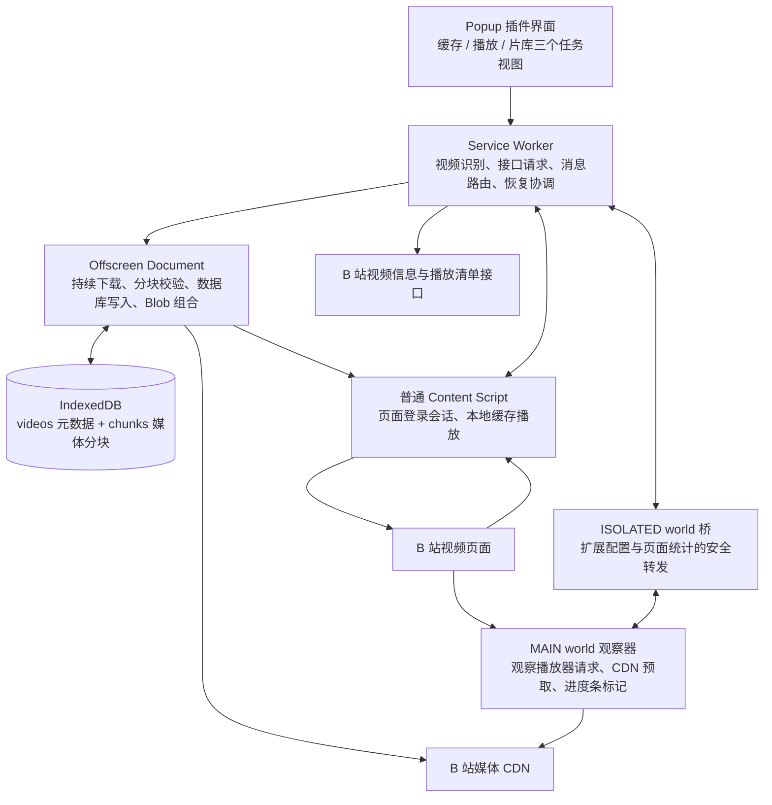
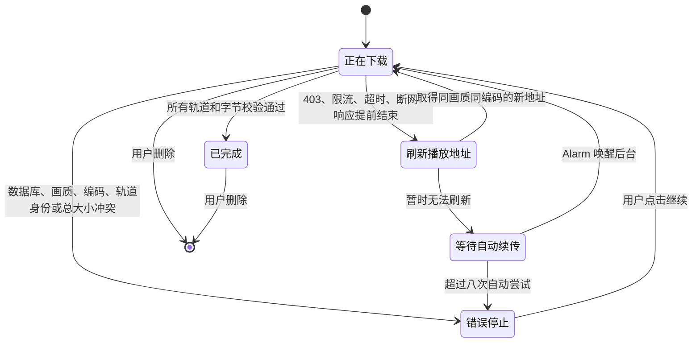

# Bili 缓冲站技术文档

> 适用版本：v2.6.1
> 最后核对：2026-09-14
> 本文描述当前源码的实际行为；《开发日志.md》保留按时间展开的问题、试验与迭代记录。

## 1. 项目目标与系统边界

Bili 缓冲站面向海外观看 B 站视频时可能出现的两类需求：

1. **降低当前在线播放的等待**：启用后观察实际媒体范围、提前保存后续分段，并在播放器 XHR/fetch 完整命中时直接返回驻留字节；不再只依赖 CDN 边缘回源副作用。
2. **完整保存视频供本地播放**：把当前账号实际可访问的媒体轨完整下载到 Chrome 的 IndexedDB，并在以后打开同一视频时通过原 `<video>` 元素播放本地数据。

这两条路线互补，但数据位置、生命周期和可靠性不同，不能混为同一种“缓存”。

### 1.1 四种容易混淆的缓存

| 类型 | 数据位置 | 生命周期 | 在本项目中的作用 |
| --- | --- | --- | --- |
| 播放器内存缓冲 | 当前 B 站页面的内存 | 页面刷新或关闭后消失 | 保证接下来一段时间可以连续播放；对应 B 站原生亮灰色进度 |
| 插件页面分段缓存 | 当前页面 MAIN world 内存 | 容量回收、关闭辅助或导航时清理，刷新/关闭页面后消失 | 保存可供播放器请求复用的正文；SIDX 确认的双轨就绪交集对应插件黄色 |
| CDN 边缘缓存 | 离用户较近的 CDN 服务器 | 保存时间由 CDN 决定 | 可能减少网络回源，但不作为黄色标记的证据 |
| 插件本地缓存 | Chrome 扩展的 IndexedDB | 扩展重载和浏览器重启后仍在；卸载扩展或清除扩展存储后删除 | 完整片库、本地播放、断点续传和保存文件 |

插件黄色表示对应数据驻留在页面分段缓存中，不等于已被追加到播放器 SourceBuffer，也不是持久化片库记录；播放还需解码，因此不构成“该位置一定不卡顿”的保证。

## 2. 运行架构

项目使用 Chrome Manifest V3，将界面、协调、长时间下载、页面观测和本地播放拆到不同运行环境。



### 2.1 Popup

主要文件：`popup.html`、`popup.css`、`src/popup.js`

职责：

- 读取当前活动标签页；
- 显示标题、UP 主、分 P、画质和编码；
- 发起完整缓存；
- 显示缓存进度、速度、重试状态和本地片库；
- 提供播放提前加载的开启 / 关闭和高亮颜色；
- 提供保存、删除和跳转操作。

界面按用户任务划分为三个互斥的一级视图：

1. **缓存**：只呈现当前视频、画质、编码、登录状态和主缓存操作；标题完整换行，不用省略号截断。
2. **播放**：只公开一个提前加载开关和一句当前状态；较低频的进度条高亮配色通过可展开设置按需显示，不再把网络诊断指标和准备流程堆在主界面。
3. **片库**：独立展示本机总缓存量、视频列表以及保存、打开和删除操作；列表自行滚动，不把所有项目继续堆叠在缓存操作之后。

同一时刻只显示一个视图。页签使用 ARIA tab/tabpanel 语义，支持点击、左右方向键、Home 和 End 切换；当前页面不支持播放观测时，“播放”页签会禁用，若用户原来停留在该页则自动退回“缓存”。画质菜单使用 Popover API 进入浏览器顶层，离开缓存页时主动关闭，避免隐藏视图中遗留可交互弹层。

Popup 关闭后 Document 会被销毁，因此它不承担持续下载。界面状态通过 Service Worker 内存和 `chrome.storage.session` 快照恢复。

### 2.2 Service Worker

主要文件：`src/background.js`

职责：

- 统一处理 Popup、Content Script 和 Offscreen 的消息；
- 解析视频 URL 并请求视频信息；
- 优先通过当前 B 站页面取得带登录态的播放清单；
- 创建 Offscreen Document；
- 转发下载事件、更新扩展徽标；
- 刷新过期播放地址；
- 使用 `chrome.alarms` 恢复等待中的任务；
- 管理 Popup 快照和播放辅助配置。

Manifest V3 Service Worker 可能被 Chrome 休眠，所以关键任务状态必须写入 IndexedDB，而不能只依赖后台内存。

### 2.3 Offscreen Document

主要文件：`offscreen.html`、`src/offscreen.js`

职责：

- 持有长时间 CDN 网络请求；
- 选择 MP4 或 DASH 媒体轨；
- CDN 小范围测试与固定 Range 并发下载；
- 校验 `HTTP 206`、`Content-Range` 和正文长度；
- 原子写入媒体分块与安全续传位置；
- 把 DASH 双轨重封装为一个双轨 MP4，并在校验通过后释放源分块；
- 组合本地播放或保存所需的 Blob URL；
- 开发态持续轮询热更新服务。

Offscreen Document 没有可见界面，但比 Popup 和 Service Worker 更适合持续持有网络连接。

### 2.4 页面主世界观察器

主要文件：`src/playback-cache.js`（先注入）、`src/playback-observer.js`

观察器以 `run_at: document_start`、`world: MAIN` 注入，早于多数播放器请求运行。它可以包装页面使用的 XHR、fetch 和 Storage 原型，职责包括：

- 观察播放器的 Range 请求；
- 记录响应启动延迟、错误、正文吞吐和媒体范围；
- 观察 `<video>` 的播放、等待、卡顿和本地播放余量；
- 开启后在取得首个合法媒体范围时立即开始初始化/索引探测与分段预取；
- 对播放器网络能力估计进行受限保护；
- 将成功预取的范围绘制到进度条。

2.6.1 起，缓存适配器对支持的完整命中请求返回真实驻留字节和 206 范围响应；未命中、不支持或适配失败走原始请求。它不修改媒体编码，也不主动向网页播放器的 SourceBuffer 追加数据。

### 2.5 隔离世界桥

主要文件：`src/playback-bridge.js`

MAIN world 不能使用 `chrome.storage`，而隔离世界可以。桥负责：

- 从 `chrome.storage.local["playbackAssistConfigV1"]` 读取配置；
- 通过 `window.postMessage` 把配置发送给 MAIN world；
- 接收 MAIN world 的聚合统计；
- 响应 Popup 查询和配置修改。

桥不转发 Cookie、签名媒体正文或完整网络响应。

### 2.6 普通 Content Script

主要文件：`src/content.js`

职责：

- 使用当前页面登录会话请求播放清单；
- 在页面打开或缓存完成后查询本地片库；
- 将完整 MP4 Blob 或 DASH MediaSource 应用到原 `<video>`；
- 恢复切换前的播放位置、暂停状态、音量和倍速。

## 3. 页面识别、登录态和画质选择

### 3.1 页面身份

当前支持：

- `/video/BV...`；
- `/video/av...`；
- 带 `bvid` 参数的 `/list/...` 页面；
- `?p=N` 分 P。

后台调用 `/x/web-interface/view` 取得 BVID、CID、标题、UP 主、封面、时长和分 P。

- **BVID**：一个投稿视频的公开编号；
- **CID**：某一个实际视频内容或分 P 的编号。

缓存身份必须包含 CID，否则不同分 P 会互相覆盖。

### 3.2 播放清单与登录态

后台请求 `/x/player/playurl`。优先顺序为：

1. 向当前 B 站标签页发送 `BILI_BUFFER_FETCH_PLAYURL`；
2. 页面以 `credentials: "include"` 请求，浏览器自动携带当前登录 Cookie；
3. 原页不存在或无法响应时，Service Worker 使用当前 Chrome 会话回退请求。

扩展通过 Cookies API 只检查 `SESSDATA` 是否存在，不展示、复制或保存 Cookie 原文。会员和付费权限最终以播放接口实际返回的媒体轨为准，插件不会绕过账号权限。

### 3.3 最高可用画质

插件请求最高质量代码，但不直接相信 `accept_quality` 声明。实际流程是：

1. 遍历返回的 `dash.video`；
2. 只保留有 URL、MP4 MIME 和 codec 的真实轨道；
3. progressive 路线只接受单段 MP4；
4. 按质量代码降序排列；
5. 第一项作为默认画质。

因此“最高画质”指当前账号、当前视频和当前响应中真正存在且可处理的最高档位。

界面会把两个概念分开呈现：

- **B 站声明可用**：`accept_quality` / `accept_description` / `support_formats` 里的档位，包含该视频支持但当前账号拿不到的（例如大会员专属），来自 `buildQualityOptions`，随快照存入 `cacheSizeInfo.declared`；
- **当前账号返回**：`dash.video` 里真正带 URL 与 codec 的轨道，来自 `buildMediaQualityOptions`，即画质菜单的内容。

当声明里存在未返回的档位时，画质按钮的悬停提示会同时列出“声明可用 / 当前账号返回 / 未返回”，登录提示追加“N 档未返回”。这样“视频是不是没到最高规格”可以直接在界面上判断：如果返回的最高档位就是声明里的最高档位，说明已经取到当前账号能拿到的最高规格；体积小通常是画面本身码率低（静态封面、低动态画面），而不是档位不够。

### 3.4 编码选择

支持：

- AV1；
- HEVC/H.265；
- AVC/H.264；
- 自动（省流）。

自动模式只在所选画质内工作：先排除 Chrome MediaSource 不支持的轨道，再按 B 站声明的 `bandwidth` 从低到高选择；码率相同才按 AV1、HEVC、AVC 排序。显式选择某种编码时，缺失或不支持会明确报错，不静默换成其他编码。

### 3.5 音频轨选择

缓存内容分两档，音频轨的挑选规则不同：

| 缓存内容 | 候选来源 | 优先级 | 用途 |
| --- | --- | --- | --- |
| 视频 + 音频 | `dash.audio`、`dash.dolby.audio`、`dash.flac.audio` | AAC（同族取最高码率）> FLAC > 杜比 > 其他 | 与视频轨合并成单个 MP4，优先选择兼容性最好的音轨 |
| 仅音频 | 同上 | Hi-Res 无损（B 站 30251 `fLaC`）> 杜比全景声 > AAC（取最高码率）> 其他 | 只下载音频，保留 B 站原始容器与编码 |

两种模式都先排除当前环境 `MediaSource.isTypeSupported` 不支持的编码：例如 macOS 无头 Chrome 不支持 `ec-3`，杜比轨会被跳过而落到 AAC；`audio/mp4; codecs="fLaC"` 在 Chrome 中受支持，因此 Hi-Res 无损可以被选中。插件不做任何转码，也不把音频统一转成 MP3。

如果播放清单里没有任何独立音频轨（只有 `durl` 单段 MP4），“仅音频”不会直接失败，而是回退到 4.10 的单文件提取路线：先下载整段 MP4，再在本地把音轨抽出来。

关于容器：B 站 Hi-Res 无损（30251）的原始文件就是 **MP4 容器 + FLAC 编码**（CDN 上的 `_30251.m4s`，字段为 `audio/mp4` + `codecs: "fLaC"`）。插件不做任何转码，只按编码把保存名定为 `.flac`（与 B 站客户端的“无损”命名习惯一致），字节与 CDN 完全一致；因此播放器把容器识别为 MP4 是准确的，而不是格式错误。片库保存按钮的悬停提示用 `describeAudioContainer` 写出“容器 · 编码”，避免只看到扩展名而产生误解。真正的“原生 FLAC 流”（去掉 MP4 封装）需要额外的容器改写（帧数据不变），当前不做：它改变了 B 站交付的原始容器，而且在手上没有真实 Hi-Res 样本时无法充分验证。

## 4. 完整缓存流程

### 4.1 创建任务

任务身份包含：

```text
BVID + CID + 缓存内容（视频 + 音频 / 仅音频）+ 画质 + 编码选择
```

不同分 P、不同画质、不同编码和两种缓存内容可以共存：视频缓存的键是 `<页 ID>:q<画质>[:c<编码>]`，仅音频缓存的键是 `<页 ID>:a`。旧版本没有编码后缀、也没有缓存模式字段的记录仍按视频缓存读取。弹窗里的“缓存内容”分段选择保存在 `chrome.storage.local` 的 `cacheModeV1`，属于用户偏好而不是单个视频的状态。

### 4.2 媒体来源

优先选择 DASH，每个缓存任务只保留实际需要的轨道：

- 视频 + 音频：一条视频轨加一条音频轨（音轨按 3.5 的兼容优先规则挑选）；
- 仅音频：只有一条音频轨（按 3.5 的无损优先规则挑选）；
- 每条轨道包含一个主 CDN 地址和若干备用地址。

如果播放接口只返回单段 MP4，则使用 progressive 单文件路线；这种文件在“视频 + 音频”下整体保存，在“仅音频”下走 4.10 的下载后提取路线（B 站不会为它返回音频分段，任何工具都只能先取整段文件）。

### 4.3 CDN 小范围测试

正式下载前，从主地址和最多两个备用地址各读取 64 KiB Range：

- 最多等待 8 秒；
- 只接受 HTTP 206；
- 校验范围和媒体总大小；
- 按端到端有效读取速度排序；
- 分开保存响应启动延迟与正文吞吐，供后续节点降级使用。

### 4.4 固定 Range 并发

媒体按 2 MiB 切分：

```text
0–2 MiB
2–4 MiB
4–6 MiB
……
```

- progressive MP4：最多三路并发；
- DASH：视频轨两路、音频轨一路；
- 单个分块最多等待 30 秒；
- 某地址失败时，保持相同起止范围切换备用地址。

扩展自身发往媒体 CDN 的 XHR 由 Declarative Net Request 补充 `Referer: https://www.bilibili.com/`，避免缺少防盗链来源时返回 HTTP 403。CDN 正文请求使用 `credentials: "omit"`，不向 CDN 手工发送 B 站 Cookie。

### 4.5 HTTP 206 与 Content-Range

正确的 Range 响应示例：

```text
HTTP 206 Partial Content
Content-Range: bytes 2097152-4194303/9437321
```

含义：

- 本次从第 2,097,152 字节开始；
- 到第 4,194,303 字节结束；
- 完整媒体为 9,437,321 字节。

每个分块必须同时满足：

- HTTP 状态为 206；
- 返回起点等于请求起点；
- 返回终点等于请求终点；
- 总大小与任务一致；
- 实收正文长度等于声明长度。

任何一项失败，分块都不会提交。

### 4.6 乱序完成与连续提交

并发请求可能乱序完成。后面的分块即使先到达，也不能越过前面的缺口推进续传位置。

下载协调器只把从当前水位开始连续存在的一批分块提交到数据库。这里区分：

- `downloadedBytes`：界面实时收到的字节，可能包含尚未落盘的临时数据；
- `resumeBytes`：已经连续、完整、原子写入数据库的安全断点。

崩溃、热更新或断网后，只能从 `resumeBytes` 恢复。

### 4.7 IndexedDB 原子事务

数据库：`bili-buffer-cache`，版本 1。

对象仓库：

- `videos`：保存任务元数据、状态、画质、编码、总大小、断点和统计；
- `chunks`：以 `[videoId, track, index]` 为复合主键保存 Blob 分块。

一批分块和新的 `resumeBytes` 在同一个 IndexedDB 事务中写入：全部成功才生效，任一失败则整体回滚。

### 4.8 完成判定

单文件路线（progressive）与仅音频路线要求：

- 每个分块完整；
- 实收字节数等于总大小（仅音频记录额外要求 `tracks.audio` 同步记录同一水位）。

视频 + 音频路线在两条轨道都完整后还要经过合并，并满足：

- `merged.totalBytes > 0`；
- `merged.downloadedBytes === merged.totalBytes`；
- 合并后的单个 MP4 能通过初始化段自检（见 4.9）。

合并失败时不会伪造完成：记录保留两条独立轨道并按双轨判定完成，同时写入 `mergeError`，界面明确提示“未能合并为单个 MP4”。HTTP 403 且零字节的错误任务不会进入已缓存片库。

### 4.9 双轨合并为单个 MP4

主要文件：`src/mp4-merge.js`

B 站高画质返回的是两条互相独立的 fragmented MP4（`ftyp + free + moov(mvex) + sidx + moof/mdat ...`），因此合并是**重封装**而不是转码：

1. 从两条轨道各读取初始化段，取出 `mvhd`、`trak`、`mvex`；
2. 合并 `ftyp` 的主品牌与兼容品牌；
3. 生成新的 `moov`：视频轨固定为 `track_ID 1`、音频轨固定为 `track_ID 2`，同步改写 `tkhd`、`trex`、`trep`，并把 `mvhd` 的时长取两条轨道的较大值和 `next_track_ID` 改为 3；
4. 逐片段读取：用 `tfdt` 的解码时间（除以各自 `mdhd` 的 timescale）做双路归并，按时间交错输出；片段尾部（最后一个 `mdat` 之后）的 `sidx`、`mfra`、`free` 等盒子会被丢弃，因为它们引用的是原始文件的字节偏移；
5. 每个 `moof` 只改写 `tfhd` 的 `track_ID` 和 `mfhd` 的片段序号，`trun` 的 `data_offset` 以 moof 起点计算，因此整段复制后仍然有效；
6. 输出以 4 MiB 分块写回 IndexedDB 的 `merged` 轨道，写完后读回开头字节做自检（`ftyp`、双轨 `moov`、轨道编号），全部通过后才删除 `video` / `audio` 分块。

内存占用只与单个片段有关：读取使用分块内的随机访问，任意时刻只驻留当前片段与一个输出缓冲。非 fragmented MP4、缺少 `mvex`、片段被截断或出现无法识别的顶层盒子时抛出 `Mp4MergeError`，缓存保留双轨而不是写出不可播放的文件。旧版本留下的双轨缓存会在本地播放或保存时走同一条合并流程自动升级，不再需要重新下载。

### 4.10 从单文件 MP4 提取音轨

主要文件：`src/mp4-merge.js` 的 `createAudioOnlyMp4`

B 站有时只返回单段 MP4（`durl`），音视频轨混在一个文件里，此时“仅音频”需要自己抽出音轨。做法与 `ffmpeg -i in.mp4 -vn -c:a copy out.m4a` 等价，不重新编码任何音频样本：

1. 解析 `moov` 找到 `hdlr` 为 `soun` 的 `trak`，取出 `stsd`（容器与真实 codec）、`stsz`、`stsc` 与 `stco` / `co64`；
2. 按 `stsc` × `stsz` 展开每个分块的字节长度，并与 `stsz` 的样本总字节数交叉校验，不一致就拒绝输出；
3. 生成新的单轨 `moov`（`track_ID` 改为 1、`mvhd.next_track_ID` 改为 2、去掉视频轨），把偏移表改写成紧凑布局：第 i 个音频分块紧跟在头部之后；
4. 输出固定为 `ftyp + moov + mdat`，`mdat` 里只放音频样本；源文件里音视频分块交错，逐块小读会退化，因此用 4 MiB 预读窗口按顺序取出音频字节；
5. 写回后读回开头校验（`ftyp`、单轨 `moov`、`audio` 轨且 `track_ID` 为 1），通过后才释放整段 `media` 分块；
6. fragmented MP4 走分支路线：只保留音频轨的 `moof/mdat` 并把 `track_ID` 改写为 1；这类初始化段常常没有 `stsz`，因此采样描述解析使用宽松模式。

因为视频样本被丢弃，提取结果通常是源文件的几分之一（实测 19 秒 360P：402 602 → 163 938 字节，其中 152 048 字节是音频样本）。代价是这一次下载的流量等于整段 MP4。



可自动恢复：

- HTTP 403、408、425、429、5xx；
- `Failed to fetch` 等网络中断；
- 请求超时；
- 响应正文提前结束；
- 临时 CDN 地址耗尽或签名失效。

不自动恢复：

- IndexedDB 事务失败；
- 画质或编码身份冲突；
- DASH 表示身份变化；
- 媒体总大小不一致；
- Range 起点错误。

自动等待为 1 分钟、2 分钟、5 分钟，之后保持 5 分钟，最多八次。`chrome.alarms` 每分钟巡视并跳过仍由 Offscreen 正常处理的任务。

关闭 Popup 不影响下载。关闭原视频页后，已有签名地址仍可继续使用；地址失效时，后台使用当前 Chrome 会话刷新同画质、同编码来源，再从 `resumeBytes` 续传。

## 6. 播放侧分段预取与缓存复用

方案选择、实现顺序、失败修正与验收过程详见[播放缓存实现设计记录](docs/playback-cache-design.md)。本节作为当前接口和行为的简明参考。

### 6.1 观察播放器请求

观察器只处理 B 站媒体 CDN 且带 `Range` 的请求，记录：

- CDN host；
- pathname；
- 请求字节范围；
- 响应启动延迟；
- 正文读取时间和吞吐；
- HTTP 状态与网络错误；
- 播放器本地播放余量；
- `waiting` / `stalled` 事件。

观察统计仍以 `host + pathname` 归组，但正文缓存必须按完整 URL 隔离。同一路径的签名查询参数变化仅沿用观察记录，不能沿用旧正文或黄色范围；切换 CDN host 同样需要当前 URL 的真实缓存。

### 6.2 高响应延迟判断

每个 CDN 节点独立计算阈值：

```text
高延迟阈值 = max(800ms, 当前节点正常响应启动延迟中位数 × 6)
```

超过阈值的播放器媒体请求记为“高响应延迟请求”。这符合 CDN 回源常见表现，但只能作为“疑似边缘未命中”的推断，不是 CDN 内部缓存状态的直接证据。

### 6.3 开启后的启动条件

用户开启后，不再等待“已经播放 20 秒”“先出现高响应延迟”“页面位于前台”或“播放器已有 10 秒播放余量”。播放器首个 Range 响应头给出位置和总大小，随后 400 ms 调度器即可工作：先补齐文件头的初始化区与 SIDX（先探测 64 KiB，最多 1 MiB），有有效索引后按真实播放时间预取后续段；缺少索引时才使用字节窗口回退，但不绘制估算黄色。无需等待播放器首个正文全部读完才能启动调度。

仍然必须满足以下边界：

- 开关为开启；
- 已取得真实媒体 URL 和合法的当前字节位置；
- 当前轨未处于错误退避或失败停用状态；
- 单轨累计额外读取未达到 200 MB；
- 并发、单块大小和前方窗口仍受限制。

“进入页面立刻开始”的准确含义，是扩展桥确认当前保存的开关为开启、且播放器暴露首个实际媒体范围后立即衔接；插件不能在完全不知道本次播放所选 CDN、画质、编码和签名 URL 时凭空提前请求。MAIN 观察器在异步配置到达前保持内部 `pending`，避免曾经明确关闭的用户在页面刚打开时被默认值抢跑。

### 6.4 前方窗口

存在 SIDX 时直接选择与当前播放位置至前方约 45 秒相交的分段，补齐初始化区及这些分段的驻留缺口。仅在索引不可用的安全回退路径，才根据轨道大小和视频时长估算请求窗口：

```text
轨道总大小 ÷ 视频时长 × 45 秒
```

该回退请求窗口限制为 8–48 MB。这个估算只用于未知索引时限制下载量，不用于进度条标记；黄色始终需要真实索引与完整双轨缓存证据。

### 6.5 自适应请求

初始：

- 每块 512 KiB；
- 两路并发。

成功时：

- 12 秒内完成则逐步增加并发；
- 8 秒内完成则块大小升到 1 MiB；
- 最多四路。

失败时：

- 并发减半；
- 块大小退回 512 KiB；
- 使用 2–30 秒指数退避；
- 连续失败六次后停用该轨预取。

单次预取最长 45 秒。只有完整收到合法 HTTP 206 和一致 `Content-Range` 后，范围才会进入 `prefetchedRanges`。

### 6.6 页面有界分段缓存（2.6.1）

`src/playback-cache.js` 在 MAIN world 中先于观察器注册，再由观察器安装请求适配器。缓存键是完整 URL（含查询串），不跨签名/主机/清晰度共享。预热必须收到合法 206、匹配的 Content-Range 和完整正文才写入；初始化响应可从播放器请求中复制，最多 1 MiB。正文仅在页面内存，不经 MAIN↔ISOLATED 消息传输，不写入离线片库，也不依赖 MV3 Service Worker 保活。

- 驻留正文上限 128 MiB，FIFO 回收；最多保留 32 个资源的元数据。另有并发下载及命中响应的短期副本，故该上限不是整个标签页内存上限。
- 单轨预热总预算沿用配置（默认 200 MB）。范围不完整、已回收或不支持时不返回部分假命中，也不拼接网络/缓存半份响应，直接让原请求执行。
- fetch 支持 GET 单段 Range、Request 对象和 AbortSignal；异步 XHR 支持 GET + arraybuffer、206 响应字段、2→3→4 状态、progress/load/loadend、取消及复用 open。同步 XHR、其他响应类型、多范围/后缀范围、If-Range、Authorization 等走原路径。
- 缓存命中返回原始媒体字节和正确 Content-Range/Content-Length，不改编码。没有重复下载不等于没有解码延迟；不承诺任意拖动零等待。
- 切换分 P/视频或关闭辅助会清理缓存并取消预热；导航前的迟到响应不得重新填充。清晰度和签名地址隔离，按实际播放器请求序号选择当前音视频轨，旧请求晚完成不重新夺回当前轨。
- `publicStats()` 新增 `cacheHits`、`cacheHitMB`、`cacheResidentMB`；通过现有 MAIN→ISOLATED `stats` 契约传递，不传媒体字节或 URL。缓存命中不作为 CDN 吞吐采样。

### 6.7 真实时间与黄色来源标记

SIDX v0/v1 的 `earliest_presentation_time / timescale` 确定时间起点，每个 reference 的 `subsegment_duration / timescale` 确定时长；字节起点是 **sidx 盒尾 + first_offset**。从初始化段 `moov/trak/mdia/hdlr` 的 `vide` / `soun` 判别轨道，不用文件大小猜音视频。索引越界、截断、层级引用或未知格式不画黄色。普通无 SIDX 的 progressive MP4 暂不标黄。

必须初始化区和完整媒体段都仍驻留，且媒体段由插件预热，才加入该轨的秒数范围。将视频、音频秒数范围求交，最后除以实际 video.duration 映射到进度条。可变码率不会再导致字节比例与时间比例混淆。

未播放范围的优先级为 **插件黄色 > 原生灰色 > 空白**；已播放颜色优先于二者。故原生 buffered 扩展到黄色位置时仍保留黄色。容量回收、关闭或导航使缓存失效时撤销相应标记，而不是永久保留不再可复用的承诺。默认预热色 `#ff8a1f`，用户可选黄色等预设或自定义色。

多段进度条按原生可见宽度投影范围，原生已播放节点、滑块及事件不被替换，仅修改缓冲背景。没有额外白线或替代拖动控件。

### 6.8 验收方法

`npm run test:extension` 使用独立临时 Chromium profile 加载实际生产 manifest，检查 MAIN/ISOLATED 注入、fetch/XHR 零网络命中；临时变更 bundle 标记后调用 runtime.reload，刷新受测页，校验新标记与 SHA-256。测试最终恢复 bundle 并删除 profile。必须在该专用 profile 开启开发者模式，否则新 Chromium 会在 reload 时以 unsupportedDeveloperExtension 禁用扩展；这不是缓存逻辑故障。

`npm test` 覆盖拼接、开放结尾、缺口、容量、SIDX v0/v1、非等码率、非法索引、黄色优先级和 fetch 适配失败/取消。`npm run test:playback` 在真实 Chromium 中加载真实 AVC/AAC 两分片夹具，由实际预热调度器准备缓存，再让 fetch/XHR 驱动双轨 MediaSource 播放、拖到第二片。检查完整命中不产生网络请求、原生事件与布局、两轨交集和起播耗时。夹具 SIDX 的引用数量缩为 2，保留原盒大小与真实媒体偏移。受控网络延迟 180ms 的首轮结果为冷路径约 203ms，fetch/XHR 缓存命中约 13/15ms，均解码 38 帧；这些数字不是实际 B 站线路或任意视频的性能承诺。

## 7. 播放器网络能力估计保护

B 站播放器会把历史网络能力估计写入：

```text
localStorage["bilibili_dash_throughput_lru_v1"]
```

一次 CDN 回源可能产生非常低的估计样本，使播放器之后长期压低自动画质。本项目不使用固定万能下限，而是按同一 CDN 节点建立本机基线：

1. 收集正常完成请求的正文吞吐；
2. 至少需要三个正常样本；
3. 取 P25 × 55%；
4. 限制到 1,000–12,000 Kbps；
5. 只有同一节点最近 15 秒刚出现高响应延迟时，才过滤低于该动态下限的估计样本；
6. 重算 P25、P50，并限制过低 EWMA 和过高 latency；
7. 其他 host、其他 key 和无法解析的数据原样保留。

这是针对播放器内部存储结构的启发式保护，不是 B 站官方稳定 API。页面结构变化后可能失效，因此所有自动修改都应保守并关联到同一 host。播放提前加载关闭时，该保护也停止修改记录。底层仍保留旧版备份 / 恢复命令的兼容实现，但精简后的 Popup 不再提供手动入口。

## 8. 本地播放和保存

### 8.1 原播放器本地播放

页面打开或收到 `CACHE_READY` 后：

1. Content Script 按当前 BVID + CID 查询完整缓存；
2. 只在视频 + 音频缓存中选择最高画质的完整记录（仅音频记录不参与自动播放，避免把播放器变成没有画面的本地音频）；
3. Offscreen 读取并校验全部分块；
4. 视频 + 音频缓存优先合并成单个 MP4，并返回一个 Blob URL；只有合并不可用（`mergeError`）时才回退到双轨路线；
5. progressive 直接合成一个 MP4 Blob；
6. 回退路线下读取 DASH 两轨为 ArrayBuffer，创建 MediaSource 和对应 SourceBuffer，把完整轨道追加进去；
7. 用生成的 URL 替换原 `<video>` 播放源；
8. 恢复播放位置、暂停状态、音量和倍速。

复用原 `<video>` 可以保留 B 站控制条、弹幕时间轴和倍速。单文件路线只需要一个 Blob；回退的双轨路线需要把完整媒体重新组合到页面内存，高画质长视频会产生较大临时内存开销。

### 8.2 保存文件

保存前再次校验缓存完整性，并按缓存内容选择文件名：

- 视频 + 音频：保存一个合并后的 `.mp4`（含视频轨与音频轨）；如果该记录此前合并失败，则退回分别保存“视频轨.mp4”和“音频轨.m4a”；
- 仅音频：保存一个音频文件，扩展名沿用 B 站返回的容器与编码（`fLaC` → `.flac`，AAC/杜比 → `.m4a`，MP3 → `.mp3`）；从单文件 MP4 提取出来的音频同样按容器推导扩展名（通常 `.m4a`）；
- progressive：保存一个 `.mp4`。

单文件保存依赖 `src/mp4-merge.js` 的浏览器侧重封装，不使用 Chrome Downloads API 的封装能力，也不调用外部工具或转码器。

## 9. 热更新与发布构建

### 9.1 开发态热更新

`npm run dev` 启动只监听 `127.0.0.1:17321` 的本机服务：

1. 文件变化产生新的 revision；
2. Offscreen 每 750ms 查询健康端点；
3. 发现 revision 变化后通知 Service Worker；
4. Service Worker 将待刷新 revision 写入 `chrome.storage.local`；
5. 调用 `chrome.runtime.reload()`；
6. 新 Service Worker 启动后消费标记；
7. 只刷新已打开的 B 站视频/列表页；
8. MAIN、ISOLATED 和普通 Content Script 重新注入。

Manifest 固定公钥保证扩展 ID 不变；IndexedDB 归属于这个固定扩展 ID，因此代码热更新不会删除片库或安全断点。

### 9.2 发布构建

`npm run build` 生成：

- `dist/unpacked`；
- `dist/bili-buffer-extension-<version>.zip`。

构建脚本会：

- 删除 `src/dev-reload.js`；
- 从 background 和 offscreen 剥离热更新导入与调用；
- 删除 `http://127.0.0.1/*` 主机权限；
- 校验 Manifest 引用文件；
- 生成根目录结构正确的 ZIP。

## 10. 权限说明

| 权限 | 用途 |
| --- | --- |
| `activeTab` | 识别用户当前操作的视频标签页 |
| `alarms` | 分钟级唤醒后台，恢复等待中的下载 |
| `cookies` | 只检查 B 站 `SESSDATA` 是否存在；不保存 Cookie 原文 |
| `declarativeNetRequestWithHostAccess` | 只为扩展自身 CDN XHR 设置 B 站 Referer |
| `downloads` | 把完整本地 Blob 保存为用户文件 |
| `offscreen` | 创建隐藏下载文档 |
| `storage` | 保存播放辅助配置、Popup 快照和热更新交接标记 |
| `unlimitedStorage` | 降低大视频 IndexedDB 受普通扩展配额限制的风险 |
| B 站/CDN host permissions | 请求视频信息、播放清单和媒体 Range |

本项目没有分析、遥测或后端服务器。任务为了续传会在扩展本地数据库保存临时签名 CDN 候选 URL，但不保存 Cookie 原文，也不会把这些数据发送给第三方服务。

## 11. 术语表

### 11.1 TTFB P95

**TTFB**：Time To First Byte，通常译为“首字节时间”。当前实现实际测量从请求发出到浏览器取得响应头的时间，更严谨的名称是“响应启动延迟”。

**P95**：第 95 百分位。把样本从小到大排序后，约 95% 的请求不超过该值，约 5% 更慢。

当前 Popup 对每个 CDN host 分别计算 P95，再显示其中最大的值，因此更接近“当前最慢 CDN 节点的响应启动延迟 P95”。样本很少时不应把它当成稳定的长期统计结论。

### 11.2 高响应延迟请求（旧称“慢请求”）

指响应启动延迟超过以下阈值的播放器媒体请求：

```text
max(800ms, 同节点正常响应中位数 × 6)
```

它是当前页面生命周期内的累计次数，不等同于总下载速度慢，也不必然产生可见卡顿。

### 11.2.1 重封装（remux）与合并

重封装指只改变容器与轨道组织方式、不重新编码音视频样本：本项目把 B 站的两条 fragmented MP4 轨道放进同一个 `moov` 并按解码时间交错 `moof/mdat`。因此合并结果的画质、音质和码率与 CDN 原始轨道完全一致，代价是合并期间要额外读写一遍数据。

### 11.3 播放余量（旧称“缓冲”）

从当前播放位置开始，播放器内存中的 `video.buffered` 还能连续播放多少秒：

```text
当前缓冲区间结束时间 - currentTime
```

它不是插件本地缓存大小，也不是 CDN 边缘缓存大小。

### 11.4 播放侧分段预取（界面称“提前加载”）

插件提前请求播放器前方分段，并将正文保存在有容量上限的页面内存缓存；播放器请求完整命中时直接复用，不再仅依赖 CDN 边缘回源副作用。它与 IndexedDB 离线片库相互独立。

### 11.5 疑似边缘未命中区间（旧称“冷区间”）

响应启动明显偏慢、可能需要 CDN 回源的媒体字节范围。插件只能从现象推断，不能直接读取 CDN 内部命中状态。

### 11.6 P50、P25、EWMA

- P50：第 50 百分位，即中位数；
- P25：第 25 百分位，本项目用作相对保守的正常吞吐参考；
- EWMA：指数加权移动平均，新样本权重更高，用来平滑波动。

### 11.7 吞吐、带宽和码率

- 吞吐量：某次请求实际取得数据的速度；
- 带宽：网络链路理论或可用传输能力；
- 码率：媒体每秒需要的数据量；
- Kbps：每秒千比特；
- Mbps：每秒兆比特，约等于 1,000 Kbps。

### 11.8 CDN、Range、DASH、Blob、MediaSource

- CDN：内容分发网络，把内容放在离用户更近的服务器节点；
- Range：只请求文件某个字节范围的 HTTP 机制；
- DASH：把视频、音频和不同画质/编码拆成独立轨道的流媒体格式；
- Blob：浏览器中的二进制大对象；
- MediaSource：浏览器把 JavaScript 提供的视频/音频数据追加给 `<video>` 的接口。

## 12. 界面用词与开关语义

内部代码保留 `ttfb`、`prefetch`、`bufferAheadSec` 等技术字段，便于诊断与兼容旧数据；Popup 不再直接展示这些指标，只显示用户需要做出的决定。

| 界面文字 | 用户可理解的含义 | 实际行为 |
| --- | --- | --- |
| 提前加载 · 开启 | 尽快准备接下来要看的内容 | 取得播放器首个媒体范围后立即额外请求后续字节，同时启用受限的网络能力估计修正 |
| 提前加载 · 关闭 | 不产生播放辅助的额外请求 | 取消预取、清理驻留缓存并停止估计修正；观察器仍被动识别请求，以便再次开启 |
| 等待视频加载 | 尚未取得真实媒体地址和字节位置 | 不是倒计时或人为准备阶段；播放器首次返回媒体响应头后会自动离开此状态 |
| 正在提前加载后续内容 | 分段预热正在进行 | 正文进入页面有界缓存，匹配的播放器请求可复用；不写入离线片库 |
| 高亮颜色 | 选择进度条上插件色段的颜色 | 只改变显示，不改变网络策略、缓存数据或下载任务 |

旧配置不需要迁移数据库：历史 `auto` 和 `always` 都解释为“开启”，历史 `observe` 和 `off` 都解释为“关闭”；颜色、IndexedDB 片库、下载断点和固定扩展身份原样保留。

界面保留“提前加载”称呼。播放器原生灰条来自 video.buffered；插件黄色来自驻留预热数据和 SIDX 时间交集，二者重叠时黄色保留来源语义，已播放色优先。缓存命中与实际解码是两个阶段，黄色不是任意拖动零等待的保证。

## 13. 外部思路与本项目实现的关系

参考 BiliLoader 的部分：

- 海外 CDN 边缘未命中的诊断思路；
- 通过前置 Range 请求促使 CDN 回源；
- 关注响应启动延迟而不只看正文速度；
- 防止单次高延迟样本长期污染播放器网络估计；
- CDN 节点可观测指标。

本项目扩展或独立实现的部分：

- 完整视频本地缓存；
- 当前账号实际可用最高画质；
- AV1、HEVC、AVC 编码选择；
- DASH 音视频双轨下载；
- IndexedDB 分块与原子续传；
- CDN 小范围测试、并发 Range 与动态回退；
- 地址失效后的自动刷新；
- 关闭原页面后的持久续传；
- 本地片库、保存和删除；
- 原 B 站播放器中的本地 MediaSource 播放；
- 开发态热更新和发布包剥离。

TTFB、P95、CDN 预取等是通用网络性能工程术语，不属于某一个项目；但面向普通用户时应使用“正式中文名称 + 简短解释”，避免直接把内部监控字段当作产品文案。

## 14. 已知边界

- 预取会产生额外流量；完整缓存命中的播放器请求不重复下载，但缺口、回收、URL 变化或不支持的请求会重新走网络；
- 黄色只用 SIDX 的真实时间交集；未知、损坏、层级索引或单轨不完整时不标黄，普通无 SIDX 的 progressive MP4 暂不提供黄色标记；
- 多分段时间轴依据 B 站呈现的子段宽度推算各段时长占比；若播放器以后改为非时长比例宽度，需要重新适配；
- CDN 可能切换节点、淘汰数据或让签名地址失效；
- 视频体积与音频体积互相独立：无损音轨（1.4–1.8 Mbps）常比低码率画面大几倍，视频字节数小不等于档位低；
- B 站 Hi-Res 无损是 MP4 容器 + FLAC 编码，保存为 `.flac` 是按编码命名，容器仍为 MP4，未做转码；
- 高响应启动延迟不等同于总吞吐低，也不必然造成卡顿；
- 低 TTFB 但正文吞吐不足时仍可能卡顿；
- 网络估计保护依赖 B 站内部 localStorage 结构，不是稳定公开 API；
- 合并只支持 fragmented MP4（`moov` 内含 `mvex`）；progressive MP4 本身就是单文件，其他布局会保留双轨并提示未合并；
- 合并过程需要完整读一遍源分块并写一份新文件，长视频在合并阶段会有一次额外的磁盘读写与短暂进度停顿；
- 单段 MP4 的“仅音频”需要先下载整段视频再提取音轨（B 站不提供该文件的音频分段），这一次下载的流量等于整段视频；
- 提取只支持标准 `stbl` 布局（`stsc` / `stsz` / `stco` / `co64`）；样本表与分块长度不一致、样本偏移超出 `mdat` 或文件被截断时明确报错并保留整段 MP4；
- 已合并记录与仅音频记录都不再参与网页自动播放，需要播放时请在片库中保存后本地打开；
- 本地双轨播放（合并不可用时的回退）仍需把完整轨道重新组合到页面内存；
- 番剧、互动视频、课程和特殊多段格式不在当前支持范围；
- 登录态只能使用账号已有权益，不能绕过会员、付费、地区或版权限制；
- 卸载扩展或清除扩展存储会删除 IndexedDB 片库。

### 14.1 当前界面回归范围

v2.6.0 的 90 项 Node 测试与全部脚本语法检查通过。浏览器隔离集成页新增两组覆盖：

- `tests/offscreen-merge-integration.html` 用真实 B 站 DASH 分片夹具（`tests/fixtures/`）走完整链路：Range 分块下载 → 重封装合并 → 校验合并文件字节数与片段顺序（1、2、2、1）→ 在同一个 Chrome 里用合并结果播放并确认真实解出视频帧与音频字节 → 仅音频模式选中 30251 `fLaC` 且只落盘音频分块 → 旧版双轨缓存在取播放地址时自动合并并释放源分块；
- `tests/popup-instant-integration.html` 改为直接加载真实 `popup.html`，因此不再与界面结构漂移，并覆盖缓存内容切换、仅音频估算文案、画质行隐藏、偏好持久化与片库标签。

`tests/offscreen-merge-integration.html` 还覆盖了单文件 MP4 的仅音频路线：真实 402 602 字节的 progressive 夹具整段下载后提取为 163 938 字节（`mp4a.40.2`、约 64 kbps），视频分块被释放，并在同一个 headless Chrome 中播放提取结果（解出音频字节、视频帧为 0）。`tests/background-popup-integration.html` 证实仅音频记录不会顶替网页播放器、合并后的单文件可以顶替；`tests/offscreen-integration.html` 与 `tests/playback-progress-integration.html` 回归通过，确认合并失败时保留双轨且不影响进度条显示层。本轮未在用户实际 Chrome 工具栏 Popup 中手动点击验收，未在真实 B 站 CDN 上下载完整的 4K / Hi-Res 视频，也未在 Windows 或第三方播放器中验证合并文件。

## 15. 关键源码索引

| 模块 | 文件 |
| --- | --- |
| Manifest 与权限 | `manifest.json`、`rules/cdn-headers.json` |
| Popup | `popup.html`、`popup.css`、`src/popup.js` |
| 后台协调 | `src/background.js` |
| 持续下载 | `src/offscreen.js` |
| DASH 双轨重封装 | `src/mp4-merge.js` |
| 固定 Range 下载 | `src/range-downloader.js` |
| 自动续传 | `src/download-retry.js` |
| 数据库 | `src/db.js` |
| 页面观测和 CDN 预取 | `src/playback-observer.js` |
| 页面/扩展配置桥 | `src/playback-bridge.js` |
| 本地播放和页面登录会话 | `src/content.js` |
| 画质、编码和通用校验 | `src/utils.js` |
| Popup 快照 | `src/popup-snapshot.js` |
| 播放辅助配置 | `src/assist-config.js` |
| 开发热更新 | `src/dev-reload.js`、`scripts/dev-reload-server.mjs` |
| 发布构建 | `scripts/build-release.mjs` |
