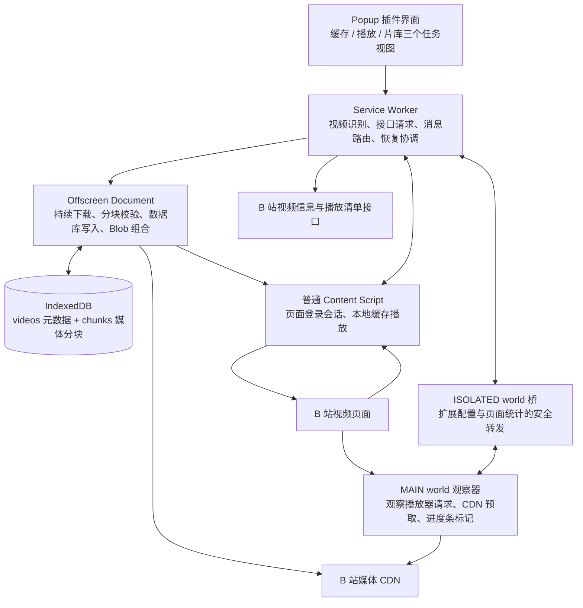
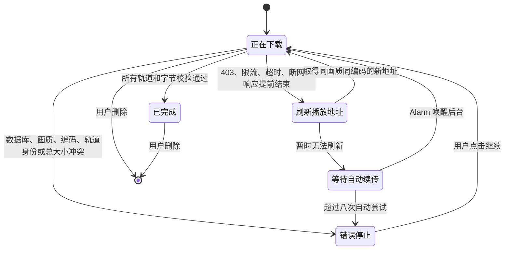

# Bili 缓冲站技术文档

> 适用版本：v2.5.0
> 最后核对：2026-09-05
> 本文描述当前源码的实际行为；《开发日志.md》保留按时间展开的问题、试验与迭代记录。

## 1. 项目目标与系统边界

Bili 缓冲站面向海外观看 B 站视频时可能出现的两类需求：

1. **降低当前在线播放的等待**：启用后观察播放器的首个媒体范围响应，并立即提前请求其后方的字节范围，促使 CDN 边缘节点更早完成回源。
2. **完整保存视频供本地播放**：把当前账号实际可访问的媒体轨完整下载到 Chrome 的 IndexedDB，并在以后打开同一视频时通过原 `<video>` 元素播放本地数据。

这两条路线互补，但数据位置、生命周期和可靠性不同，不能混为同一种“缓存”。

### 1.1 三种容易混淆的缓存

| 类型 | 数据位置 | 生命周期 | 在本项目中的作用 |
| --- | --- | --- | --- |
| 播放器内存缓冲 | 当前 B 站页面的内存 | 页面刷新或关闭后消失 | 保证接下来一段时间可以连续播放；对应 B 站原生亮灰色进度 |
| CDN 边缘缓存 | 离用户较近的 CDN 服务器 | 保存时间由 CDN 决定 | 避免每次都跨境回源；插件高亮表示的主要是这一层曾响应过预取字节 |
| 插件本地缓存 | Chrome 扩展的 IndexedDB | 扩展重载和浏览器重启后仍在；卸载扩展或清除扩展存储后删除 | 完整片库、本地播放、断点续传和保存文件 |

插件高亮色段不表示数据已进入播放器内存或本地片库，也不构成“该位置一定不卡顿”的保证。

## 2. 运行架构

项目使用 Chrome Manifest V3，将界面、协调、长时间下载、页面观测和本地播放拆到不同运行环境。



### 2.1 Popup

主要文件：`popup.html`、`popup.css`、`src/popup.js`

职责：

- 读取当前活动标签页；
- 显示标题、UP 主、分 P、画质和编码；
- 发起完整缓存；
- 显示缓存进度、速度、重试状态和本地片库；
- 提供播放提前加载的开启 / 关闭和高亮颜色；
- 提供保存、删除和跳转操作。

界面按用户任务划分为三个互斥的一级视图：

1. **缓存**：只呈现当前视频、画质、编码、登录状态和主缓存操作；标题完整换行，不用省略号截断。
2. **播放**：只公开一个提前加载开关和一句当前状态；较低频的进度条高亮配色通过可展开设置按需显示，不再把网络诊断指标和准备流程堆在主界面。
3. **片库**：独立展示本机总缓存量、视频列表以及保存、打开和删除操作；列表自行滚动，不把所有项目继续堆叠在缓存操作之后。

同一时刻只显示一个视图。页签使用 ARIA tab/tabpanel 语义，支持点击、左右方向键、Home 和 End 切换；当前页面不支持播放观测时，“播放”页签会禁用，若用户原来停留在该页则自动退回“缓存”。画质菜单使用 Popover API 进入浏览器顶层，离开缓存页时主动关闭，避免隐藏视图中遗留可交互弹层。

Popup 关闭后 Document 会被销毁，因此它不承担持续下载。界面状态通过 Service Worker 内存和 `chrome.storage.session` 快照恢复。

### 2.2 Service Worker

主要文件：`src/background.js`

职责：

- 统一处理 Popup、Content Script 和 Offscreen 的消息；
- 解析视频 URL 并请求视频信息；
- 优先通过当前 B 站页面取得带登录态的播放清单；
- 创建 Offscreen Document；
- 转发下载事件、更新扩展徽标；
- 刷新过期播放地址；
- 使用 `chrome.alarms` 恢复等待中的任务；
- 管理 Popup 快照和播放辅助配置。

Manifest V3 Service Worker 可能被 Chrome 休眠，所以关键任务状态必须写入 IndexedDB，而不能只依赖后台内存。

### 2.3 Offscreen Document

主要文件：`offscreen.html`、`src/offscreen.js`

职责：

- 持有长时间 CDN 网络请求；
- 选择 MP4 或 DASH 媒体轨；
- CDN 小范围测试与固定 Range 并发下载；
- 校验 `HTTP 206`、`Content-Range` 和正文长度；
- 原子写入媒体分块与安全续传位置；
- 组合本地播放或保存所需的 Blob URL；
- 开发态持续轮询热更新服务。

Offscreen Document 没有可见界面，但比 Popup 和 Service Worker 更适合持续持有网络连接。

### 2.4 页面主世界观察器

主要文件：`src/playback-observer.js`

观察器以 `run_at: document_start`、`world: MAIN` 注入，早于多数播放器请求运行。它可以包装页面使用的 XHR、fetch 和 Storage 原型，职责包括：

- 观察播放器的 Range 请求；
- 记录响应启动延迟、错误、正文吞吐和媒体范围；
- 观察 `<video>` 的播放、等待、卡顿和本地播放余量；
- 开启后在取得首个合法媒体范围时立即发起 CDN 边缘缓存预取；
- 对播放器网络能力估计进行受限保护；
- 将成功预取的范围绘制到进度条。

它只观察播放器响应，不拦截、替换或伪造播放器收到的数据。

### 2.5 隔离世界桥

主要文件：`src/playback-bridge.js`

MAIN world 不能使用 `chrome.storage`，而隔离世界可以。桥负责：

- 从 `chrome.storage.local["playbackAssistConfigV1"]` 读取配置；
- 通过 `window.postMessage` 把配置发送给 MAIN world；
- 接收 MAIN world 的聚合统计；
- 响应 Popup 查询和配置修改。

桥不转发 Cookie、签名媒体正文或完整网络响应。

### 2.6 普通 Content Script

主要文件：`src/content.js`

职责：

- 使用当前页面登录会话请求播放清单；
- 在页面打开或缓存完成后查询本地片库；
- 将完整 MP4 Blob 或 DASH MediaSource 应用到原 `<video>`；
- 恢复切换前的播放位置、暂停状态、音量和倍速。

## 3. 页面识别、登录态和画质选择

### 3.1 页面身份

当前支持：

- `/video/BV...`；
- `/video/av...`；
- 带 `bvid` 参数的 `/list/...` 页面；
- `?p=N` 分 P。

后台调用 `/x/web-interface/view` 取得 BVID、CID、标题、UP 主、封面、时长和分 P。

- **BVID**：一个投稿视频的公开编号；
- **CID**：某一个实际视频内容或分 P 的编号。

缓存身份必须包含 CID，否则不同分 P 会互相覆盖。

### 3.2 播放清单与登录态

后台请求 `/x/player/playurl`。优先顺序为：

1. 向当前 B 站标签页发送 `BILI_BUFFER_FETCH_PLAYURL`；
2. 页面以 `credentials: "include"` 请求，浏览器自动携带当前登录 Cookie；
3. 原页不存在或无法响应时，Service Worker 使用当前 Chrome 会话回退请求。

扩展通过 Cookies API 只检查 `SESSDATA` 是否存在，不展示、复制或保存 Cookie 原文。会员和付费权限最终以播放接口实际返回的媒体轨为准，插件不会绕过账号权限。

### 3.3 最高可用画质

插件请求最高质量代码，但不直接相信 `accept_quality` 声明。实际流程是：

1. 遍历返回的 `dash.video`；
2. 只保留有 URL、MP4 MIME 和 codec 的真实轨道；
3. progressive 路线只接受单段 MP4；
4. 按质量代码降序排列；
5. 第一项作为默认画质。

因此“最高画质”指当前账号、当前视频和当前响应中真正存在且可处理的最高档位。

### 3.4 编码选择

支持：

- AV1；
- HEVC/H.265；
- AVC/H.264；
- 自动（省流）。

自动模式只在所选画质内工作：先排除 Chrome MediaSource 不支持的轨道，再按 B 站声明的 `bandwidth` 从低到高选择；码率相同才按 AV1、HEVC、AVC 排序。显式选择某种编码时，缺失或不支持会明确报错，不静默换成其他编码。

## 4. 完整缓存流程

### 4.1 创建任务

任务身份包含：

```text
BVID + CID + 画质 + 编码选择
```

不同分 P、不同画质和不同编码可以共存。旧版本没有编码后缀的记录仍按兼容规则读取。

### 4.2 媒体来源

优先选择 DASH：

- 一条视频轨；
- 一条音频轨；
- 每条轨道包含一个主 CDN 地址和若干备用地址。

如果播放接口只返回单段 MP4，则使用 progressive 单文件路线。

### 4.3 CDN 小范围测试

正式下载前，从主地址和最多两个备用地址各读取 64 KiB Range：

- 最多等待 8 秒；
- 只接受 HTTP 206；
- 校验范围和媒体总大小；
- 按端到端有效读取速度排序；
- 分开保存响应启动延迟与正文吞吐，供后续节点降级使用。

### 4.4 固定 Range 并发

媒体按 2 MiB 切分：

```text
0–2 MiB
2–4 MiB
4–6 MiB
……
```

- progressive MP4：最多三路并发；
- DASH：视频轨两路、音频轨一路；
- 单个分块最多等待 30 秒；
- 某地址失败时，保持相同起止范围切换备用地址。

扩展自身发往媒体 CDN 的 XHR 由 Declarative Net Request 补充 `Referer: https://www.bilibili.com/`，避免缺少防盗链来源时返回 HTTP 403。CDN 正文请求使用 `credentials: "omit"`，不向 CDN 手工发送 B 站 Cookie。

### 4.5 HTTP 206 与 Content-Range

正确的 Range 响应示例：

```text
HTTP 206 Partial Content
Content-Range: bytes 2097152-4194303/9437321
```

含义：

- 本次从第 2,097,152 字节开始；
- 到第 4,194,303 字节结束；
- 完整媒体为 9,437,321 字节。

每个分块必须同时满足：

- HTTP 状态为 206；
- 返回起点等于请求起点；
- 返回终点等于请求终点；
- 总大小与任务一致；
- 实收正文长度等于声明长度。

任何一项失败，分块都不会提交。

### 4.6 乱序完成与连续提交

并发请求可能乱序完成。后面的分块即使先到达，也不能越过前面的缺口推进续传位置。

下载协调器只把从当前水位开始连续存在的一批分块提交到数据库。这里区分：

- `downloadedBytes`：界面实时收到的字节，可能包含尚未落盘的临时数据；
- `resumeBytes`：已经连续、完整、原子写入数据库的安全断点。

崩溃、热更新或断网后，只能从 `resumeBytes` 恢复。

### 4.7 IndexedDB 原子事务

数据库：`bili-buffer-cache`，版本 1。

对象仓库：

- `videos`：保存任务元数据、状态、画质、编码、总大小、断点和统计；
- `chunks`：以 `[videoId, track, index]` 为复合主键保存 Blob 分块。

一批分块和新的 `resumeBytes` 在同一个 IndexedDB 事务中写入：全部成功才生效，任一失败则整体回滚。

### 4.8 完成判定

只有以下条件全部成立，任务才能标记为 `complete`：

- 每个分块完整；
- DASH 视频轨完整；
- DASH 音频轨完整；
- 每轨实收字节数等于轨道总大小；
- 聚合 `downloadedBytes === totalBytes`。

HTTP 403 且零字节的错误任务不会进入已缓存片库。

## 5. 下载恢复状态机



可自动恢复：

- HTTP 403、408、425、429、5xx；
- `Failed to fetch` 等网络中断；
- 请求超时；
- 响应正文提前结束；
- 临时 CDN 地址耗尽或签名失效。

不自动恢复：

- IndexedDB 事务失败；
- 画质或编码身份冲突；
- DASH 表示身份变化；
- 媒体总大小不一致；
- Range 起点错误。

自动等待为 1 分钟、2 分钟、5 分钟，之后保持 5 分钟，最多八次。`chrome.alarms` 每分钟巡视并跳过仍由 Offscreen 正常处理的任务。

关闭 Popup 不影响下载。关闭原视频页后，已有签名地址仍可继续使用；地址失效时，后台使用当前 Chrome 会话刷新同画质、同编码来源，再从 `resumeBytes` 续传。

## 6. 播放侧 CDN 边缘缓存预取

### 6.1 观察播放器请求

观察器只处理 B 站媒体 CDN 且带 `Range` 的请求，记录：

- CDN host；
- pathname；
- 请求字节范围；
- 响应启动延迟；
- 正文读取时间和吞吐；
- HTTP 状态与网络错误；
- 播放器本地播放余量；
- `waiting` / `stalled` 事件。

媒体轨以 `host + pathname` 区分：同一 host 的签名查询参数变化可继续沿用记录；切换 CDN host 后，旧节点范围不冒充新节点已准备。

### 6.2 高响应延迟判断

每个 CDN 节点独立计算阈值：

```text
高延迟阈值 = max(800ms, 当前节点正常响应启动延迟中位数 × 6)
```

超过阈值的播放器媒体请求记为“高响应延迟请求”。这符合 CDN 回源常见表现，但只能作为“疑似边缘未命中”的推断，不是 CDN 内部缓存状态的直接证据。

### 6.3 开启后的启动条件

用户开启后，不再等待“已经播放 20 秒”“先出现高响应延迟”“页面位于前台”或“播放器已有 10 秒播放余量”。观察器在播放器首个带 `Range` 的媒体请求收到合法 `Content-Range` 响应头时，就可以确定当前响应结束位置和轨道总大小，并把“下一字节”设为提前加载起点。调度器最迟在下一次 400 ms 周期开始请求后续范围，不必等待播放器把首个响应正文全部读取完。

仍然必须满足以下边界：

- 开关为开启；
- 已取得真实媒体 URL 和合法的当前字节位置；
- 当前轨未处于错误退避或失败停用状态；
- 单轨累计额外读取未达到 200 MB；
- 并发、单块大小和前方窗口仍受限制。

“进入页面立刻开始”的准确含义，是扩展桥确认当前保存的开关为开启、且播放器暴露首个实际媒体范围后立即衔接；插件不能在完全不知道本次播放所选 CDN、画质、编码和签名 URL 时凭空提前请求。MAIN 观察器在异步配置到达前保持内部 `pending`，避免曾经明确关闭的用户在页面刚打开时被默认值抢跑。

### 6.4 前方窗口

根据轨道大小和视频时长估算约 45 秒的数据量：

```text
轨道总大小 ÷ 视频时长 × 45 秒
```

结果限制为 8–48 MB。可变码率会导致字节比例与时间比例不完全一致，因此这里只是估算。

### 6.5 自适应请求

初始：

- 每块 512 KiB；
- 两路并发。

成功时：

- 12 秒内完成则逐步增加并发；
- 8 秒内完成则块大小升到 1 MiB；
- 最多四路。

失败时：

- 并发减半；
- 块大小退回 512 KiB；
- 使用 2–30 秒指数退避；
- 连续失败六次后停用该轨预取。

单次预取最长 45 秒。只有完整收到合法 HTTP 206 和一致 `Content-Range` 后，范围才会进入 `prefetchedRanges`。

### 6.6 为什么正文读完后丢弃

CDN 预取依赖的是服务器侧副作用：边缘节点为了响应请求，可能先从源站取得相应字节并暂时保留。正文在页面侧读完后立即丢弃，不写入播放器 MediaSource，也不写入插件本地片库。

因此播放器稍后仍会重新请求同一范围，只是该请求可能直接命中边缘节点。

### 6.7 进度条高亮

只有插件主动预取且完整成功的范围才会着色。

DASH 必须取当前视频轨与音频轨归一化范围的交集：

```text
视频轨预取：20%–40%
音频轨预取：30%–50%
最终显示：  30%–40%
```

单文件 MP4 直接显示自身范围。映射采用“字节位置 ÷ 轨道总大小”，所以高亮是近似时间位置。

当 B 站把总进度条拆成多个带间隔的子段时，插件先按照每个子段的实际可见宽度计算它在全片时间轴中的起止比例，再把全片预取范围与该子段求交并换算为段内坐标。没有交集的子段不创建色块，因此不会在每一段重复显示相同的 0–100% 比例。

默认颜色为 `#ff8a1f`，可选择预设或自定义颜色。色段为纯色，没有顶部高光和阴影。

当 `currentTime / duration` 进入预取范围时，2px 白色分界以约 30fps 的 transform 跟随播放位置；在多分段进度条上，全片播放比例只换算到当前所属子段，其他子段不重复显示分界。进度条悬停或聚焦时隐藏。

## 7. 播放器网络能力估计保护

B 站播放器会把历史网络能力估计写入：

```text
localStorage["bilibili_dash_throughput_lru_v1"]
```

一次 CDN 回源可能产生非常低的估计样本，使播放器之后长期压低自动画质。本项目不使用固定万能下限，而是按同一 CDN 节点建立本机基线：

1. 收集正常完成请求的正文吞吐；
2. 至少需要三个正常样本；
3. 取 P25 × 55%；
4. 限制到 1,000–12,000 Kbps；
5. 只有同一节点最近 15 秒刚出现高响应延迟时，才过滤低于该动态下限的估计样本；
6. 重算 P25、P50，并限制过低 EWMA 和过高 latency；
7. 其他 host、其他 key 和无法解析的数据原样保留。

这是针对播放器内部存储结构的启发式保护，不是 B 站官方稳定 API。页面结构变化后可能失效，因此所有自动修改都应保守并关联到同一 host。播放提前加载关闭时，该保护也停止修改记录。底层仍保留旧版备份 / 恢复命令的兼容实现，但精简后的 Popup 不再提供手动入口。

## 8. 本地播放和保存

### 8.1 原播放器本地播放

页面打开或收到 `CACHE_READY` 后：

1. Content Script 按当前 BVID + CID 查询完整缓存；
2. 选择最高画质的完整记录；
3. Offscreen 读取并校验全部分块；
4. progressive 合成一个 MP4 Blob；
5. DASH 分别合成视频和音频 Blob；
6. Content Script 读取 DASH 两轨为 ArrayBuffer；
7. 创建 MediaSource 和对应 SourceBuffer；
8. 将完整轨道追加进去；
9. 用生成的 URL 替换原 `<video>` 播放源；
10. 恢复播放位置、暂停状态、音量和倍速。

复用原 `<video>` 可以保留 B 站控制条、弹幕时间轴和倍速，但当前路线需要把完整媒体重新组合到页面内存，高画质长视频会产生较大临时内存开销。

### 8.2 保存文件

保存前再次校验缓存完整性：

- progressive：保存一个 `.mp4`；
- DASH：分别保存“视频轨.mp4”和“音频轨.m4a”。

Chrome Downloads API 不提供 DASH 音视频无损封装能力；本地播放可通过 MediaSource 同步两轨，但导出单文件需要额外 MP4 封装器。

## 9. 热更新与发布构建

### 9.1 开发态热更新

`npm run dev` 启动只监听 `127.0.0.1:17321` 的本机服务：

1. 文件变化产生新的 revision；
2. Offscreen 每 750ms 查询健康端点；
3. 发现 revision 变化后通知 Service Worker；
4. Service Worker 将待刷新 revision 写入 `chrome.storage.local`；
5. 调用 `chrome.runtime.reload()`；
6. 新 Service Worker 启动后消费标记；
7. 只刷新已打开的 B 站视频/列表页；
8. MAIN、ISOLATED 和普通 Content Script 重新注入。

Manifest 固定公钥保证扩展 ID 不变；IndexedDB 归属于这个固定扩展 ID，因此代码热更新不会删除片库或安全断点。

### 9.2 发布构建

`npm run build` 生成：

- `dist/unpacked`；
- `dist/bili-buffer-extension-<version>.zip`。

构建脚本会：

- 删除 `src/dev-reload.js`；
- 从 background 和 offscreen 剥离热更新导入与调用；
- 删除 `http://127.0.0.1/*` 主机权限；
- 校验 Manifest 引用文件；
- 生成根目录结构正确的 ZIP。

## 10. 权限说明

| 权限 | 用途 |
| --- | --- |
| `activeTab` | 识别用户当前操作的视频标签页 |
| `alarms` | 分钟级唤醒后台，恢复等待中的下载 |
| `cookies` | 只检查 B 站 `SESSDATA` 是否存在；不保存 Cookie 原文 |
| `declarativeNetRequestWithHostAccess` | 只为扩展自身 CDN XHR 设置 B 站 Referer |
| `downloads` | 把完整本地 Blob 保存为用户文件 |
| `offscreen` | 创建隐藏下载文档 |
| `storage` | 保存播放辅助配置、Popup 快照和热更新交接标记 |
| `unlimitedStorage` | 降低大视频 IndexedDB 受普通扩展配额限制的风险 |
| B 站/CDN host permissions | 请求视频信息、播放清单和媒体 Range |

本项目没有分析、遥测或后端服务器。任务为了续传会在扩展本地数据库保存临时签名 CDN 候选 URL，但不保存 Cookie 原文，也不会把这些数据发送给第三方服务。

## 11. 术语表

### 11.1 TTFB P95

**TTFB**：Time To First Byte，通常译为“首字节时间”。当前实现实际测量从请求发出到浏览器取得响应头的时间，更严谨的名称是“响应启动延迟”。

**P95**：第 95 百分位。把样本从小到大排序后，约 95% 的请求不超过该值，约 5% 更慢。

当前 Popup 对每个 CDN host 分别计算 P95，再显示其中最大的值，因此更接近“当前最慢 CDN 节点的响应启动延迟 P95”。样本很少时不应把它当成稳定的长期统计结论。

### 11.2 高响应延迟请求（旧称“慢请求”）

指响应启动延迟超过以下阈值的播放器媒体请求：

```text
max(800ms, 同节点正常响应中位数 × 6)
```

它是当前页面生命周期内的累计次数，不等同于总下载速度慢，也不必然产生可见卡顿。

### 11.3 播放余量（旧称“缓冲”）

从当前播放位置开始，播放器内存中的 `video.buffered` 还能连续播放多少秒：

```text
当前缓冲区间结束时间 - currentTime
```

它不是插件本地缓存大小，也不是 CDN 边缘缓存大小。

### 11.4 CDN 边缘缓存预取（旧称“预热”）

插件提前请求播放器前方字节，使当前 CDN 边缘节点有机会提前完成回源。正文读完后丢弃，不写入本地片库。

### 11.5 疑似边缘未命中区间（旧称“冷区间”）

响应启动明显偏慢、可能需要 CDN 回源的媒体字节范围。插件只能从现象推断，不能直接读取 CDN 内部命中状态。

### 11.6 P50、P25、EWMA

- P50：第 50 百分位，即中位数；
- P25：第 25 百分位，本项目用作相对保守的正常吞吐参考；
- EWMA：指数加权移动平均，新样本权重更高，用来平滑波动。

### 11.7 吞吐、带宽和码率

- 吞吐量：某次请求实际取得数据的速度；
- 带宽：网络链路理论或可用传输能力；
- 码率：媒体每秒需要的数据量；
- Kbps：每秒千比特；
- Mbps：每秒兆比特，约等于 1,000 Kbps。

### 11.8 CDN、Range、DASH、Blob、MediaSource

- CDN：内容分发网络，把内容放在离用户更近的服务器节点；
- Range：只请求文件某个字节范围的 HTTP 机制；
- DASH：把视频、音频和不同画质/编码拆成独立轨道的流媒体格式；
- Blob：浏览器中的二进制大对象；
- MediaSource：浏览器把 JavaScript 提供的视频/音频数据追加给 `<video>` 的接口。

## 12. 界面用词与开关语义

内部代码保留 `ttfb`、`prefetch`、`bufferAheadSec` 等技术字段，便于诊断与兼容旧数据；Popup 不再直接展示这些指标，只显示用户需要做出的决定。

| 界面文字 | 用户可理解的含义 | 实际行为 |
| --- | --- | --- |
| 提前加载 · 开启 | 尽快准备接下来要看的内容 | 取得播放器首个媒体范围后立即额外请求后续字节，同时启用受限的网络能力估计修正 |
| 提前加载 · 关闭 | 不产生播放辅助的额外请求 | 停止新 CDN 预取和估计修正；页面观察器仍被动识别播放器请求，以便再次开启 |
| 等待视频加载 | 尚未取得真实媒体地址和字节位置 | 不是倒计时或人为准备阶段；播放器首次返回媒体响应头后会自动离开此状态 |
| 正在提前加载后续内容 | CDN 前置请求正在进行 | 响应正文读完后丢弃，不写入播放器内存或本地片库 |
| 高亮颜色 | 选择进度条上插件色段的颜色 | 只改变显示，不改变网络策略、缓存数据或下载任务 |

旧配置不需要迁移数据库：历史 `auto` 和 `always` 都解释为“开启”，历史 `observe` 和 `off` 都解释为“关闭”；颜色、IndexedDB 片库、下载断点和固定扩展身份原样保留。

“缓冲”在浏览器媒体语境中通常指播放器已经保存在内存里的可播放数据，本项目的 CDN 前置请求并不把正文交给播放器，因此界面改用“提前加载”。技术文档仍可使用“CDN 预取”说明其服务器侧目的。

## 13. 外部思路与本项目实现的关系

参考 BiliLoader 的部分：

- 海外 CDN 边缘未命中的诊断思路；
- 通过前置 Range 请求促使 CDN 回源；
- 关注响应启动延迟而不只看正文速度；
- 防止单次高延迟样本长期污染播放器网络估计；
- CDN 节点可观测指标。

本项目扩展或独立实现的部分：

- 完整视频本地缓存；
- 当前账号实际可用最高画质；
- AV1、HEVC、AVC 编码选择；
- DASH 音视频双轨下载；
- IndexedDB 分块与原子续传；
- CDN 小范围测试、并发 Range 与动态回退；
- 地址失效后的自动刷新；
- 关闭原页面后的持久续传；
- 本地片库、保存和删除；
- 原 B 站播放器中的本地 MediaSource 播放；
- 开发态热更新和发布包剥离。

TTFB、P95、CDN 预取等是通用网络性能工程术语，不属于某一个项目；但面向普通用户时应使用“正式中文名称 + 简短解释”，避免直接把内部监控字段当作产品文案。

## 14. 已知边界

- CDN 预取会产生额外流量，播放器之后仍可能再次请求相同字节；
- 高亮按字节比例映射到时间轴，可变码率会造成位置误差；
- 多分段时间轴依据 B 站呈现的子段宽度推算各段时长占比；若播放器以后改为非时长比例宽度，需要重新适配；
- CDN 可能切换节点、淘汰数据或让签名地址失效；
- 高响应启动延迟不等同于总吞吐低，也不必然造成卡顿；
- 低 TTFB 但正文吞吐不足时仍可能卡顿；
- 网络估计保护依赖 B 站内部 localStorage 结构，不是稳定公开 API；
- 本地 DASH 播放需要把完整轨道重新组合到页面内存；
- DASH 保存仍为视频轨和音频轨两个文件；
- 番剧、互动视频、课程和特殊多段格式不在当前支持范围；
- 登录态只能使用账号已有权益，不能绕过会员、付费、地区或版权限制；
- 卸载扩展或清除扩展存储会删除 IndexedDB 片库。

### 14.1 当前界面回归范围

v2.5.0 的 58 项自动化测试与全部脚本语法检查通过。浏览器隔离集成页确认 Popup 快照可立即恢复，缓存、播放和片库视图互斥，播放页只保留一个可键盘访问的开关与折叠配色，开关状态可双向持久化；360 px 下页面高 245 px 且无横向溢出。观察器回归确认开启后不再受 20 秒、慢响应、页面隐藏或初始播放余量限制，并可在首个合法 `Content-Range` 响应头到达时确定下一请求起点。发布包版本及内容结构也已核对，且不包含开发热更新入口或本机端点权限。

本轮没有在用户实际 Chrome 工具栏 Popup 中执行手动点击验收，因此 Chrome 窗口自身的阴影、字体栅格化和系统缩放表现仍以用户实机为准；这项边界不影响自动化已经覆盖的页面结构、状态互斥和尺寸计算。

## 15. 关键源码索引

| 模块 | 文件 |
| --- | --- |
| Manifest 与权限 | `manifest.json`、`rules/cdn-headers.json` |
| Popup | `popup.html`、`popup.css`、`src/popup.js` |
| 后台协调 | `src/background.js` |
| 持续下载 | `src/offscreen.js` |
| 固定 Range 下载 | `src/range-downloader.js` |
| 自动续传 | `src/download-retry.js` |
| 数据库 | `src/db.js` |
| 页面观测和 CDN 预取 | `src/playback-observer.js` |
| 页面/扩展配置桥 | `src/playback-bridge.js` |
| 本地播放和页面登录会话 | `src/content.js` |
| 画质、编码和通用校验 | `src/utils.js` |
| Popup 快照 | `src/popup-snapshot.js` |
| 播放辅助配置 | `src/assist-config.js` |
| 开发热更新 | `src/dev-reload.js`、`scripts/dev-reload-server.mjs` |
| 发布构建 | `scripts/build-release.mjs` |
